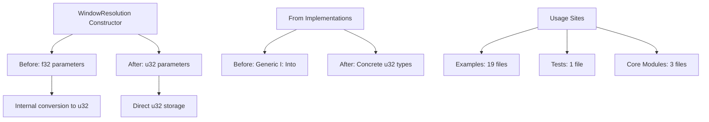

+++
title = "#20582 Remove redundant number conversion in window resolution"
date = "2025-08-20T00:00:00"
draft = false
template = "pull_request_page.html"
in_search_index = false

[extra]
current_language = "zh-cn"
available_languages = {"en" = { name = "English", url = "/pull_request/bevy/2025-08/pr-20582-en-20250820" }, "zh-cn" = { name = "中文", url = "/pull_request/bevy/2025-08/pr-20582-zh-cn-20250820" }}
labels = ["A-Windowing", "C-Usability"]
+++

# Remove redundant number conversion in window resolution

## Basic Information
- **Title**: Remove redundant number conversion in window resolution
- **PR Link**: https://github.com/bevyengine/bevy/pull/20582
- **Author**: BigWingBeat
- **Status**: MERGED
- **Labels**: A-Windowing, C-Usability, S-Ready-For-Final-Review, M-Needs-Migration-Guide
- **Created**: 2025-08-15T04:37:45Z
- **Merged**: 2025-08-20T18:41:11Z
- **Merged By**: alice-i-cecile

## Description Translation
# Objective

`WindowResolution` 将宽度和高度存储为 `u32`，但其构造函数接受 `f32` 并直接转换为 `u32`。此外，在 Bevy 中构造 `WindowResolution` 的所有地方都指定了整数，这使得使用浮点数完全无意义。

## Solution

将 `f32` 构造函数替换为 `u32` 构造函数。

我还决定将泛型 `I: Into<f32>` 元组和数组构造函数更改为仅接受 u32，而不是 `I: Into<u32>`，这是出于用户体验的考虑。它允许将这些构造函数格式化为 `(1920, 1080).into()`，因为编译器可以推断这些数字是 u32。保持这些实现为泛型会阻止这种推断，并且由于默认数字类型 (i32) 没有实现 `Into<u32>`，这将需要将其显式格式化为 `(1920u32, 1080u32).into()` 才能编译。

实际上，这些泛型构造函数也仅与整数值 f32 一起使用，与其他所有内容一样，因此它们的泛型特性实际上在任何地方都没有得到利用。

## Testing

追踪类型错误直到它们全部消失

## The Story of This Pull Request

这个 PR 解决了一个在 Bevy 窗口系统中存在已久的冗余设计问题。`WindowResolution` 结构体内部使用 `u32` 类型存储窗口的物理宽度和高度，这是合理的，因为像素数量必须是整数。然而，其构造函数却接受 `f32` 参数，并在内部立即将其转换为 `u32`。

问题的核心在于这种设计带来了不必要的复杂性。在实际使用中，所有调用 `WindowResolution::new()` 的地方都传递整数值，即使是使用 `f32` 字面量（如 `1920.0`），这实际上是在进行毫无意义的浮点数到整数的转换。这种设计不仅增加了运行时开销（尽管微小），更重要的是降低了代码的清晰度和类型安全性。

开发者采取了直接而有效的解决方案：将构造函数的参数类型从 `f32` 改为 `u32`，完全移除冗余的类型转换。这个变更影响了三个主要方面：

1. **核心构造函数**：`WindowResolution::new()` 现在直接接受 `u32` 参数
2. **From trait 实现**：移除了基于 `f32` 的转换，改为基于 `u32` 和 `UVec2`
3. **使用站点更新**：更新所有调用这些构造函数的地方使用整数值

一个值得注意的工程决策是关于泛型约束的调整。原本的 `From` 实现使用 `I: Into<f32>`，这允许更灵活的参数类型，但实际使用中这种灵活性从未被利用。更重要的是，保持泛型会阻碍类型推断，导致开发者需要显式标注类型（如 `(1920u32, 1080u32).into()`）。通过将约束改为具体的 `u32` 类型，现在可以简洁地写作 `(1920, 1080).into()`，编译器能够正确推断类型。

这个变更的影响范围相当广泛，涉及 19 个示例文件、多个测试文件和核心模块。每个修改都遵循相同的模式：将浮点数字面量改为整数字面量，移除不必要的类型转换。这种一致性表明这是一个经过深思熟虑的重构，而不是零散的修复。

从技术债务的角度来看，这个 PR 清理了存在已久的不合理设计。它提高了代码的清晰度，消除了不必要的运行时转换，并提供了更好的开发者体验。迁移相对简单直接，主要涉及将 `.0` 后缀从数字字面量中移除。

## Visual Representation



## Key Files Changed

### `crates/bevy_window/src/window.rs` (+13/-25)
核心变更文件，修改了 `WindowResolution` 的构造函数和转换实现：

```rust
// Before:
pub fn new(physical_width: f32, physical_height: f32) -> Self {
    Self {
        physical_width: physical_width as u32,
        physical_height: physical_height as u32,
        ..Default::default()
    }
}

// After:
pub fn new(physical_width: u32, physical_height: u32) -> Self {
    Self {
        physical_width,
        physical_height,
        ..Default::default()
    }
}
```

移除了基于 `f32` 的泛型 `From` 实现，改为具体的 `u32` 实现：

```rust
// 移除了这些实现:
// impl<I> From<(I, I)> where I: Into<f32>
// impl<I> From<[I; 2]> where I: Into<f32>  
// impl From<DVec2>

// 添加了这些实现:
impl From<(u32, u32)> for WindowResolution
impl From<[u32; 2]> for WindowResolution
impl From<UVec2> for WindowResolution
```

### `crates/bevy_ui/src/update.rs` (+8/-16)
更新了 UI 测试中的窗口分辨率构造方式，使用更简洁的 `From` 转换：

```rust
// Before:
resolution: WindowResolution::new(physical_size.x as f32, physical_size.y as f32)
    .with_scale_factor_override(10.),

// After:
resolution: WindowResolution::from(physical_size).with_scale_factor_override(10.),
```

### `release-content/migration-guides/window_resolution_constructors.md` (+21/-0)
新增迁移指南，详细说明了如何从旧 API 迁移到新 API：

```markdown
WindowResolution::new(1920.0, 1080.0)
// becomes
WindowResolution::new(1920, 1080)

WindowResolution::new(some_uvec2.x as f32, some_uvec2.y as f32)
// becomes  
WindowResolution::from(some_uvec2)
```

### `examples/shader/compute_shader_game_of_life.rs` (+6/-10)
更新计算着色器示例，使用 `UVec2` 代替元组，简化分辨率设置：

```rust
// Before:
const SIZE: (u32, u32) = (1280 / DISPLAY_FACTOR, 720 / DISPLAY_FACTOR);
resolution: ((SIZE.0 * DISPLAY_FACTOR) as f32, (SIZE.1 * DISPLAY_FACTOR) as f32).into(),

// After:
const SIZE: UVec2 = UVec2::new(1280 / DISPLAY_FACTOR, 720 / DISPLAY_FACTOR);
resolution: (SIZE * DISPLAY_FACTOR).into(),
```

### `crates/bevy_ui/src/layout/mod.rs` (+4/-4)
更新测试常量从 `f32` 到 `u32`，相应调整断言：

```rust
// Before:
const WINDOW_WIDTH: f32 = 1000.;
const WINDOW_HEIGHT: f32 = 100.;

// After:
const WINDOW_WIDTH: u32 = 1000;
const WINDOW_HEIGHT: u32 = 100;
```

## Further Reading

- [Rust 类型转换最佳实践](https://doc.rust-lang.org/rust-by-example/types/cast.html)
- [Bevy 窗口系统文档](https://docs.rs/bevy_window/latest/bevy_window/)
- [From 和 Into trait 的使用](https://doc.rust-lang.org/std/convert/trait.From.html)
- [UVec2 类型文档](https://docs.rs/glam/latest/glam/f32/struct.UVec2.html)