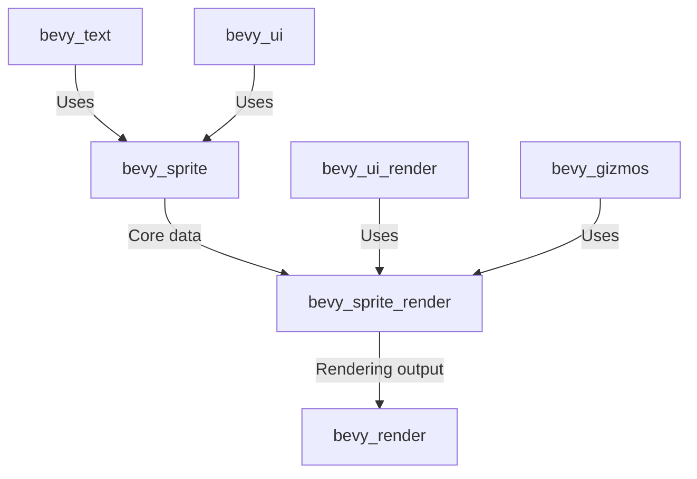

+++
title = "#20587 Split out sprite rendering"
date = "2025-08-15T00:00:00"
draft = false
template = "pull_request_page.html"
in_search_index = true

[taxonomies]
list_display = ["show"]

[extra]
current_language = "en"
available_languages = {"en" = { name = "English", url = "/pull_request/bevy/2025-08/pr-20587-en-20250815" }, "zh-cn" = { name = "中文", url = "/pull_request/bevy/2025-08/pr-20587-zh-cn-20250815" }}
labels = ["A-Rendering", "A-Text"]
+++

## Technical Report: Split out sprite rendering

### Basic Information
- **Title**: Split out sprite rendering
- **PR Link**: https://github.com/bevyengine/bevy/pull/20587
- **Author**: Zeophlite
- **Status**: MERGED
- **Labels**: A-Rendering, S-Ready-For-Final-Review, M-Needs-Migration-Guide, A-Text, M-Needs-Release-Note
- **Created**: 2025-08-15T10:11:52Z
- **Merged**: 2025-08-15T23:00:28Z
- **Merged By**: alice-i-cecile

### The Story of This Pull Request

#### Problem and Context
The `bevy_sprite` crate had grown to encompass both sprite data management and rendering functionality. This created several issues:
1. **Compilation bloat**: Systems that only needed sprite data structures were forced to compile rendering dependencies
2. **Architectural coupling**: Rendering systems were tightly integrated with sprite data structures
3. **Code organization**: The single crate contained unrelated responsibilities

The goal was to separate rendering concerns from core sprite functionality to improve modularity and compilation efficiency. This separation allows systems that only need sprite definitions (like UI or text) to depend solely on `bevy_sprite` without pulling in rendering dependencies.

#### Solution Approach
The solution involved:
1. Creating a new crate `bevy_sprite_render` for rendering logic
2. Moving all rendering systems and components from `bevy_sprite` to the new crate
3. Updating dependencies across the codebase to reference the new crate
4. Preserving existing public APIs through re-exports

Key engineering decisions:
- Maintained backward compatibility through `bevy_internal` re-exports
- Kept sprite data structures in `bevy_sprite`
- Moved text rendering extraction to `bevy_ui_render` where it logically belongs
- Updated feature flags to ensure proper dependency resolution

#### Implementation
The implementation consisted of several coordinated changes:

1. **New crate creation**:
   - Added `bevy_sprite_render` crate with rendering systems
   - Migrated rendering logic including:
     - Sprite batching and pipeline setup
     - Mesh2D rendering systems
     - Texture slicing computations
     - Tilemap chunk rendering

```rust
// File: crates/bevy_sprite_render/src/lib.rs
#[derive(Default)]
pub struct SpriteRenderingPlugin;

impl Plugin for SpriteRenderingPlugin {
    fn build(&self, app: &mut App) {
        // Rendering system setup
        app.add_plugins((
            Mesh2dRenderPlugin,
            ColorMaterialPlugin,
            TilemapChunkPlugin,
            TilemapChunkMaterialPlugin,
        ))
        .add_systems(/* systems */);
        
        if let Some(render_app) = app.get_sub_app_mut(RenderApp) {
            render_app
                .init_resource::<ImageBindGroups>()
                .add_systems(/* rendering systems */);
        }
    }
}
```

2. **Refactoring bevy_sprite**:
   - Removed all rendering systems from `bevy_sprite`
   - Kept core sprite components and utilities
   - Simplified the `SpritePlugin` to only handle non-rendering concerns

```rust
// File: crates/bevy_sprite/src/lib.rs
#[derive(Default)]
pub struct SpritePlugin;

impl Plugin for SpritePlugin {
    fn build(&self, app: &mut App) {
        // Only non-rendering systems remain
        if !app.is_plugin_added::<TextureAtlasPlugin>() {
            app.add_plugins(TextureAtlasPlugin);
        }
        
        #[cfg(feature = "bevy_sprite_picking_backend")]
        app.add_plugins(SpritePickingPlugin);
    }
}
```

3. **Text rendering relocation**:
   - Moved text extraction from `bevy_text` to `bevy_ui_render`
   - Created new `text2d.rs` module in `bevy_ui_render`

```rust
// File: crates/bevy_ui_render/src/text2d.rs
pub fn extract_text2d_sprite(
    mut commands: Commands,
    mut extracted_sprites: ResMut<ExtractedSprites>,
    // ... other parameters ...
) {
    // Text extraction logic
}
```

4. **Dependency updates**:
   - Updated `Cargo.toml` files across the project
   - Added `bevy_sprite_render` where rendering functionality was needed
   - Ensured feature flags properly enabled the new crate

```toml
# File: Cargo.toml
[features]
bevy_sprite = ["bevy_internal/bevy_sprite", "bevy_color"]
bevy_sprite_render = [
    "bevy_internal/bevy_sprite_render",
    "bevy_sprite",
    "bevy_render",
    "bevy_core_pipeline",
    "bevy_color",
]
```

#### Technical Insights
1. **Component relocation**:
   - Rendering-specific components like `ExtractedSprites` moved to new crate
   - Core components like `Sprite` remain in `bevy_sprite`
   - Added `SyncToRenderWorld` requirement for `Sprite` component

2. **Shader management**:
   - Shader paths updated to reference new crate namespace
   - Import paths changed from `bevy_sprite` to `bevy_sprite_render`

```wgsl
// Updated shader import path
#import bevy_sprite_render::{
    mesh2d_functions as mesh_functions,
    mesh2d_view_bindings::view,
}
```

3. **System ordering**:
   - Maintained system ordering constraints between sprite and text rendering
   - Ensured extraction systems run in correct sequence

4. **Feature flag propagation**:
   - WebGL/webgpu features properly forwarded to new crate
   - Gizmo dependencies updated to use new rendering crate

#### Impact
1. **Positive**:
   - Improved compile times for non-rendering use cases
   - Clearer separation of concerns
   - More modular architecture
   - Reduced crate dependencies for UI/text systems

2. **Migration considerations**:
   - Projects using sprite rendering need to add `bevy_sprite_render`
   - Some internal paths changed (documented in migration guide)
   - Text extraction now handled by `bevy_ui_render`

### Visual Representation



### Key Files Changed

1. `crates/bevy_sprite_render/src/lib.rs` (+333/-0)
   - New home for sprite rendering systems
   - Contains `SpriteRenderingPlugin` and rendering logic

```rust
// File: crates/bevy_sprite_render/src/lib.rs
pub struct SpriteRenderingPlugin;

impl Plugin for SpriteRenderingPlugin {
    fn build(&self, app: &mut App) {
        // Rendering system initialization
    }
}

// Systems for bounds calculation, slicing, etc.
pub fn calculate_bounds_2d(/* ... */) { /* ... */ }
```

2. `crates/bevy_sprite/src/lib.rs` (+4/-284)
   - Removed rendering systems
   - Simplified plugin implementation

```rust
// Before: 
// Extensive rendering system setup

// After:
#[derive(Default)]
pub struct SpritePlugin;

impl Plugin for SpritePlugin {
    fn build(&self, app: &mut App) {
        // Minimal non-rendering setup
    }
}
```

3. `crates/bevy_ui_render/src/text2d.rs` (+187/-0)
   - New home for text extraction logic
   - Handles sprite generation for text entities

```rust
pub fn extract_text2d_sprite(
    mut commands: Commands,
    mut extracted_sprites: ResMut<ExtractedSprites>,
    // ... parameters ...
) {
    // Logic to convert text into renderable sprites
}
```

4. `crates/bevy_text/src/text2d.rs` (+5/-180)
   - Removal of text extraction systems
   - Now relies on `bevy_ui_render` for rendering

```rust
// Before:
pub fn extract_text2d_sprite(/* ... */) { /* ... */ }

// After:
// (Text extraction removed entirely)
```

5. `crates/bevy_sprite_render/LICENSE-APACHE` (+176/-0)
   - Added Apache license to new crate

### Further Reading
1. [Bevy Plugin System](https://bevy-cheatbook.github.io/programming/plugins.html)
2. [Bevy Render Architecture](https://bevyengine.org/learn/book/getting-started/ecs/#render-world)
3. [Entity Component System Pattern](https://en.wikipedia.org/wiki/Entity_component_system)