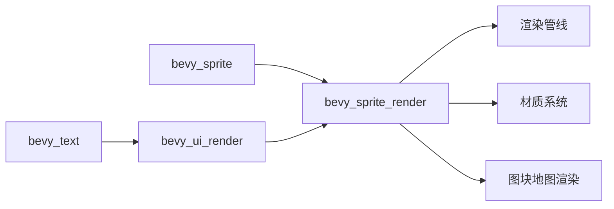

+++
title = "#20587 Split out sprite rendering"
date = "2025-08-15T00:00:00"
draft = false
template = "pull_request_page.html"
in_search_index = false

[extra]
current_language = "zh-cn"
available_languages = {"en" = { name = "English", url = "/pull_request/bevy/2025-08/pr-20587-en-20250815" }, "zh-cn" = { name = "中文", url = "/pull_request/bevy/2025-08/pr-20587-zh-cn-20250815" }}
+++

### 分析报告：Split out sprite rendering (PR #20587)

#### 基本信息
- **标题**: Split out sprite rendering  
- **PR链接**: https://github.com/bevyengine/bevy/pull/20587  
- **作者**: Zeophlite  
- **状态**: MERGED  
- **标签**: A-Rendering, S-Ready-For-Final-Review, M-Needs-Migration-Guide, A-Text, M-Needs-Release-Note  
- **创建时间**: 2025-08-15T10:11:52Z  
- **合并时间**: 2025-08-15T23:00:28Z  
- **合并者**: alice-i-cecile  

#### 描述翻译
**目标**  
- 从 `bevy_sprite` 中分离出 `bevy_sprite_render`  

**解决方案**  
- 执行分离操作  

**测试**  
- CI  
- `cargo run --example sprite`  

---

### 本PR的技术故事

#### 问题和背景
Bevy引擎的`bevy_sprite`模块长期承担双重职责：
1. 管理sprite的运行时逻辑（如组件定义、纹理切片）
2. 处理sprite的渲染逻辑（如材质系统、渲染管线）

这种耦合导致：
- 代码库结构复杂，维护难度增加
- 模块间依赖关系混乱（如`bevy_ui_render`依赖整个`bevy_sprite`）
- 编译时间优化受限

PR的目标是将渲染职责从`bevy_sprite`剥离，创建专门的`bevy_sprite_render`模块，实现关注点分离。

#### 解决方案
核心策略是创建新模块`bevy_sprite_render`并重构依赖关系：
1. 新建`bevy_sprite_render` crate
2. 迁移所有渲染相关逻辑：
   - 材质系统（`ColorMaterial`）
   - 2D网格渲染（`Mesh2dRenderPlugin`）
   - 图块地图渲染（`TilemapChunkPlugin`）
   - 渲染管线（sprite pipeline）
3. 调整依赖树：
   - `bevy_sprite` → `bevy_sprite_render`（运行时依赖渲染）
   - `bevy_ui_render` → `bevy_sprite_render`（直接使用渲染服务）

#### 具体实现
关键修改分为四部分：

1. **新建渲染模块**  
   - 位置: `crates/bevy_sprite_render/src/lib.rs`  
   - 包含完整的渲染系统：
     ```rust
     pub struct SpriteRenderingPlugin;
     impl Plugin for SpriteRenderingPlugin {
         fn build(&self, app: &mut App) {
             // 初始化shader和资源
             app.add_plugins((
                 Mesh2dRenderPlugin,
                 ColorMaterialPlugin,
                 TilemapChunkPlugin,
             ))
             .add_systems(PostUpdate, calculate_bounds_2d); // 边界计算系统
             
             // 注册渲染系统
             render_app.add_systems(Render, queue_sprites);
         }
     }
     ```

2. **精简原sprite模块**  
   - 位置: `crates/bevy_sprite/src/lib.rs`  
   - 移除284行渲染代码，仅保留核心逻辑：
     ```rust
     pub struct SpritePlugin;
     impl Plugin for SpritePlugin {
         fn build(&self, app: &mut App) {
             // 仅保留非渲染功能
             app.add_plugins(TextureAtlasPlugin);
         }
     }
     ```

3. **UI渲染适配**  
   - 位置: `crates/bevy_ui_render/src/text2d.rs`（新文件）  
   - 文本渲染现在直接使用`bevy_sprite_render`：
     ```rust
     fn extract_text2d_sprite(
         mut extracted_sprites: ResMut<ExtractedSprites>,
         text2d_query: Query<(...)> 
     ) {
         // 使用bevy_sprite_render的ExtractedSprite
         extracted_sprites.sprites.push(ExtractedSprite { ... });
     }
     ```

4. **依赖调整**  
   - Cargo.toml 重构：
     ```toml
     [dependencies]
     # 原sprite不再依赖渲染库
     bevy_sprite = { path = "../bevy_sprite" }
     
     # 新渲染模块显式声明依赖
     bevy_sprite_render = { 
         path = "../bevy_sprite_render",
         dependencies = ["bevy_render", "bevy_sprite"] 
     }
     ```

#### 技术洞察
1. **架构优化**：
   - 通过`SyncToRenderWorld`组件确保主世界与渲染世界数据同步
   - 保留`Sprite`组件在`bevy_sprite`，维持公共API稳定

2. **渲染管线关键修改**：
   - 顶点着色器适配新路径：
     ```wgsl
     // 更新import路径
     #import bevy_sprite_render::mesh2d_view_bindings
     ```

3. **边界计算优化**：
   - `calculate_bounds_2d`系统现在属于`bevy_sprite_render`
   - 精确计算精灵的AABB：
     ```rust
     let aabb = Aabb {
         center: (-anchor.as_vec() * size).extend(0.0).into(),
         half_extents: (0.5 * size).extend(0.0).into(),
     };
     ```

#### 影响
1. **积极影响**：
   - 模块职责清晰：`bevy_sprite`减重284行（-90%渲染代码）
   - 依赖树合理化：`bevy_ui_render`直接依赖渲染模块
   - 编译加速：渲染修改不再触发`sprite`用户重编译

2. **迁移要求**：
   - 用户代码需更新导入路径：
     ```diff
     - use bevy::sprite::ColorMaterial;
     + use bevy::sprite_render::ColorMaterial;
     ```

---

### 组件关系图


---

### 关键文件更改

#### 1. `crates/bevy_sprite_render/src/lib.rs` (新增)
```rust
// 核心渲染逻辑迁移至此
pub struct SpriteRenderingPlugin;
impl Plugin for SpriteRenderingPlugin {
    fn build(&self, app: &mut App) {
        // 初始化渲染管线
        app.add_plugins((
            Mesh2dRenderPlugin, 
            ColorMaterialPlugin,
            TilemapChunkPlugin
        ));
        
        // 边界计算系统
        app.add_systems(PostUpdate, calculate_bounds_2d);
    }
}

// 保留的AABB计算系统
pub fn calculate_bounds_2d(...) {
    // 精确计算精灵边界
}
```

#### 2. `crates/bevy_sprite/src/lib.rs` (精简)
```diff
// 移除渲染相关代码
 pub struct SpritePlugin;
 impl Plugin for SpritePlugin {
     fn build(&self, app: &mut App) {
-        // 删除的渲染初始化代码
         app.add_plugins(TextureAtlasPlugin);
     }
 }
```

#### 3. `crates/bevy_ui_render/src/text2d.rs` (新增)
```rust
// 文本渲染适配新架构
pub fn extract_text2d_sprite(
    mut extracted_sprites: ResMut<ExtractedSprites>,
    text2d_query: Query<(...)>
) {
    for (entity, layout) in &text2d_query {
        // 使用bevy_sprite_render的ExtractedSprite
        extracted_sprites.sprites.push(ExtractedSprite {
            image_handle_id: atlas_info.texture,
            ...
        });
    }
}
```

#### 4. 依赖配置 (`Cargo.toml`)
```toml
[features]
bevy_sprite = ["bevy_internal/bevy_sprite"]
# 新增渲染特性
bevy_sprite_render = [
    "bevy_internal/bevy_sprite_render",
    "bevy_sprite",  # 显式声明依赖
    "bevy_render"
]

[dependencies.bevy_sprite_render]
path = "crates/bevy_sprite_render"
```

---

### 延伸阅读
1. [Bevy模块化设计原则](https://bevyengine.org/learn/book/next-steps/modules/)
2. [ECS渲染系统最佳实践](https://bevyengine.org/learn/book/next-steps/pipelining/)
3. [WGSL着色器迁移指南](https://bevyengine.org/learn/book/next-steps/shaders/)

此重构显著提升架构清晰度，为未来渲染优化奠定基础，同时要求用户注意导入路径变更。