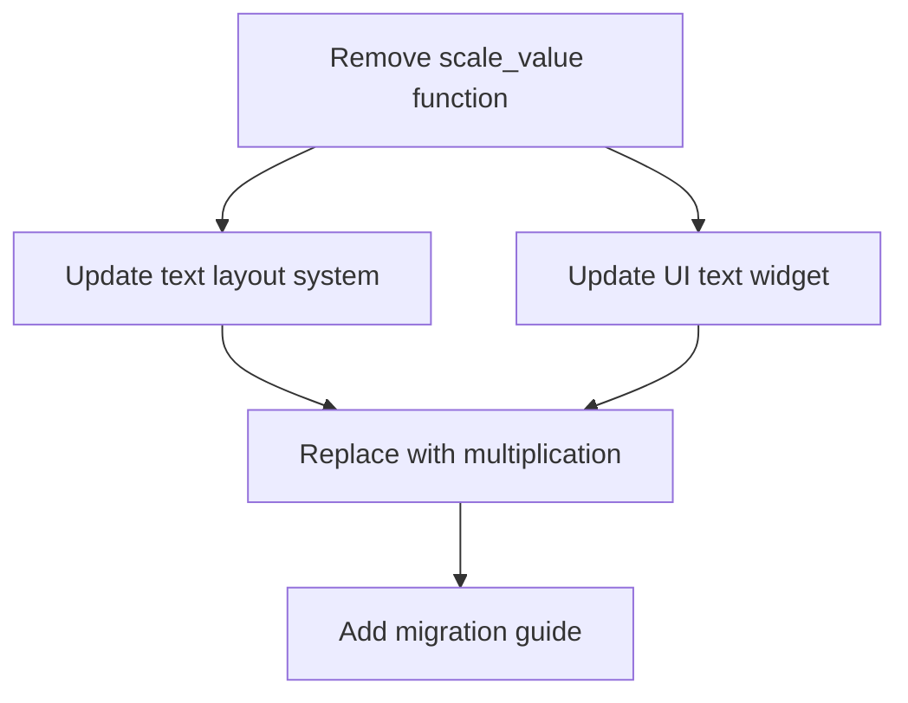

+++
title = "#20589 Remove `scale_value`"
date = "2025-08-16T00:00:00"
draft = false
template = "pull_request_page.html"
in_search_index = true

[taxonomies]
list_display = ["show"]

[extra]
current_language = "en"
available_languages = {"en" = { name = "English", url = "/pull_request/bevy/2025-08/pr-20589-en-20250816" }, "zh-cn" = { name = "中文", url = "/pull_request/bevy/2025-08/pr-20589-zh-cn-20250816" }}
labels = ["D-Trivial", "C-Code-Quality", "A-Text"]
+++

# Remove `scale_value`

## Basic Information
- **Title**: Remove `scale_value` 
- **PR Link**: https://github.com/bevyengine/bevy/pull/20589
- **Author**: ickshonpe
- **Status**: MERGED
- **Labels**: D-Trivial, C-Code-Quality, M-Needs-Migration-Guide, A-Text, S-Needs-Review
- **Created**: 2025-08-15T12:22:23Z
- **Merged**: 2025-08-16T00:29:21Z
- **Merged By**: james7132

## Description Translation
# Objective

Remove this function:
```
/// Scales `value` by `factor`.
pub fn scale_value(value: f32, factor: f32) -> f32 {
    value * factor
}
```

## Solution

Replace it with a multiplication.

## The Story of This Pull Request

The PR addresses a straightforward code quality issue in Bevy's text rendering system. The `scale_value` function in `bevy_text` served as a trivial wrapper around basic multiplication (`value * factor`). While originally intended to abstract scaling operations, its simplicity actually reduced code clarity rather than enhancing it. 

The core problem was that `scale_value` provided no meaningful abstraction - it directly mapped to a basic arithmetic operation while adding an extra function call layer. This violated the principle of avoiding unnecessary indirection, especially for fundamental operations. The function's existence required developers to look up its implementation rather than immediately understanding the operation being performed.

The solution was methodical:
1. Identify all call sites of `scale_value` in the codebase
2. Replace each call with direct multiplication
3. Remove the function definition
4. Add migration documentation

In `text2d.rs`, the changes demonstrate how direct multiplication improves readability. For example:

```diff
- bounds.width.map(|width| scale_value(width, scale_factor))
+ bounds.width.map(|width| width * scale_factor)
```

The author also took the opportunity to use more idiomatic Rust patterns where applicable. When scaling vector components individually, they replaced separate X/Y scaling operations with vector multiplication:

```diff
- text_layout_info.size.x = scale_value(text_layout_info.size.x, inverse_scale_factor);
- text_layout_info.size.y = scale_value(text_layout_info.size.y, inverse_scale_factor);
+ text_layout_info.size *= inverse_scale_factor;
```

This change reduces code duplication and leverages Rust's operator overloading for cleaner vector math. The same optimization was applied to the UI text widget in `widget/text.rs`.

The PR includes a migration guide that clearly communicates the change to users. The documentation is concise but sufficient, explaining both the removal and the straightforward replacement:

```markdown
The `scale_value` function from `bevy::text::text2d` has been removed. Multiply by the scale factor instead.
```

From an engineering perspective, this change:
- Reduces cognitive load by eliminating trivial abstractions
- Maintains identical runtime performance (the compiler would inline the function anyway)
- Follows Rust's philosophy of favoring explicit operations over unnecessary wrappers
- Sets a precedent for removing similar trivial utilities elsewhere in the codebase

The PR demonstrates good judgment in identifying and removing unnecessary abstraction layers while maintaining functionality. It's a focused, localized change that improves code quality without introducing new complexity.

## Visual Representation



## Key Files Changed

### `crates/bevy_text/src/text2d.rs`
- Removed `scale_value` function and replaced calls with direct multiplication
- Used vector multiplication where appropriate for more concise code

```diff
- bounds.width.map(|width| scale_value(width, scale_factor))
+ bounds.width.map(|width| width * scale_factor)

- text_layout_info.size.x = scale_value(text_layout_info.size.x, inverse_scale_factor);
- text_layout_info.size.y = scale_value(text_layout_info.size.y, inverse_scale_factor);
+ text_layout_info.size *= inverse_scale_factor;

- /// Scales `value` by `factor`.
- pub fn scale_value(value: f32, factor: f32) -> f32 {
-     value * factor
- }
```

### `crates/bevy_ui/src/widget/text.rs`
- Replaced `scale_value` calls with vector multiplication

```diff
- text_layout_info.size.x = scale_value(text_layout_info.size.x, inverse_scale_factor);
- text_layout_info.size.y = scale_value(text_layout_info.size.y, inverse_scale_factor);
+ text_layout_info.size *= inverse_scale_factor;
```

### `release-content/migration-guides/remove_scale_value.md`
- Added documentation for the removed function

```markdown
---
title: Remove `scale_value`
pull_requests: [19143]
---

The `scale_value` function from `bevy::text::text2d` has been removed. Multiply by the scale factor instead.
```

## Further Reading
- [Rust Operator Overloading](https://doc.rust-lang.org/book/ch19-03-advanced-traits.html#using-the-newtype-pattern-to-implement-external-traits-on-external-types)
- [Code Smells: Dispensables](https://refactoring.guru/smells/dispensables)
- [Bevy Text Documentation](https://docs.rs/bevy_text/latest/bevy_text/)