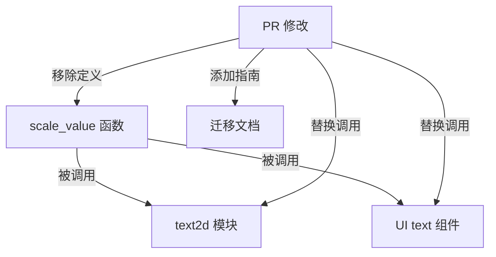

+++
title = "#20589 Remove `scale_value`"
date = "2025-08-16T00:00:00"
draft = false
template = "pull_request_page.html"
in_search_index = false

[extra]
current_language = "zh-cn"
available_languages = {"en" = { name = "English", url = "/pull_request/bevy/2025-08/pr-20589-en-20250816" }, "zh-cn" = { name = "中文", url = "/pull_request/bevy/2025-08/pr-20589-zh-cn-20250816" }}
labels = ["D-Trivial", "C-Code-Quality", "A-Text"]
+++

# Remove `scale_value`

## Basic Information
- **Title**: Remove `scale_value` 
- **PR Link**: https://github.com/bevyengine/bevy/pull/20589
- **Author**: ickshonpe
- **Status**: MERGED
- **Labels**: D-Trivial, C-Code-Quality, M-Needs-Migration-Guide, A-Text, S-Needs-Review
- **Created**: 2025-08-15T12:22:23Z
- **Merged**: 2025-08-16T00:29:21Z
- **Merged By**: james7132

## Description Translation
### 目标
移除以下函数：
```rust
/// Scales `value` by `factor`.
pub fn scale_value(value: f32, factor: f32) -> f32 {
    value * factor
}
```

### 解决方案
用直接乘法操作替换该函数调用。

## The Story of This Pull Request

在Bevy引擎的文本处理模块中，存在一个名为`scale_value`的工具函数。该函数实现简单，仅执行浮点数乘法操作：`value * factor`。随着代码库演进，维护者发现这个辅助函数实际上增加了不必要的抽象层，并没有提供足够的价值来证明其存在必要性。

问题在于，`scale_value`函数本质上只是乘法操作的简单封装。在Rust语言中，乘法运算符(*)本身就清晰表达了缩放操作，添加额外函数反而增加了认知负担和调用开销。该函数被用于文本布局计算的关键路径中，包括：
1. 文本边界框的尺寸计算
2. 文本布局信息的缩放处理
3. UI组件的尺寸调整

解决方案直接明了：完全移除`scale_value`函数，并在所有调用点替换为乘法运算符。这带来几个优势：
1. **减少间接性**：消除不必要的函数调用层
2. **提升可读性**：乘法操作符比函数调用更直观
3. **简化API**：减少公共接口数量
4. **潜在性能提升**：避免函数调用开销（尽管现代编译器可能内联）

在实现过程中，开发者识别出两个核心模块使用了该函数：
1. 文本2D布局系统 (`text2d.rs`)
2. UI文本组件 (`text.rs`)

具体修改包括：
1. 将`scale_value(width, scale_factor)` 替换为 `width * scale_factor`
2. 将`scale_value(height, scale_factor)` 替换为 `height * scale_factor`
3. 将分开的x/y缩放操作合并为向量乘法：`text_layout_info.size *= inverse_scale_factor`

特别值得注意的是向量乘法优化：原先对x和y分量分别调用`scale_value`的操作被替换为单行向量乘法。这更符合数学表达习惯，并减少了代码重复。

由于这是API破坏性变更，PR包含了迁移指南(`remove_scale_value.md`)，明确指导用户如何适配：
1. 删除对`scale_value`函数的调用
2. 直接使用乘法运算符替代

## Visual Representation



## Key Files Changed

### 1. `crates/bevy_text/src/text2d.rs` (+3/-13)
**修改原因**：移除`scale_value`函数并替换其调用点

**关键变更**：
```rust
// Before:
bounds.width.map(|width| scale_value(width, scale_factor))
bounds.height.map(|height| scale_value(height, scale_factor))
text_layout_info.size.x = scale_value(text_layout_info.size.x, inverse_scale_factor);
text_layout_info.size.y = scale_value(text_layout_info.size.y, inverse_scale_factor);

// After:
bounds.width.map(|width| width * scale_factor)
bounds.height.map(|height| height * scale_factor)
text_layout_info.size *= inverse_scale_factor;
```

### 2. `crates/bevy_ui/src/widget/text.rs` (+4/-5)
**修改原因**：替换UI文本组件中的`scale_value`调用

**关键变更**：
```rust
// Before:
text_layout_info.size.x = scale_value(text_layout_info.size.x, inverse_scale_factor);
text_layout_info.size.y = scale_value(text_layout_info.size.y, inverse_scale_factor);

// After:
text_layout_info.size *= inverse_scale_factor;
```

### 3. `release-content/migration-guides/remove_scale_value.md` (+6/-0)
**修改原因**：为API变更提供迁移指导

**新增内容**：
```markdown
---
title: Remove `scale_value`
pull_requests: [19143]
---

The `scale_value` function from `bevy::text::text2d` has been removed. Multiply by the scale factor instead.
```

## Further Reading
1. Rust运算符重载文档：https://doc.rust-lang.org/book/ch19-03-advanced-traits.html#using-the-newtype-pattern-to-implement-external-traits-on-external-types
2. Bevy引擎文本系统架构：https://github.com/bevyengine/bevy/tree/main/crates/bevy_text
3. 软件抽象层设计原则：Martin Fowler, "Refactoring: Improving the Design of Existing Code"

## Full Code Diff
<details>
<summary>View full diff</summary>

```diff
diff --git a/crates/bevy_text/src/text2d.rs b/crates/bevy_text/src/text2d.rs
index da17508dad14d..a2983b6dbab10 100644
--- a/crates/bevy_text/src/text2d.rs
+++ b/crates/bevy_text/src/text2d.rs
@@ -373,11 +373,9 @@ pub fn update_text2d_layout(
                 width: if block.linebreak == LineBreak::NoWrap {
                     None
                 } else {
-                    bounds.width.map(|width| scale_value(width, scale_factor))
+                    bounds.width.map(|width| width * scale_factor)
                 },
-                height: bounds
-                    .height
-                    .map(|height| scale_value(height, scale_factor)),
+                height: bounds.height.map(|height| height * scale_factor),
             };
 
             let text_layout_info = text_layout_info.into_inner();
@@ -404,21 +402,13 @@ pub fn update_text2d_layout(
                     panic!("Fatal error when processing text: {e}.");
                 }
                 Ok(()) => {
-                    text_layout_info.size.x =
-                        scale_value(text_layout_info.size.x, inverse_scale_factor);
-                    text_layout_info.size.y =
-                        scale_value(text_layout_info.size.y, inverse_scale_factor);
+                    text_layout_info.size *= inverse_scale_factor;
                 }
             }
         }
     }
 }
 
-/// Scales `value` by `factor`.
-pub fn scale_value(value: f32, factor: f32) -> f32 {
-    value * factor
-}
-
 /// System calculating and inserting an [`Aabb`] component to entities with some
 /// [`TextLayoutInfo`] and [`Anchor`] components, and without a [`NoFrustumCulling`] component.
 ///
diff --git a/crates/bevy_ui/src/widget/text.rs b/crates/bevy_ui/src/widget/text.rs
index 36e1c2aecefc6..9d725aa9f9f10 100644
--- a/crates/bevy_ui/src/widget/text.rs
+++ b/crates/bevy_ui/src/widget/text.rs
@@ -18,9 +18,9 @@ use bevy_image::prelude::*;
 use bevy_math::Vec2;
 use bevy_reflect::{std_traits::ReflectDefault, Reflect};
 use bevy_text::{
-    scale_value, ComputedTextBlock, CosmicFontSystem, Font, FontAtlasSets, LineBreak, SwashCache,
-    TextBounds, TextColor, TextError, TextFont, TextLayout, TextLayoutInfo, TextMeasureInfo,
-    TextPipeline, TextReader, TextRoot, TextSpanAccess, TextWriter,
+    ComputedTextBlock, CosmicFontSystem, Font, FontAtlasSets, LineBreak, SwashCache, TextBounds,
+    TextColor, TextError, TextFont, TextLayout, TextLayoutInfo, TextMeasureInfo, TextPipeline,
+    TextReader, TextRoot, TextSpanAccess, TextWriter,
 };
 use taffy::style::AvailableSpace;
 use tracing::error;
@@ -367,8 +367,7 @@ fn queue_text(
             panic!("Fatal error when processing text: {e}.");
         }
         Ok(()) => {
-            text_layout_info.size.x = scale_value(text_layout_info.size.x, inverse_scale_factor);
-            text_layout_info.size.y = scale_value(text_layout_info.size.y, inverse_scale_factor);
+            text_layout_info.size *= inverse_scale_factor;
             text_flags.needs_recompute = false;
         }
     }
diff --git a/release-content/migration-guides/remove_scale_value.md b/release-content/migration-guides/remove_scale_value.md
new file mode 100644
index 0000000000000..fdc4267690608
--- /dev/null
+++ b/release-content/migration-guides/remove_scale_value.md
@@ -0,0 +1,6 @@
+---
+title: Remove `scale_value`
+pull_requests: [19143]
+---
+
+The `scale_value` function from `bevy::text::text2d` has been removed. Multiply by the scale factor instead.
```

</details>