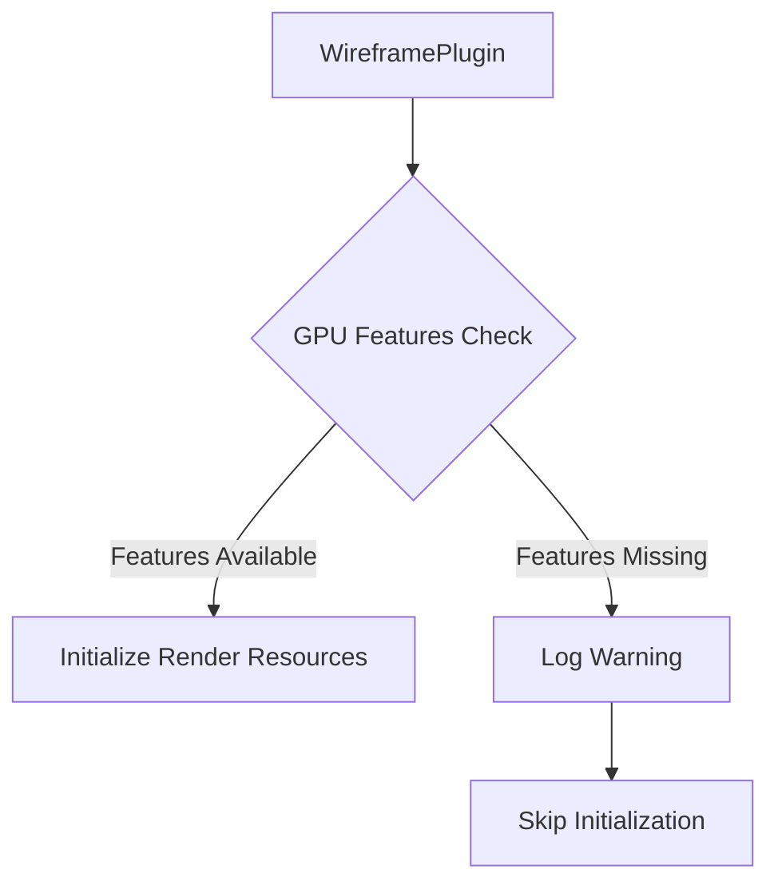

+++
title = "#20591 Gate WireframePlugin behind WgpuFeatures::POLYGON_MODE_LINE | WgpuFeatures::PUSH_CONSTANTS"
date = "2025-08-16T00:00:00"
draft = false
template = "pull_request_page.html"
in_search_index = true

[taxonomies]
list_display = ["show"]

[extra]
current_language = "en"
available_languages = {"en" = { name = "English", url = "/pull_request/bevy/2025-08/pr-20591-en-20250816" }, "zh-cn" = { name = "中文", url = "/pull_request/bevy/2025-08/pr-20591-zh-cn-20250816" }}
labels = ["C-Bug", "D-Trivial", "A-Rendering", "O-Web", "O-WebGPU"]
+++

## Gate WireframePlugin behind WgpuFeatures::POLYGON_MODE_LINE | WgpuFeatures::PUSH_CONSTANTS

### Basic Information
- **Title**: Gate WireframePlugin behind WgpuFeatures::POLYGON_MODE_LINE | WgpuFeatures::PUSH_CONSTANTS
- **PR Link**: https://github.com/bevyengine/bevy/pull/20591
- **Author**: JMS55
- **Status**: MERGED
- **Labels**: C-Bug, D-Trivial, A-Rendering, O-Web, S-Ready-For-Final-Review, O-WebGPU
- **Created**: 2025-08-15T14:32:47Z
- **Merged**: 2025-08-16T22:51:29Z
- **Merged By**: alice-i-cecile

### Description
# Objective
- Fix https://github.com/bevyengine/bevy/issues/20537 by showing a better error

## Solution
- Gate the plugin behind GPU features, following our existing patterns

## Testing
Not tested. Please compile for web and see what happens when you try to use wireframes. I'm not sure if the systems in build() should also be moved to finish() after the feature check.

---

### The Story of This Pull Request

#### The Problem
The WireframePlugin was causing runtime panics when used with WebGPU configurations that lacked required GPU features. Specifically, wireframe rendering requires both `POLYGON_MODE_LINE` for line rendering and `PUSH_CONSTANTS` for shader parameter passing. When these features were unavailable, the engine would panic during rendering setup. This was particularly problematic for Web and WebGPU targets where these features might not be consistently supported.

#### The Solution Approach
The fix follows Bevy's established pattern for feature gating by moving plugin initialization to the `finish()` lifecycle hook where GPU capabilities can be checked. The key decisions were:
1. Delay renderer setup until GPU features can be verified
2. Add clear warning when required features are missing
3. Maintain existing functionality when features are present
4. Avoid unnecessary overhead by skipping initialization when features are unavailable

#### Implementation Details
The changes relocate the render app initialization from `build()` to `finish()` where the `RenderDevice` is guaranteed to be available. The implementation checks for the required GPU features using a bitwise OR of `WgpuFeatures::POLYGON_MODE_LINE` and `WgpuFeatures::PUSH_CONSTANTS`. If either feature is missing:
1. A warning is logged indicating the missing features
2. Plugin initialization skips render app setup
3. The application continues running without wireframe support

The core logic change is straightforward but strategically placed to leverage Bevy's plugin lifecycle:

```rust
fn finish(&self, app: &mut App) {
    let Some(render_app) = app.get_sub_app_mut(RenderApp) else {
        return;
    };

    let required_features = WgpuFeatures::POLYGON_MODE_LINE | WgpuFeatures::PUSH_CONSTANTS;
    let render_device = render_app.world().resource::<RenderDevice>();
    if !render_device.features().contains(required_features) {
        warn!(
            "WireframePlugin not loaded. GPU lacks support for required features: {:?}.",
            required_features
        );
        return;
    }
    // Proceed with initialization if features are supported
}
```

#### Technical Insights
The solution demonstrates proper use of:
1. **Plugin Lifecycle Hooks**: `finish()` executes after render backend initialization when GPU capabilities are available
2. **Feature Flag Composition**: Combining flags with bitwise OR (`|`) creates a composite feature requirement
3. **Graceful Degradation**: Skipping plugin setup instead of crashing when requirements aren't met
4. **Diagnostic Logging**: Clear warning messages help developers identify missing capabilities

The `POLYGON_MODE_LINE` feature enables non-filled polygon rendering (wireframes), while `PUSH_CONSTANTS` allows efficient shader parameter updates. Both are essential for wireframe rendering to function correctly.

#### Impact
These changes:
1. Prevent runtime crashes on unsupported platforms
2. Improve developer experience with clear warning messages
3. Maintain backward compatibility for supported configurations
4. Reduce resource usage when wireframes can't be rendered
5. Align wireframe handling with Bevy's feature gating patterns

### Visual Representation



### Key Files Changed

#### `crates/bevy_pbr/src/wireframe.rs` (+14/-2)
Changes move render app initialization to `finish()` and add feature checking.

**Before:**
```rust
impl Plugin for WireframePlugin {
    fn build(&self, app: &mut App) {
        app.init_resource::<WireframeConfig>()
            .add_systems(PostUpdate, update_wireframe_mesh_colors
                .after(AssetEventSystems)
                .run_if(resource_exists::<WireframeConfig>),
        );

        let Some(render_app) = app.get_sub_app_mut(RenderApp) else {
            return;
        };

        render_app
            .init_resource::<WireframeEntitySpecializationTicks>()
            .init_resource::<SpecializedWireframePipelineCache>()
            // ... additional setup ...
    }
}
```

**After:**
```rust
impl Plugin for WireframePlugin {
    fn build(&self, app: &mut App) {
        app.init_resource::<WireframeConfig>()
            .add_systems(PostUpdate, update_wireframe_mesh_colors
                .after(AssetEventSystems)
                .run_if(resource_exists::<WireframeConfig>),
        );
    }

    fn finish(&self, app: &mut App) {
        let Some(render_app) = app.get_sub_app_mut(RenderApp) else {
            return;
        };

        let required_features = WgpuFeatures::POLYGON_MODE_LINE | WgpuFeatures::PUSH_CONSTANTS;
        let render_device = render_app.world().resource::<RenderDevice>();
        if !render_device.features().contains(required_features) {
            warn!(
                "WireframePlugin not loaded. GPU lacks support for required features: {:?}.",
                required_features
            );
            return;
        }

        render_app
            .init_resource::<WireframeEntitySpecializationTicks>()
            .init_resource::<SpecializedWireframePipelineCache>()
            // ... additional setup ...
    }
}
```

### Further Reading
1. [WebGPU Feature Support Table](https://github.com/gpuweb/gpuweb/wiki/Implementation-Status)
2. [Bevy Plugin System Documentation](https://docs.rs/bevy/latest/bevy/app/trait.Plugin.html)
3. [wgpu::Features Reference](https://docs.rs/wgpu/latest/wgpu/struct.Features.html)
4. [Wireframe Rendering Techniques](https://microsoft.github.io/DirectX-Specs/d3d/archive/D3D11_3_FunctionalSpec.htm#PolygonRasterization)