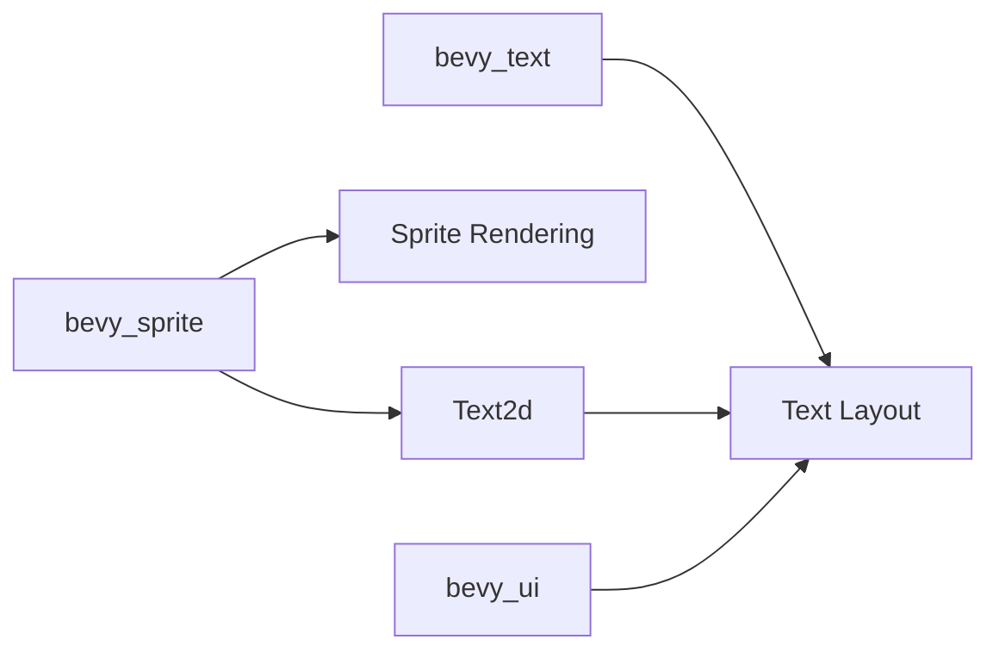

+++
title = "#20594 Move `text2d` into `bevy_sprite`"
date = "2025-08-16T00:00:00"
draft = false
template = "pull_request_page.html"
in_search_index = true

[taxonomies]
list_display = ["show"]

[extra]
current_language = "en"
available_languages = {"en" = { name = "English", url = "/pull_request/bevy/2025-08/pr-20594-en-20250816" }, "zh-cn" = { name = "中文", url = "/pull_request/bevy/2025-08/pr-20594-zh-cn-20250816" }}
labels = ["A-Rendering", "A-Text", "X-Contentious"]
+++

# Analysis of PR #20594: Move `text2d` into `bevy_sprite`

## Basic Information
- **Title**: Move `text2d` into `bevy_sprite`
- **PR Link**: https://github.com/bevyengine/bevy/pull/20594
- **Author**: ickshonpe
- **Status**: MERGED
- **Labels**: A-Rendering, S-Ready-For-Final-Review, A-Text, M-Needs-Release-Note, X-Contentious
- **Created**: 2025-08-15T21:49:05Z
- **Merged**: 2025-08-16T22:31:18Z
- **Merged By**: alice-i-cecile

## Description Translation
# Objective

Fixes #19531

## Solution

Move the `text2d` module from `bevy_text` into `bevy_sprite`
Move the `text2d` rendering module from `bevy_ui_render` to `bevy_sprite_render`.
Remove the `bevy_sprite`, `bevy_window`, `bevy_camera` and `bevy_transform` dependencies from `bevy_text`.

## Testing

```
cargo run --example text2d
```

## Showcase

## The Story of This Pull Request

This PR addresses architectural concerns around the `text2d` module's placement in Bevy's codebase. The core problem was that `bevy_text` contained both UI text components and world-space 2D text components (`Text2d`), creating unnecessary dependencies and conceptual overlap. 

The `text2d` module had dependencies on sprite, camera, window, and transform systems - dependencies that don't align with `bevy_text`'s core responsibility of text layout and rendering. This forced `bevy_text` to carry dependencies that were only relevant for world-space text rendering, increasing compile times and complexity for users who only needed UI text.

The solution moves `text2d` functionality to `bevy_sprite` where it naturally belongs:
1. `Text2d` is conceptually a 2D rendering primitive like sprites
2. `bevy_sprite` already handles 2D rendering pipeline integration
3. This separation reduces cross-crate dependencies

The implementation required careful system reorganization. In `bevy_sprite`'s plugin setup:
```rust
app.add_systems(
    PostUpdate,
    (
        detect_text_needs_rerender::<Text2d>,
        update_text2d_layout
            .ambiguous_with(CameraUpdateSystems)
            .after(bevy_text::remove_dropped_font_atlas_sets),
        calculate_bounds_text2d.in_set(VisibilitySystems::CalculateBounds),
    )
        .chain()
        .in_set(Text2dUpdateSystems)
        .after(AnimationSystems),
);
```
This registers the text systems while handling potential conflicts with camera systems that also access `Assets<Image>`.

The rendering pipeline integration moved from `bevy_ui_render` to `bevy_sprite_render`:
```rust
// In SpriteRenderingPlugin:
add_systems(ExtractSchedule, 
    extract_text2d_sprite.after(SpriteSystems::ExtractSprites)
)
```

Dependency cleanup was significant in `bevy_text`'s Cargo.toml:
```toml
# Removed dependencies
bevy_camera = { ... }
bevy_sprite = { ... }
bevy_transform = { ... }
bevy_window = { ... }
```

The changes required updating numerous import paths across the codebase. For example, in the text2d example:
```rust
// Before:
use bevy::text::{Text2dShadow, ...};

// After:
use bevy::sprite::Text2dShadow;
```

Key technical insights:
1. The `Text2d` component now lives in `bevy_sprite::text2d`
2. Systems like `update_text2d_layout` moved with the component
3. Rendering extraction now happens through sprite pipelines
4. Text layout logic remains in `bevy_text` as a shared service

The impact includes:
- Cleaner separation between UI text and world-space text
- Reduced compile times for UI-only projects
- More logical organization of 2D rendering primitives
- Simplified dependency graph for text systems

## Visual Representation



## Key Files Changed

### crates/bevy_sprite/src/lib.rs
Added text2d systems to sprite plugin:
```rust
// Added:
mod text2d;
use bevy_text::Text2dUpdateSystems;

impl Plugin for SpritePlugin {
    fn build(&self, app: &mut App) {
        app.add_systems(PostUpdate, (
            detect_text_needs_rerender::<Text2d>,
            update_text2d_layout.ambiguous_with(CameraUpdateSystems),
            calculate_bounds_text2d
        ).in_set(Text2dUpdateSystems));
    }
}
```

### crates/bevy_text/src/lib.rs
Removed text2d systems:
```rust
// Before:
app.add_systems(PostUpdate, (
    detect_text_needs_rerender::<Text2d>,
    update_text2d_layout,
    calculate_bounds_text2d
));

// After:
app.add_systems(PostUpdate, 
    remove_dropped_font_atlas_sets
);
```

### crates/bevy_sprite/src/text2d.rs
Moved from bevy_text with updated imports:
```rust
// Before:
use bevy_sprite::{Anchor, Sprite};

// After:
use crate::{Anchor, Sprite};
```

### crates/bevy_sprite_render/src/text2d/mod.rs
Moved from bevy_ui_render:
```rust
// Before:
use bevy_text::Text2dShadow;

// After:
use bevy_sprite::Text2dShadow;
```

### examples/2d/text2d.rs
Updated imports:
```rust
// Before:
use bevy::text::Text2dShadow;

// After:
use bevy::sprite::Text2dShadow;
```

## Further Reading
- [Bevy Sprite Documentation](https://docs.rs/bevy_sprite/latest/bevy_sprite/)
- [ECS System Ambiguity Handling](https://bevyengine.org/learn/book/getting-started/ecs/#system-ordering)
- [Component-Based Architecture Patterns](https://www.gameenginebook.com/)