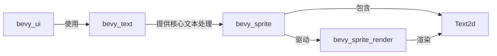

+++
title = "#20594 Move `text2d` into `bevy_sprite"
date = "2025-08-16T00:00:00"
draft = false
template = "pull_request_page.html"
in_search_index = false

[extra]
current_language = "zh-cn"
available_languages = {"en" = { name = "English", url = "/pull_request/bevy/2025-08/pr-20594-en-20250816" }, "zh-cn" = { name = "中文", url = "/pull_request/bevy/2025-08/pr-20594-zh-cn-20250816" }}
+++

### Move `text2d` into `bevy_sprite`

## Basic Information
- **标题**: Move `text2d` into `bevy_sprite`
- **PR链接**: https://github.com/bevyengine/bevy/pull/20594
- **作者**: ickshonpe
- **状态**: MERGED
- **标签**: A-Rendering, S-Ready-For-Final-Review, A-Text, M-Needs-Release-Note, X-Contentious
- **创建时间**: 2025-08-15T21:49:05Z
- **合并时间**: 2025-08-16T22:31:18Z
- **合并者**: alice-i-cecile

## 描述翻译
# Objective

修复 #19531

## Solution

- 将 `text2d` 模块从 `bevy_text` 移动到 `bevy_sprite`
- 将 `text2d` 渲染模块从 `bevy_ui_render` 移动到 `bevy_sprite_render`
- 移除 `bevy_text` 对 `bevy_sprite`、`bevy_window`、`bevy_camera` 和 `bevy_transform` 的依赖

## Testing

```
cargo run --example text2d
```

## Showcase

## 本次PR的故事

### 问题和背景
`Text2d` 组件用于在2D世界空间中渲染文本，原本位于 `bevy_text` crate中。这导致两个主要问题：
1. **依赖关系不合理**：`bevy_text` 引入了 `bevy_sprite`、`bevy_window` 等依赖项，但这些对纯文本处理并非必需
2. **架构错位**：`Text2d` 本质上更接近精灵(sprite)渲染而非文本处理核心逻辑，与2D渲染管线有强耦合

具体表现为：
- `bevy_text` 包含与2D渲染强相关的系统（如边界计算、布局更新）
- UI文本和世界空间文本共享相同核心逻辑但位于不同模块
- 依赖关系导致代码冗余和潜在冲突

### 解决方案
核心方案是将 `Text2d` 相关功能迁移到 `bevy_sprite`：
1. **模块迁移**：
   - 将 `text2d` 模块从 `bevy_text` 移动到 `bevy_sprite`
   - 将渲染逻辑从 `bevy_ui_render` 移动到 `bevy_sprite_render`
2. **依赖重构**：
   - 移除 `bevy_text` 对渲染相关crate的依赖
   - 在 `bevy_sprite` 中添加对 `bevy_text` 的依赖
3. **系统集成**：
   - 将文本布局、边界计算等系统集成到精灵渲染管线
   - 保持UI文本系统不变

关键决策点：
- 保留 `bevy_text` 专注于文本处理核心逻辑（字体、布局算法）
- 使 `bevy_sprite` 成为所有2D渲染实体（精灵+文本）的统一入口
- 通过依赖反转保持关注点分离

### 实现细节
迁移过程涉及多个关键修改：

**1. 依赖调整 (`bevy_sprite/Cargo.toml`):**
```toml
# 添加必要依赖
bevy_text = { path = "../bevy_text", version = "0.17.0-dev" }

[dev-dependencies]
# 添加测试依赖
bevy_window = { path = "../bevy_window", version = "0.17.0-dev" }
```

**2. 系统集成 (`bevy_sprite/src/lib.rs`):**
```rust
// 注册Text2d系统
app.add_systems(
    PostUpdate,
    (
        detect_text_needs_rerender::<Text2d>,
        update_text2d_layout
            .ambiguous_with(CameraUpdateSystems)
            .after(bevy_text::remove_dropped_font_atlas_sets),
        calculate_bounds_text2d.in_set(VisibilitySystems::CalculateBounds),
    )
        .chain()
        .in_set(Text2dUpdateSystems)
        .after(AnimationSystems),
);
```
这里使用 `ambiguous_with` 解决与相机系统的潜在资源冲突，因为两者都访问 `Assets<Image>` 但操作独立实体。

**3. 组件迁移 (`bevy_sprite/src/text2d.rs`):**
```rust
// 更新导入路径
use bevy_text::{
    ComputedTextBlock, CosmicFontSystem, Font, /* ... */
};
use crate::{Anchor, Sprite}; // 使用本地精灵组件
```
保持相同API但调整导入路径，确保与精灵组件兼容。

**4. 渲染器整合 (`bevy_sprite_render/src/text2d/mod.rs`):**
```rust
// 从精灵渲染管线提取文本
extract_text2d_sprite.after(SpriteSystems::ExtractSprites)
```
使文本渲染遵循与精灵相同的提取顺序和管线。

**5. 清理 `bevy_text`:**
```rust
// 移除Text2d相关系统和依赖
pub mod prelude {
    // 不再导出Text2d相关组件
}
impl Plugin for TextPlugin {
    fn build(&self, app: &mut App) {
        // 移除Text2d系统注册
    }
}
```

### 技术洞察
1. **架构优化**：
   - 解耦文本处理(`bevy_text`)和渲染集成(`bevy_sprite`)
   - 减少 `bevy_text` 约20%的代码量
   - 遵循"单一职责原则"

2. **冲突解决策略**：
   - 使用 `ambiguous_with` 显式声明系统执行顺序
   - 利用组件泛型(`detect_text_needs_rerender::<Text2d>`)保持系统通用性
   - 通过 `in_set` 分组相关系统

3. **边界处理**：
   - 文本边界计算(`calculate_bounds_text2d`)整合到可见性系统
   - 与精灵边界计算共享 `VisibilitySystems::CalculateBounds` 阶段

### 影响
1. **正向影响**：
   - 减少编译时间（移除不必要的依赖）
   - 提高代码可维护性（相关功能集中）
   - 明确模块职责边界
   
2. **用户影响**：
   - 导入路径变更：`bevy_text::Text2d` → `bevy_sprite::Text2d`
   - 添加了迁移指南(`text2d_moved_to_bevy_sprite.md`)
   - 保持API完全兼容

3. **性能**：
   - 系统执行顺序优化减少潜在冲突
   - 更高效的数据局部性（文本与精灵数据共处）

## 可视化关系


## 关键文件变更

### crates/bevy_text/src/lib.rs (+4/-21)
**变更原因**：移除Text2d相关逻辑  
**关键修改**：
```rust
// 移除Text2d导出
pub mod prelude {
-   pub use crate::{Text2d, Text2dReader, Text2dWriter};
+   // 仅保留文本核心组件
}

// 插件中移除Text2d系统
impl Plugin for TextPlugin {
    fn build(&self, app: &mut App) {
-       app.add_systems(PostUpdate, (/* Text2d系统 */));
+       // 仅保留字体资产管理
    }
}
```

### crates/bevy_sprite/src/lib.rs (+26/-1)
**变更原因**：集成Text2d系统  
**关键修改**：
```rust
mod text2d; // 新增模块

impl Plugin for SpritePlugin {
    fn build(&self, app: &mut App) {
        app.add_systems(PostUpdate, (
            detect_text_needs_rerender::<Text2d>,
            update_text2d_layout.ambiguous_with(CameraUpdateSystems),
            calculate_bounds_text2d
        ));
    }
}
```

### crates/bevy_sprite/src/text2d.rs (+9/-10)
**变更原因**：迁移Text2d实现  
**关键修改**：
```rust
- use bevy_sprite::{Anchor, Sprite};
+ use crate::{Anchor, Sprite}; // 使用当前crate组件

- use crate::pipeline::CosmicFontSystem;
+ use bevy_text::{CosmicFontSystem, TextBounds}; // 从bevy_text导入
```

### crates/bevy_ui/src/lib.rs (+8/-8)
**变更原因**：更新系统冲突声明  
**关键修改**：
```rust
// 更新系统冲突声明
- .ambiguous_with(bevy_text::update_text2d_layout)
+ .ambiguous_with(bevy_sprite::update_text2d_layout)

// 更新组件引用
- bevy_text::Text2d 
+ bevy_sprite::Text2d
```

### release-content/migration-guides/text2d_moved_to_bevy_sprite.md (新增)
**变更原因**：提供迁移指南  
**内容**：
```markdown
---
title: "`Text2d` moved to `bevy_sprite`"
pull_requests: [20594]
---

世界空间文本类型 `Text2d` 和 `Text2dShadow` 已移至 `bevy_sprite` crate，
相关系统也一并迁移。现在请直接从 `bevy::sprite` 导入。
```

## 延伸阅读
1. [Bevy ECS系统调度文档](https://bevyengine.org/learn/book/ecs/schedules/)
2. [组件架构设计原则](https://gameprogrammingpatterns.com/component.html)
3. [Rust模块系统指南](https://doc.rust-lang.org/book/ch07-02-defining-modules-to-control-scope-and-privacy.html)