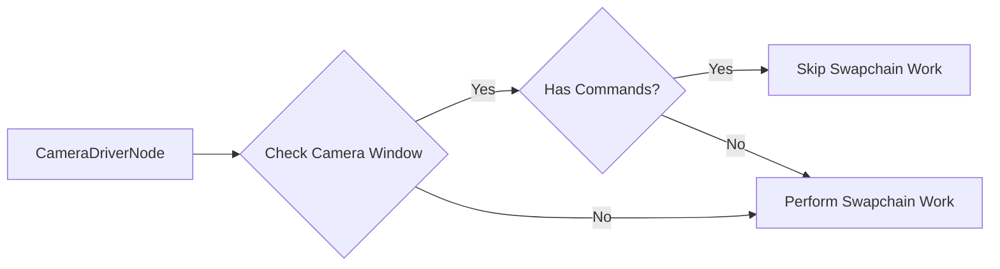

+++
title = "#20595 Make sure we submit work even if we visited a camera."
date = "2025-08-16T00:00:00"
draft = false
template = "pull_request_page.html"
in_search_index = true

[taxonomies]
list_display = ["show"]

[extra]
current_language = "en"
available_languages = {"en" = { name = "English", url = "/pull_request/bevy/2025-08/pr-20595-en-20250816" }, "zh-cn" = { name = "中文", url = "/pull_request/bevy/2025-08/pr-20595-zh-cn-20250816" }}
labels = ["C-Bug", "A-Rendering"]
+++

## Make sure we submit work even if we visited a camera

### Basic Information
- **Title**: Make sure we submit work even if we visited a camera.
- **PR Link**: https://github.com/bevyengine/bevy/pull/20595
- **Author**: tychedelia
- **Status**: MERGED
- **Labels**: C-Bug, A-Rendering, S-Ready-For-Final-Review
- **Created**: 2025-08-15T22:32:05Z
- **Merged**: 2025-08-16T05:11:35Z
- **Merged By**: alice-i-cecile

### Description Translation
Alternative fix to #20318. We have existing code making sure that we do work on a swapchain in `CameraDriverNode`. However, it's only protecting against the case where we have no cameras spawned. We also need to check that we actually did any rendering work, even if we have cameras in the scene.

Tested on macOS.

### The Story of This Pull Request

The issue (#20318) occurred because Bevy could crash when presenting to the swap chain if no rendering work was submitted, even when cameras existed in the scene. Previously, the renderer only protected against cases where no cameras were present. The problem manifested specifically when cameras existed but didn't produce any render commands, such as when all cameras were disabled.

The solution required modifying two key components. First, we added a `has_commands()` method to `RenderContext` to check if any render commands exist. This method returns true if either a command encoder is active or command buffers are queued:

```rust
pub(crate) fn has_commands(&mut self) -> bool {
    self.command_encoder.is_some() || !self.command_buffer_queue.is_empty()
}
```

Second, we updated the camera driver node to use this new check. The existing condition that skipped swap chain work when cameras were present was extended to also require that rendering commands exist:

```rust
for (id, window) in world.resource::<ExtractedWindows>().iter() {
    if camera_windows.contains(id) && render_context.has_commands() {
        continue;
    }
    // ... perform swapchain work ...
}
```

This change ensures swap chain work is submitted even when cameras exist but produce no render commands. The approach avoids unnecessary work when commands exist while preventing crashes in edge cases. Testing confirmed the fix resolves the crash scenario on macOS systems.

### Visual Representation



### Key Files Changed

1. **crates/bevy_render/src/render_graph/camera_driver_node.rs** (+1/-1)  
   Modified the swap chain work guard to check for render commands:
```rust
// Before:
if camera_windows.contains(id) {
    continue;
}

// After:
if camera_windows.contains(id) && render_context.has_commands() {
    continue;
}
```

2. **crates/bevy_render/src/renderer/mod.rs** (+4/-0)  
   Added command presence check method:
```rust
pub(crate) fn has_commands(&mut self) -> bool {
    self.command_encoder.is_some() || !self.command_buffer_queue.is_empty()
}
```

### Further Reading
- [wgpu Swapchain Documentation](https://docs.rs/wgpu/latest/wgpu/struct.Surface.html#method.get_current_texture)
- [Bevy Render Graph Architecture](https://bevyengine.org/learn/book/getting-started/rendering/)