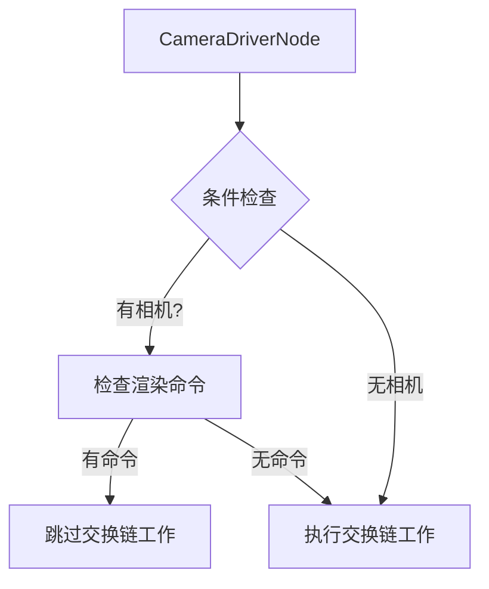

+++
title = "#20595 Make sure we submit work even if we visited a camera"
date = "2025-08-16T00:00:00"
draft = false
template = "pull_request_page.html"
in_search_index = false

[extra]
current_language = "zh-cn"
available_languages = {"en" = { name = "English", url = "/pull_request/bevy/2025-08/pr-20595-en-20250816" }, "zh-cn" = { name = "中文", url = "/pull_request/bevy/2025-08/pr-20595-zh-cn-20250816" }}
+++

# 分析报告：PR #20595 - 确保即使访问过相机也提交渲染工作

## 基本信息
- **标题**: Make sure we submit work even if we visited a camera
- **PR链接**: https://github.com/bevyengine/bevy/pull/20595
- **作者**: tychedelia
- **状态**: 已合并
- **标签**: C-Bug, A-Rendering, S-Ready-For-Final-Review
- **创建时间**: 2025-08-15T22:32:05Z
- **合并时间**: 2025-08-16T05:11:35Z
- **合并者**: alice-i-cecile

## 问题描述翻译
这是对 #20318 的替代修复方案。我们已有代码确保在 `CameraDriverNode` 中处理交换链(swapchain)，但这仅能防止没有相机(spawned cameras)的情况。我们还需要确保即使场景中存在相机，只要实际执行了任何渲染工作，就进行提交。

已在 macOS 上测试。

***

## 技术实现分析

### 问题背景
在 Bevy 的渲染系统中，`CameraDriverNode` 负责管理交换链操作。现有的保护逻辑仅处理了没有相机的情况，但当场景中存在相机却没有实际渲染工作时（例如所有相机都被禁用时），系统仍会跳过必要的交换链操作。这违反了 wgpu 的要求：只要调用了 `get_current_texture()` 和 `present()`，就必须执行交换链相关工作，否则会导致崩溃。

### 解决方案
核心思路是引入双重验证机制：
1. 保留原有的相机存在性检查
2. 新增渲染命令存在性验证

具体实现：
- 在 `RenderContext` 中添加 `has_commands()` 方法检测命令队列状态
- 在 `CameraDriverNode` 中同时验证相机存在性和命令队列状态

### 关键实现细节
在渲染上下文(`RenderContext`)中添加状态检测方法：

```rust
// 文件: crates/bevy_render/src/renderer/mod.rs
// 新增:
pub(crate) fn has_commands(&mut self) -> bool {
    self.command_encoder.is_some() || !self.command_buffer_queue.is_empty()
}
```
该方法通过检查两个条件判断是否存在待处理命令：
1. `command_encoder` 是否已初始化
2. 命令缓冲区队列 `command_buffer_queue` 是否非空

在相机驱动节点中修改条件判断逻辑：
```diff
// 文件: crates/bevy_render/src/render_graph/camera_driver_node.rs
 for (id, window) in world.resource::<ExtractedWindows>().iter() {
-    if camera_windows.contains(id) {
+    if camera_windows.contains(id) && render_context.has_commands() {
         continue;
     }
```

### 技术考量
1. **条件组合逻辑**：使用 `&&` 运算符确保仅在同时满足以下条件时跳过交换链处理：
   - 窗口关联了相机 (`camera_windows.contains(id)`)
   - 存在实际渲染命令 (`render_context.has_commands()`)

2. **状态检测设计**：
   - 检测 `command_encoder` 存在：表示已开始记录命令
   - 检测 `command_buffer_queue` 非空：表示有待提交的命令缓冲区
   - 两者任一成立即视为存在有效工作

3. **执行路径覆盖**：
   - 无相机窗口：始终执行交换链工作（原有行为保留）
   - 有相机但无渲染命令：新增执行交换链工作
   - 有相机且有渲染命令：跳过交换链工作（原有行为）

### 影响与验证
1. **问题修复**：解决了 #20318 报告的崩溃问题，确保在无渲染命令时仍正确处理交换链
2. **兼容性**：保持原有工作流程不变，仅扩展边界条件处理
3. **测试验证**：已在 macOS 平台验证功能正确性

## 关键文件变更

### 1. 渲染上下文扩展 (crates/bevy_render/src/renderer/mod.rs)
```diff
@@ -509,6 +509,10 @@ impl<'w> RenderContext<'w> {
         })
     }
 
+    pub(crate) fn has_commands(&mut self) -> bool {
+        self.command_encoder.is_some() || !self.command_buffer_queue.is_empty()
+    }
+
     /// Creates a new [`TrackedRenderPass`] for the context,
     /// configured using the provided `descriptor`.
     pub fn begin_tracked_render_pass<'a>(
```
**变更说明**：  
新增 `has_commands()` 方法用于检测当前渲染上下文是否存在待处理命令，为相机驱动节点提供状态判断依据。

### 2. 相机驱动节点逻辑增强 (crates/bevy_render/src/render_graph/camera_driver_node.rs)
```diff
@@ -63,7 +63,7 @@ impl Node for CameraDriverNode {
         // wgpu (and some backends) require doing work for swap chains if you call `get_current_texture()` and `present()`
         // This ensures that Bevy doesn't crash, even when there are no cameras (and therefore no work submitted).
         for (id, window) in world.resource::<ExtractedWindows>().iter() {
-            if camera_windows.contains(id) {
+            if camera_windows.contains(id) && render_context.has_commands() {
                 continue;
             }
```
**变更说明**：  
修改交换链工作提交条件，现在仅当窗口关联了相机**且**存在渲染命令时才跳过交换链操作。这确保了即使存在相机但无渲染工作时，仍执行必要的交换链处理。

## 组件关系图


## 延伸阅读
1. [wgpu 交换链文档](https://docs.rs/wgpu/latest/wgpu/struct.Surface.html#method.get_current_texture)
2. [Bevy 渲染图架构](https://bevyengine.org/learn/book/getting-started/rendering/)
3. [相关 Issue #20318](https://github.com/bevyengine/bevy/issues/20318)