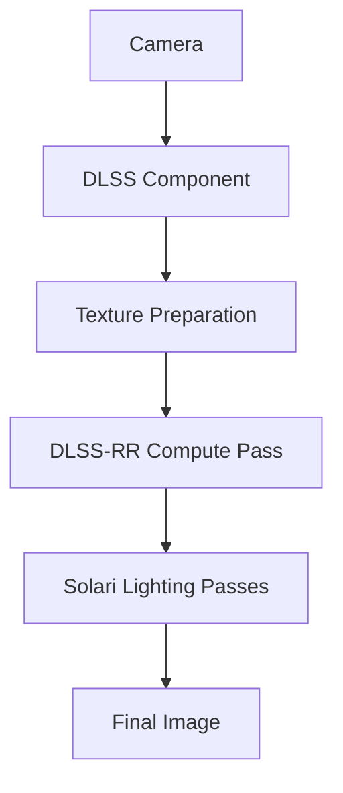

+++
title = "#20596 Optional DLSS-RR support in Solari"
date = "2025-08-16T00:00:00"
draft = false
template = "pull_request_page.html"
in_search_index = true

[taxonomies]
list_display = ["show"]

[extra]
current_language = "en"
available_languages = {"en" = { name = "English", url = "/pull_request/bevy/2025-08/pr-20596-en-20250816" }, "zh-cn" = { name = "中文", url = "/pull_request/bevy/2025-08/pr-20596-zh-cn-20250816" }}
labels = ["C-Feature", "A-Rendering"]
+++

# Technical Analysis of PR #20596: Optional DLSS-RR Support in Solari

## Basic Information
- **Title**: Optional DLSS-RR support in Solari
- **PR Link**: https://github.com/bevyengine/bevy/pull/20596
- **Author**: JMS55
- **Status**: MERGED
- **Labels**: C-Feature, A-Rendering, S-Ready-For-Final-Review, M-Needs-Release-Note
- **Created**: 2025-08-15T23:11:33Z
- **Merged**: 2025-08-16T18:17:50Z
- **Merged By**: alice-i-cecile

## The Story of This Pull Request

### Problem and Context
Solari, Bevy's experimental real-time ray tracing solution, initially lacked built-in denoising and anti-aliasing capabilities. Without these features, ray-traced images exhibited significant noise artifacts that required either computationally expensive sampling techniques or external post-processing to resolve. This limitation hindered both visual quality and performance, particularly on complex scenes. Additionally, Solari didn't leverage modern upscaling technologies that could reduce rendering costs while maintaining image quality.

### Solution Approach
The implementation adds optional support for NVIDIA's DLSS Ray Reconstruction (DLSS-RR) as an integrated solution for denoising, anti-aliasing, and upscaling. The approach maintains Solari's core architecture while conditionally enabling DLSS-RR when both the feature flag is enabled and compatible hardware is detected. Key design decisions include:

1. **Optional Integration**: DLSS-RR is gated behind a `dlss` feature flag to avoid imposing dependencies on all users
2. **Minimal API Changes**: Users enable DLSS-RR by simply adding `Dlss<DlssRayReconstructionFeature>` to their camera
3. **Texture Management**: New intermediate textures are created only when DLSS-RR is active
4. **Compute Pass Integration**: A new compute pass prepares required textures before Solari's main lighting passes

### Implementation Details
The implementation required coordinated changes across Solari's rendering pipeline:

1. **Conditional Pipeline Construction**:
```rust
// In node.rs
#[cfg(all(feature = "dlss", not(feature = "force_disable_dlss"))]
let bind_group_layout_resolve_dlss_rr_textures = render_device.create_bind_group_layout(...);
```
The render node now conditionally creates bind group layouts and pipelines for DLSS-RR only when the feature is enabled.

2. **Texture Preparation**:
```rust
// In prepare.rs
#[cfg(all(feature = "dlss", not(feature = "force_disable_dlss"))]
if has_dlss_rr {
    let diffuse_albedo = render_device.create_texture(&TextureDescriptor {
        label: Some("solari_lighting_diffuse_albedo"),
        size: view_size.to_extents(),
        format: TextureFormat::Rgba8Unorm,
        // ...
    });
    // Creates specular_albedo, normal_roughness, specular_motion_vectors
}
```
When DLSS-RR is active, four new textures are created at render time to store intermediate data required by DLSS.

3. **Compute Pass Execution**:
```rust
// In node.rs
#[cfg(all(feature = "dlss", not(feature = "force_disable_dlss"))]
if let Some(bind_group_resolve_dlss_rr_textures) = bind_group_resolve_dlss_rr_textures {
    pass.set_bind_group(2, &bind_group_resolve_dlss_rr_textures, &[]);
    pass.set_pipeline(resolve_dlss_rr_textures_pipeline);
    pass.dispatch_workgroups(dx, dy, 1);
}
```
The new compute pass runs before Solari's main lighting passes when DLSS-RR is active, populating the required textures.

4. **Shader Implementation**:
```rust
// resolve_dlss_rr_textures.wgsl
@compute @workgroup_size(8, 8, 1)
fn resolve_dlss_rr_textures(@builtin(global_invocation_id) global_id: vec3<u32>) {
    // ...
    textureStore(diffuse_albedo, pixel_id, vec4(base_color, 0.0));
    textureStore(normal_roughness, pixel_id, vec4(world_normal, perceptual_roughness));
    // ...
}
```
The new WGSL shader extracts material properties from the G-buffer and writes them to DLSS-specific textures.

### Technical Insights
1. **Conditional Compilation**: The implementation uses Rust's `#[cfg]` attributes extensively to ensure DLSS code only compiles when explicitly enabled
2. **Texture Optimization**: Textures are created with minimal mip levels and appropriate formats to reduce memory overhead
3. **Pipeline Flexibility**: The render node dynamically adjusts its query based on DLSS feature status
4. **Progressive Enhancement**: The example demonstrates how to check for DLSS support at runtime before enabling it

### Impact
1. **Visual Quality**: DLSS-RR provides integrated denoising and anti-aliasing
2. **Performance**: Upscaling reduces rendering costs while maintaining output resolution
3. **Developer Experience**: Simple API surface (single component addition) enables the feature
4. **Future Proofing**: The texture preparation pipeline establishes patterns for integrating other upscalers

## Visual Representation



## Key Files Changed

### crates/bevy_solari/src/realtime/prepare.rs (+101/-2)
Creates required textures when DLSS-RR is enabled  
```rust
// Before: No DLSS texture handling
// After:
#[cfg(all(feature = "dlss", not(feature = "force_disable_dlss"))]
if has_dlss_rr {
    // Creates diffuse_albedo, specular_albedo, 
    // normal_roughness, specular_motion_vectors
    commands.entity(entity).insert(ViewDlssRayReconstructionTextures { ... });
}
```

### crates/bevy_solari/src/realtime/node.rs (+79/-1)
Integrates DLSS-RR compute pass into rendering pipeline  
```rust
// Before: Standard Solari passes
// After:
#[cfg(all(feature = "dlss", not(feature = "force_disable_dlss"))]
if let Some(bind_group) = bind_group_resolve_dlss_rr_textures {
    pass.set_bind_group(2, &bind_group, &[]);
    pass.set_pipeline(resolve_dlss_rr_textures_pipeline);
    pass.dispatch_workgroups(dx, dy, 1);
}
```

### examples/3d/solari.rs (+30/-1)
Demonstrates DLSS-RR usage in example  
```rust
// Before: Basic camera setup
// After:
#[cfg(all(feature = "dlss", not(feature = "force_disable_dlss"))]
if dlss_rr_supported.is_some() {
    camera.insert(Dlss::<DlssRayReconstructionFeature> { ... });
}
```

### crates/bevy_solari/src/realtime/resolve_dlss_rr_textures.wgsl (+28/-0)
New shader for DLSS texture preparation  
```rust
@compute @workgroup_size(8, 8, 1)
fn resolve_dlss_rr_textures(...) {
    // Extracts material properties from G-buffer
    // Writes to DLSS-specific textures
}
```

### release-content/release-notes/bevy_solari.md (+20/-2)
Updates documentation with DLSS-RR information  
```markdown
- Updated release notes:
+## Try it out
+`cargo run --example solari --features bevy_solari,dlss`
```

## Further Reading
1. [NVIDIA DLSS Ray Reconstruction Overview](https://www.nvidia.com/en-us/geforce/technologies/dlss/ray-reconstruction/)
2. [Bevy Anti-Aliasing Documentation](https://github.com/bevyengine/bevy/tree/main/crates/bevy_anti_aliasing)
3. [WGSL Texture Operations Specification](https://gpuweb.github.io/gpuweb/wgsl/#texture-operations)