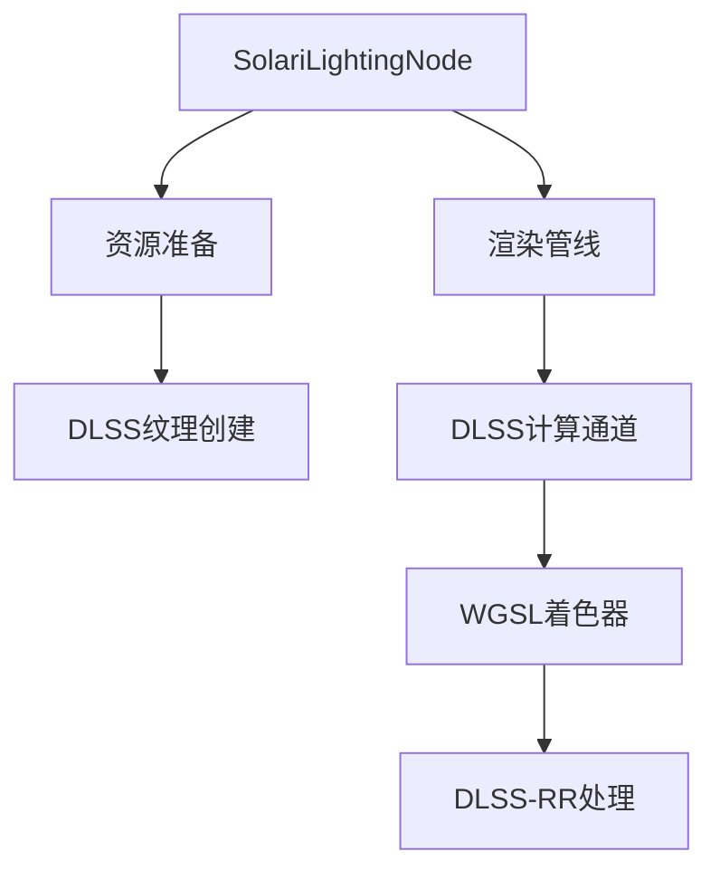

+++
title = "#20596 Optional DLSS-RR support in Solari"
date = "2025-08-16T00:00:00"
draft = false
template = "pull_request_page.html"
in_search_index = false

[extra]
current_language = "zh-cn"
available_languages = {"en" = { name = "English", url = "/pull_request/bevy/2025-08/pr-20596-en-20250816" }, "zh-cn" = { name = "中文", url = "/pull_request/bevy/2025-08/pr-20596-zh-cn-20250816" }}
+++

# 可选支持 DLSS-RR 的 Solari 光线追踪

## 基本信息
- **标题**: Optional DLSS-RR support in Solari
- **PR链接**: https://github.com/bevyengine/bevy/pull/20596
- **作者**: JMS55
- **状态**: 已合并
- **标签**: C-Feature, A-Rendering, S-Ready-For-Final-Review, M-Needs-Release-Note
- **创建时间**: 2025-08-15T23:11:33Z
- **合并时间**: 2025-08-16T18:17:50Z
- **合并者**: alice-i-cecile

## 描述翻译
### 目标
- 为 Solari 添加去噪器（同时包含上采样器，可显著降低 Solari 开销）和抗锯齿功能

### 解决方案
- 添加对 DLSS-RR 的可选支持。用户需要使用 `dlss` 特性编译，然后在相机中添加 `Dlss<DlssRayReconstructionFeature>`。Solari 会处理剩余部分。

### 测试
已启用/禁用 DLSS 进行测试

### 效果展示

未启用 DLSS-RR


启用 DLSS-RR


## 本PR的技术实现过程

### 问题背景
Bevy 的 Solari 光线追踪系统在实时模式下存在两个关键问题：
1. 缺乏内置的去噪器导致渲染结果噪点明显
2. 完整分辨率渲染的计算开销较高

DLSS-RR（深度学习超级采样-光线重建）能同时解决这两个问题：
- 作为AI驱动的去噪器提升图像质量
- 通过智能上采样降低实际渲染分辨率
- 提供抗锯齿功能

### 解决方案选择
实现方案聚焦于：
1. 添加可选编译支持（`dlss`特性标志）
2. 动态创建DLSS-RR所需的纹理资源
3. 在渲染管线中添加新的计算通道
4. 提供WGSL着色器进行GBuffer数据转换
5. 更新示例展示用法

### 核心实现细节
**特性标志配置**：
在`bevy_internal/Cargo.toml`中扩展了特性标志：
```toml
dlss = ["bevy_anti_aliasing/dlss", "bevy_solari?/dlss"]
force_disable_dlss = [
  "bevy_anti_aliasing?/force_disable_dlss",
  "bevy_solari?/force_disable_dlss",
]
```

**资源准备系统**：
在`prepare_solari_lighting_resources`中动态创建DLSS-RR所需的纹理：
```rust
// 创建漫反射反照率纹理
let diffuse_albedo = render_device.create_texture(&TextureDescriptor {
    label: Some("solari_lighting_diffuse_albedo"),
    size: view_size.to_extents(),
    format: TextureFormat::Rgba8Unorm,
    usage: TextureUsages::TEXTURE_BINDING | TextureUsages::STORAGE_BINDING,
    // ...其他参数
});
```

**渲染管线扩展**：
在`SolariLightingNode`中添加了新的计算通道：
```rust
#[cfg(all(feature = "dlss", not(feature = "force_disable_dlss"))]
if let Some(bind_group_resolve_dlss_rr_textures) = bind_group_resolve_dlss_rr_textures {
    pass.set_bind_group(2, &bind_group_resolve_dlss_rr_textures, &[]);
    pass.set_pipeline(resolve_dlss_rr_textures_pipeline);
    pass.dispatch_workgroups(dx, dy, 1);
}
```

**WGSL着色器**：
新增`resolve_dlss_rr_textures.wgsl`处理GBuffer数据转换：
```wgsl
@compute @workgroup_size(8, 8, 1)
fn resolve_dlss_rr_textures(@builtin(global_invocation_id) global_id: vec3<u32>) {
    // 从GBuffer提取数据
    let gpixel = textureLoad(gbuffer, pixel_id, 0);
    let base_rough = unpack4x8unorm(gpixel.r);
    let base_color = pow(base_rough.rgb, vec3(2.2));
    let world_normal = octahedral_decode(unpack_24bit_normal(gpixel.a));
    
    // 写入DLSS-RR所需纹理
    textureStore(diffuse_albedo, pixel_id, vec4(base_color, 0.0));
    textureStore(normal_roughness, pixel_id, vec4(world_normal, perceptual_roughness));
}
```

**示例集成**：
在solari示例中添加DLSS支持：
```rust
#[cfg(all(feature = "dlss", not(feature = "force_disable_dlss"))]
if dlss_rr_supported.is_some() {
    camera.insert(Dlss::<DlssRayReconstructionFeature> {
        perf_quality_mode: Default::default(),
        // ...其他配置
    });
}
```

### 技术考量
1. **条件编译**：使用`#[cfg]`属性确保DLSS代码只在启用特性时编译
2. **资源管理**：动态创建纹理避免固定分配开销
3. **管线扩展**：在现有管线中添加新计算通道保持架构一致
4. **向后兼容**：未启用特性时保持原有行为不变

### 实际影响
1. **性能优化**：通过上采样降低实际渲染分辨率
2. **质量提升**：DLSS-RR提供高质量去噪和抗锯齿
3. **使用成本**：需要NVIDIA RTX GPU支持
4. **配置简化**：通过特性标志和组件添加启用

## 组件关系图



## 关键文件变更

### `crates/bevy_solari/src/realtime/prepare.rs` (+101/-2)
**变更原因**：添加DLSS-RR所需的纹理资源创建逻辑  
**关键代码**：
```rust
#[cfg(all(feature = "dlss", not(feature = "force_disable_dlss"))]
if has_dlss_rr {
    // 创建四种DLSS-RR所需纹理
    let diffuse_albedo = render_device.create_texture(...);
    let specular_albedo = render_device.create_texture(...);
    let normal_roughness = render_device.create_texture(...);
    let specular_motion_vectors = render_device.create_texture(...);
    
    // 插入纹理组件
    commands.entity(entity).insert(ViewDlssRayReconstructionTextures {
        diffuse_albedo: ...,
        specular_albedo: ...,
        normal_roughness: ...,
        specular_motion_vectors: ...,
    });
}
```

### `crates/bevy_solari/src/realtime/node.rs` (+79/-1)
**变更原因**：在渲染管线中添加DLSS-RR处理通道  
**关键代码**：
```rust
// 添加新的绑定组布局
#[cfg(all(feature = "dlss", not(feature = "force_disable_dlss"))]
bind_group_layout_resolve_dlss_rr_textures: BindGroupLayout,

// 添加新的计算管线
#[cfg(all(feature = "dlss", not(feature = "force_disable_dlss"))]
resolve_dlss_rr_textures_pipeline: CachedComputePipelineId,

// 运行时调度新通道
#[cfg(all(feature = "dlss", not(feature = "force_disable_dlss"))]
if let Some(bind_group) = bind_group_resolve_dlss_rr_textures {
    pass.set_bind_group(2, &bind_group, &[]);
    pass.set_pipeline(resolve_dlss_rr_textures_pipeline);
    pass.dispatch_workgroups(dx, dy, 1);
}
```

### `examples/3d/solari.rs` (+30/-1)
**变更原因**：在示例中展示如何启用DLSS-RR  
**关键代码**：
```rust
// 插入DLSS项目ID
#[cfg(all(feature = "dlss", not(feature = "force_disable_dlss"))]
app.insert_resource(DlssProjectId(bevy_asset::uuid::uuid!(
    "5417916c-0291-4e3f-8f65-326c1858ab96"
)));

// 条件添加DLSS组件
#[cfg(all(feature = "dlss", not(feature = "force_disable_dlss"))]
if dlss_rr_supported.is_some() {
    camera.insert(Dlss::<DlssRayReconstructionFeature> {
        perf_quality_mode: Default::default(),
        // ...
    });
}
```

### `crates/bevy_solari/src/realtime/resolve_dlss_rr_textures.wgsl` (+28/-0)
**变更原因**：新增着色器处理GBuffer到DLSS-RR纹理的转换  
**关键代码**：
```wgsl
@group(1) @binding(7) var gbuffer: texture_2d<u32>;
@group(2) @binding(0) var diffuse_albedo: texture_storage_2d<rgba8unorm, write>;

fn resolve_dlss_rr_textures(...) {
    // 从GBuffer解包数据
    let gpixel = textureLoad(gbuffer, pixel_id, 0);
    let base_rough = unpack4x8unorm(gpixel.r);
    
    // 写入输出纹理
    textureStore(diffuse_albedo, pixel_id, vec4(base_color, 0.0));
}
```

### `release-content/release-notes/bevy_solari.md` (+20/-2)
**变更原因**：更新发布说明文档包含DLSS-RR信息  
**关键变更**：
```markdown
+## Try it out
+
+Additionally, if you have a NVIDIA GPU, you can enable DLSS Ray Reconstruction...
+`cargo run --release --example solari --features bevy_solari,dlss`.
```

## 延伸阅读

1. [NVIDIA DLSS 技术文档](https://developer.nvidia.com/dlss)
2. [WGSL 着色语言规范](https://gpuweb.github.io/gpuweb/wgsl/)
3. [Bevy 渲染管线架构](https://bevyengine.org/learn/book/getting-started/rendering/)
4. [现代实时光线追踪技术](https://arxiv.org/abs/2203.07932)