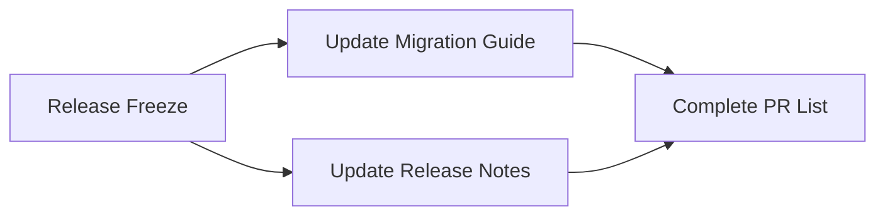

+++
title = "#20597 Update the list of `RenderStartup` PRs in the release notes."
date = "2025-08-16T00:00:00"
draft = false
template = "pull_request_page.html"
in_search_index = false

[extra]
current_language = "zh-cn"
available_languages = {"en" = { name = "English", url = "/pull_request/bevy/2025-08/pr-20597-en-20250816" }, "zh-cn" = { name = "中文", url = "/pull_request/bevy/2025-08/pr-20597-zh-cn-20250816" }}
labels = ["C-Docs", "D-Trivial", "A-Rendering"]
+++

# Update the list of `RenderStartup` PRs in the release notes.

## Basic Information
- **Title**: Update the list of `RenderStartup` PRs in the release notes.
- **PR Link**: https://github.com/bevyengine/bevy/pull/20597
- **Author**: andriyDev
- **Status**: MERGED
- **Labels**: C-Docs, D-Trivial, A-Rendering, S-Ready-For-Final-Review
- **Created**: 2025-08-15T23:27:05Z
- **Merged**: 2025-08-16T00:04:55Z
- **Merged By**: alice-i-cecile

## Description Translation
我停止更新它是因为它导致了合并冲突，但现在一切都已经冻结，所以是更新的好时机。

## The Story of This Pull Request

### 问题背景
在 Bevy 引擎的开发周期中，`RenderStartup` 是一个重要的渲染架构改进。多个相关的 pull requests 被合并以实现这项改进，这些 PR 需要记录在发布说明和迁移指南中。然而，在开发过程中持续更新这些列表会导致频繁的合并冲突，因为多个贡献者同时修改相关文档。

### 解决方案
在发布周期冻结后（此时文档不再频繁变动），维护人员选择一次性更新两个关键文档：
1. 迁移指南 (`render_startup.md`)
2. 发布说明 (`render_startup.md`)

更新操作直接扩展两个文件中的 `pull_requests` 列表，添加所有缺失的 PR 编号。这种处理方式避免了开发期间的文档冲突，同时确保了发布前文档的完整性。

### 技术实现
修改完全集中在两个 Markdown 文件的 front matter 部分，仅更新 YAML 格式的 `pull_requests` 列表。原始列表包含 9 个 PR 编号，更新后扩展到 19 个。这些编号按时间顺序排列，确保历史记录的准确性。

### 影响与价值
1. **文档完整性**：完整记录了所有参与 `RenderStartup` 重构的贡献
2. **可追溯性**：开发者可通过链接查看具体的技术实现
3. **维护效率**：在发布冻结期更新避免了开发期间的合并冲突
4. **迁移准确性**：确保用户迁移时能参考所有相关变更

## Visual Representation



## Key Files Changed

### 1. `release-content/migration-guides/render_startup.md`
**变更原因**：确保迁移指南包含所有相关 PR 的引用

```markdown
--- a/release-content/migration-guides/render_startup.md
+++ b/release-content/migration-guides/render_startup.md
@@ -1,6 +1,6 @@
 ---
 title: Many render resources now initialized in `RenderStartup`
-pull_requests: [19841, 19926, 19885, 19886, 19897, 19898, 19901, 20002, 20147]
+pull_requests: [19841, 19885, 19886, 19897, 19898, 19901, 19912, 19926, 19999, 20002, 20024, 20124, 20147, 20184, 20194, 20195, 20208, 20209, 20210]
 ---
```

### 2. `release-content/release-notes/render_startup.md`
**变更原因**：确保发布说明包含完整的贡献记录

```markdown
--- a/release-content/release-notes/render_startup.md
+++ b/release-content/release-notes/render_startup.md
@@ -1,7 +1,7 @@
 ---
 title: "`RenderStartup` and making the renderer my ECS-y"
 authors: ["@IceSentry", "@andriyDev"]
-pull_requests: [19841, 19926, 19885, 19886, 19897, 19898, 19901]
+pull_requests: [19841, 19885, 19886, 19897, 19898, 19901, 19912, 19926, 19999, 20002, 20024, 20124, 20147, 20184, 20194, 20195, 20208, 20209, 20210]
 ---
```

## Further Reading
1. [Bevy 发布流程文档](https://github.com/bevyengine/bevy/blob/main/docs/plugins_guidelines.md#release-process)
2. [Front Matter 规范](https://jekyllrb.com/docs/front-matter/)
3. [原始 RenderStartup 架构讨论](https://github.com/bevyengine/bevy/pull/19841)