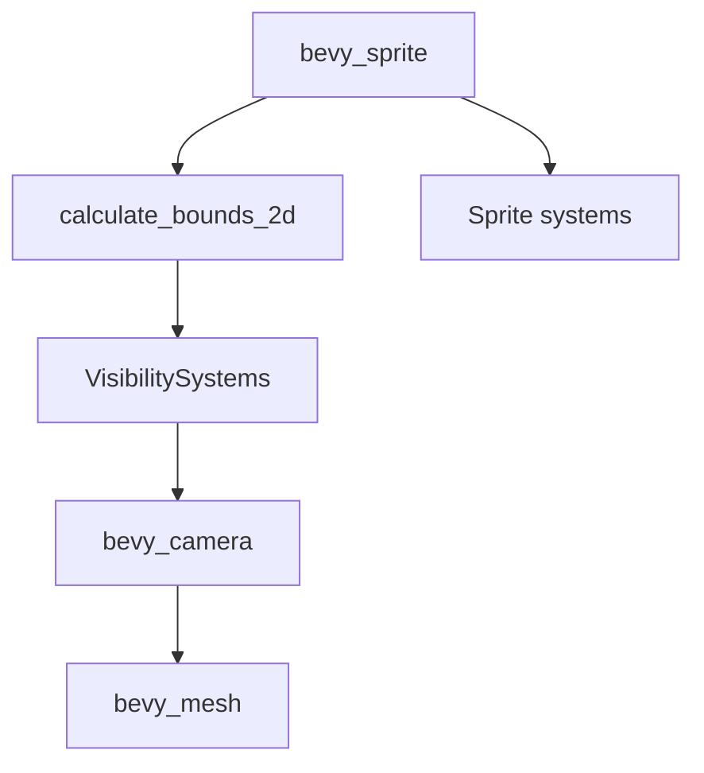

+++
title = "#20599 Move calculate_bounds_2d back to bevy_sprite"
date = "2025-08-16T00:00:00"
draft = false
template = "pull_request_page.html"
in_search_index = true

[taxonomies]
list_display = ["show"]

[extra]
current_language = "en"
available_languages = {"en" = { name = "English", url = "/pull_request/bevy/2025-08/pr-20599-en-20250816" }, "zh-cn" = { name = "中文", url = "/pull_request/bevy/2025-08/pr-20599-zh-cn-20250816" }}
labels = ["A-Rendering"]
+++

## Move calculate_bounds_2d back to bevy_sprite

### Basic Information
- **Title**: Move calculate_bounds_2d back to bevy_sprite
- **PR Link**: https://github.com/bevyengine/bevy/pull/20599
- **Author**: atlv24
- **Status**: MERGED
- **Labels**: A-Rendering, S-Ready-For-Final-Review
- **Created**: 2025-08-16T02:03:23Z
- **Merged**: 2025-08-16T04:58:16Z
- **Merged By**: alice-i-cecile

### Description Translation
# Objective

- Revert an unnecessary system move from #20587
- bevy_mesh is already depended on transiently by bevy_camera so its not adding deps

## Solution

- put it back

## Testing

- cargo check --examples

### The Story of This Pull Request

This PR addresses an unnecessary relocation of the `calculate_bounds_2d` system that occurred in PR #20587. The original move placed this visibility calculation system in `bevy_sprite_render`, but this location wasn't optimal for the system's dependencies and responsibilities.

The core issue was that moving `calculate_bounds_2d` to `bevy_sprite_render` created an artificial separation between sprite functionality and visibility calculations. The `bevy_sprite` module already contained related sprite handling logic, making it the more natural home for this system. Additionally, the dependency on `bevy_mesh` wasn't actually introducing new transitive dependencies since `bevy_camera` already depended on `bevy_mesh` through its visibility systems.

The solution was straightforward: revert the system's location back to `bevy_sprite`. This required adding `bevy_mesh` as a dependency to `bevy_sprite`'s Cargo.toml, but since the dependency chain already existed through `bevy_camera`, this didn't introduce new dependency overhead. The system registration was moved from `SpriteRenderingPlugin` to `SpritePlugin`, maintaining its placement in the `VisibilitySystems::CalculateBounds` system set.

The implementation preserves all functionality of `calculate_bounds_2d`, which calculates axis-aligned bounding boxes (AABBs) for 2D entities. It handles both mesh-based entities (via `Mesh2d` components) and sprite-based entities (via `Sprite` components), accounting for custom sizes, texture atlases, and anchor points. The system efficiently updates AABBs only when necessary by using change detection filters:

```rust
// Only recalculate when Sprite or Anchor change
sprites_to_recalculate_aabb: Query<
    (Entity, &Sprite, &Anchor),
    (
        Or<(Without<Aabb>, Changed<Sprite>, Changed<Anchor>)>,
        Without<NoFrustumCulling>,
    ),
>
```

The comprehensive test suite was also moved intact, verifying correct AABB calculation for various sprite configurations including:
- Initial AABB creation for image sprites
- AABB updates when sprite properties change
- Correct AABB calculation for sprites with custom rectangles and anchor points

The impact of this change is improved code organization and maintainability. By colocating the visibility calculation with related sprite logic, we reduce cross-module dependencies and make the system easier to locate and modify. The dependency graph remains efficient since we're leveraging existing transient dependencies rather than introducing new ones.

### Visual Representation



### Key Files Changed

1. `crates/bevy_sprite/Cargo.toml` (+1/-0)  
   Added `bevy_mesh` dependency to support AABB calculations:
   ```toml
   bevy_mesh = { path = "../bevy_mesh", version = "0.17.0-dev" }
   ```

2. `crates/bevy_sprite/src/lib.rs` (+215/-1)  
   Moved system implementation and tests from render module:
   ```rust
   // System registration in SpritePlugin
   app.add_systems(
       PostUpdate,
       calculate_bounds_2d.in_set(VisibilitySystems::CalculateBounds),
   );
   
   // Full system implementation
   pub fn calculate_bounds_2d(
       mut commands: Commands,
       meshes: Res<Assets<Mesh>>,
       // ... other dependencies
   ) {
       // Handles mesh entities
       for (entity, mesh_handle) in &meshes_without_aabb {
           if let Some(mesh) = meshes.get(&mesh_handle.0)
               && let Some(aabb) = mesh.compute_aabb()
           {
               commands.entity(entity).try_insert(aabb);
           }
       }
       
       // Handles sprite entities
       for (entity, sprite, anchor) in &sprites_to_recalculate_aabb {
           if let Some(size) = /* size calculation logic */ {
               let aabb = Aabb {
                   center: (-anchor.as_vec() * size).extend(0.0).into(),
                   half_extents: (0.5 * size).extend(0.0).into(),
               };
               commands.entity(entity).try_insert(aabb);
           }
       }
   }
   ```

3. `crates/bevy_sprite_render/src/lib.rs` (+7/-221)  
   Removed system and tests from rendering module:
   ```rust
   // Before:
   app.add_systems(
       PostUpdate,
       (
           calculate_bounds_2d.in_set(VisibilitySystems::CalculateBounds),
           // ... other systems
       )
   );
   
   // After:
   app.add_systems(
       PostUpdate,
       (
           compute_slices_on_asset_event.before(AssetEventSystems),
           compute_slices_on_sprite_change,
       )
           .in_set(SpriteSystems::ComputeSlices),
   );
   
   // Entire calculate_bounds_2d implementation and tests removed
   ```

### Further Reading
- [Bevy ECS System Sets](https://bevyengine.org/learn/book/getting-started/ecs/#system-sets)
- [Bevy Visibility Systems](https://github.com/bevyengine/bevy/blob/main/crates/bevy_camera/src/visibility.rs)
- [Axis-Aligned Bounding Boxes](https://developer.nvidia.com/blog/thinking-parallel-part-i-collision-detection-gpu/)

### Full Code Diff
<details>
<summary>View full diff</summary>

```diff
diff --git a/crates/bevy_sprite/Cargo.toml b/crates/bevy_sprite/Cargo.toml
index d0ea9b6e51578..8339230d6f4c6 100644
--- a/crates/bevy_sprite/Cargo.toml
+++ b/crates/bevy_sprite/Cargo.toml
@@ -19,6 +19,7 @@ bevy_color = { path = "../bevy_color", version = "0.17.0-dev" }
 bevy_ecs = { path = "../bevy_ecs", version = "0.17.0-dev" }
 bevy_image = { path = "../bevy_image", version = "0.17.0-dev" }
 bevy_camera = { path = "../bevy_camera", version = "0.17.0-dev" }
+bevy_mesh = { path = "../bevy_mesh", version = "0.17.0-dev" }
 bevy_math = { path = "../bevy_math", version = "0.17.0-dev" }
 bevy_picking = { path = "../bevy_picking", version = "0.17.0-dev", optional = true }
 bevy_reflect = { path = "../bevy_reflect", version = "0.17.0-dev" }
diff --git a/crates/bevy_sprite/src/lib.rs b/crates/bevy_sprite/src/lib.rs
index 500ebdf778a3f..5f5a2de77c415 100644
--- a/crates/bevy_sprite/src/lib.rs
+++ b/crates/bevy_sprite/src/lib.rs
@@ -32,6 +32,12 @@ pub mod prelude {
     };
 }
 
+use bevy_asset::Assets;
+use bevy_camera::{
+    primitives::{Aabb, MeshAabb},
+    visibility::{NoFrustumCulling, VisibilitySystems},
+};
+use bevy_mesh::{Mesh, Mesh2d};
 #[cfg(feature = "bevy_sprite_picking_backend")]
 pub use picking_backend::*;
 pub use sprite::*;
@@ -39,7 +45,7 @@ pub use texture_slice::*;
 
 use bevy_app::prelude::*;
 use bevy_ecs::prelude::*;
-use bevy_image::TextureAtlasPlugin;
+use bevy_image::{Image, TextureAtlasLayout, TextureAtlasPlugin};
 
 /// Adds support for 2D sprites.
 #[derive(Default)]
@@ -61,8 +67,216 @@ impl Plugin for SpritePlugin {
         if !app.is_plugin_added::<TextureAtlasPlugin>() {
             app.add_plugins(TextureAtlasPlugin);
         }
+        app.add_systems(
+            PostUpdate,
+            calculate_bounds_2d.in_set(VisibilitySystems::CalculateBounds),
+        );
 
         #[cfg(feature = "bevy_sprite_picking_backend")]
         app.add_plugins(SpritePickingPlugin);
     }
 }
+
+/// System calculating and inserting an [`Aabb`] component to entities with either:
+/// - a `Mesh2d` component,
+/// - a `Sprite` and `Handle<Image>` components,
+///   and without a [`NoFrustumCulling`] component.
+///
+/// Used in system set [`VisibilitySystems::CalculateBounds`].
+pub fn calculate_bounds_2d(
+    mut commands: Commands,
+    meshes: Res<Assets<Mesh>>,
+    images: Res<Assets<Image>>,
+    atlases: Res<Assets<TextureAtlasLayout>>,
+    meshes_without_aabb: Query<(Entity, &Mesh2d), (Without<Aabb>, Without<NoFrustumCulling>)>,
+    sprites_to_recalculate_aabb: Query<
+        (Entity, &Sprite, &Anchor),
+        (
+            Or<(Without<Aabb>, Changed<Sprite>, Changed<Anchor>)>,
+            Without<NoFrustumCulling>,
+        ),
+    >,
+) {
+    for (entity, mesh_handle) in &meshes_without_aabb {
+        if let Some(mesh) = meshes.get(&mesh_handle.0)
+            && let Some(aabb) = mesh.compute_aabb()
+        {
+            commands.entity(entity).try_insert(aabb);
+        }
+    }
+    for (entity, sprite, anchor) in &sprites_to_recalculate_aabb {
+        if let Some(size) = sprite
+            .custom_size
+            .or_else(|| sprite.rect.map(|rect| rect.size()))
+            .or_else(|| match &sprite.texture_atlas {
+                // We default to the texture size for regular sprites
+                None => images.get(&sprite.image).map(Image::size_f32),
+                // We default to the drawn rect for atlas sprites
+                Some(atlas) => atlas
+                    .texture_rect(&atlases)
+                    .map(|rect| rect.size().as_vec2()),
+            })
+        {
+            let aabb = Aabb {
+                center: (-anchor.as_vec() * size).extend(0.0).into(),
+                half_extents: (0.5 * size).extend(0.0).into(),
+            };
+            commands.entity(entity).try_insert(aabb);
+        }
+    }
+}
+
+#[cfg(test)]
+mod test {
+    use super::*;
+    use bevy_math::{Rect, Vec2, Vec3A};
+
+    #[test]
+    fn calculate_bounds_2d_create_aabb_for_image_sprite_entity() {
+        // Setup app
+        let mut app = App::new();
+
+        // Add resources and get handle to image
+        let mut image_assets = Assets::<Image>::default();
+        let image_handle = image_assets.add(Image::default());
+        app.insert_resource(image_assets);
+        let mesh_assets = Assets::<Mesh>::default();
+        app.insert_resource(mesh_assets);
+        let texture_atlas_assets = Assets::<TextureAtlasLayout>::default();
+        app.insert_resource(texture_atlas_assets);
+
+        // Add system
+        app.add_systems(Update, calculate_bounds_2d);
+
+        // Add entities
+        let entity = app.world_mut().spawn(Sprite::from_image(image_handle)).id();
+
+        // Verify that the entity does not have an AABB
+        assert!(!app
+            .world()
+            .get_entity(entity)
+            .expect("Could not find entity")
+            .contains::<Aabb>());
+
+        // Run system
+        app.update();
+
+        // Verify the AABB exists
+        assert!(app
+            .world()
+            .get_entity(entity)
+            .expect("Could not find entity")
+            .contains::<Aabb>());
+    }
+
+    #[test]
+    fn calculate_bounds_2d_update_aabb_when_sprite_custom_size_changes_to_some() {
+        // Setup app
+        let mut app = App::new();
+
+        // Add resources and get handle to image
+        let mut image_assets = Assets::<Image>::default();
+        let image_handle = image_assets.add(Image::default());
+        app.insert_resource(image_assets);
+        let mesh_assets = Assets::<Mesh>::default();
+        app.insert_resource(mesh_assets);
+        let texture_atlas_assets = Assets::<TextureAtlasLayout>::default();
+        app.insert_resource(texture_atlas_assets);
+
+        // Add system
+        app.add_systems(Update, calculate_bounds_2d);
+
+        // Add entities
+        let entity = app
+            .world_mut()
+            .spawn(Sprite {
+                custom_size: Some(Vec2::ZERO),
+                image: image_handle,
+                ..Sprite::default()
+            })
+            .id();
+
+        // Create initial AABB
+        app.update();
+
+        // Get the initial AABB
+        let first_aabb = *app
+            .world()
+            .get_entity(entity)
+            .expect("Could not find entity")
+            .get::<Aabb>()
+            .expect("Could not find initial AABB");
+
+        // Change `custom_size` of sprite
+        let mut binding = app
+            .world_mut()
+            .get_entity_mut(entity)
+            .expect("Could not find entity");
+        let mut sprite = binding
+            .get_mut::<Sprite>()
+            .expect("Could not find sprite component of entity");
+        sprite.custom_size = Some(Vec2::ONE);
+
+        // Re-run the `calculate_bounds_2d` system to get the new AABB
+        app.update();
+
+        // Get the re-calculated AABB
+        let second_aabb = *app
+            .world()
+            .get_entity(entity)
+            .expect("Could not find entity")
+            .get::<Aabb>()
+            .expect("Could not find second AABB");
+
+        // Check that the AABBs are not equal
+        assert_ne!(first_aabb, second_aabb);
+    }
+
+    #[test]
+    fn calculate_bounds_2d_correct_aabb_for_sprite_with_custom_rect() {
+        // Setup app
+        let mut app = App::new();
+
+        // Add resources and get handle to image
+        let mut image_assets = Assets::<Image>::default();
+        let image_handle = image_assets.add(Image::default());
+        app.insert_resource(image_assets);
+        let mesh_assets = Assets::<Mesh>::default();
+        app.insert_resource(mesh_assets);
+        let texture_atlas_assets = Assets::<TextureAtlasLayout>::default();
+        app.insert_resource(texture_atlas_assets);
+
+        // Add system
+        app.add_systems(Update, calculate_bounds_2d);
+
+        // Add entities
+        let entity = app
+            .world_mut()
+            .spawn((
+                Sprite {
+                    rect: Some(Rect::new(0., 0., 0.5, 1.)),
+                    image: image_handle,
+                    ..Sprite::default()
+                },
+                Anchor::TOP_RIGHT,
+            ))
+            .id();
+
+        // Create AABB
+        app.update();
+
+        // Get the AABB
+        let aabb = *app
+            .world_mut()
+            .get_entity(entity)
+            .expect("Could not find entity")
+            .get::<Aabb>()
+            .expect("Could not find AABB");
+
+        // Verify that the AABB is at the expected position
+        assert_eq!(aabb.center, Vec3A::new(-0.25, -0.5, 0.));
+
+        // Verify that the AABB has the expected size
+        assert_eq!(aabb.half_extents, Vec3A::new(0.25, 0.5, 0.));
+    }
+}
diff --git a/crates/bevy_sprite_render/src/lib.rs b/crates/bevy_sprite_render/src/lib.rs
index d1a119cebd2a4..5819a5da63766 100644
--- a/crates/bevy_sprite_render/src/lib.rs
+++ b/crates/bevy_sprite_render/src/lib.rs
@@ -23,10 +23,6 @@ pub mod prelude {
     pub use crate::{ColorMaterial, MeshMaterial2d};
 }
 
-use bevy_camera::{
-    primitives::{Aabb, MeshAabb as _},
-    visibility::{NoFrustumCulling, VisibilitySystems},
-};
 use bevy_shader::load_shader_library;
 pub use mesh2d::*;
 pub use render::*;
@@ -34,17 +30,17 @@ pub(crate) use texture_slice::*;
 pub use tilemap_chunk::*;
 
 use bevy_app::prelude::*;
-use bevy_asset::{embedded_asset, AssetEventSystems, Assets};
+use bevy_asset::{embedded_asset, AssetEventSystems};
 use bevy_core_pipeline::core_2d::{AlphaMask2d, Opaque2d, Transparent2d};
 use bevy_ecs::prelude::*;
 use bevy_image::{prelude::*, TextureAtlasPlugin};
-use bevy_mesh::{Mesh, Mesh2d};
+use bevy_mesh::Mesh2d;
 use bevy_render::{
     batching::sort_binned_render_phase, render_phase::AddRenderCommand,
     render_resource::SpecializedRenderPipelines, sync_world::SyncToRenderWorld, ExtractSchedule,
     Render, RenderApp, RenderStartup, RenderSystems,
 };
-use bevy_sprite::{Anchor, Sprite};
+use bevy_sprite::Sprite;
 
 /// Adds support for 2D sprite rendering.
 #[derive(Default)]
@@ -80,13 +76,10 @@ impl Plugin for SpriteRenderingPlugin {
         .add_systems(
             PostUpdate,
             (
-                calculate_bounds_2d.in_set(VisibilitySystems::CalculateBounds),
-                (
-                    compute_slices_on_asset_event.before(AssetEventSystems),
-                    compute_slices_on_sprite_change,
-                )
-                    .in_set(SpriteSystems::ComputeSlices),
-            ),
+                compute_slices_on_asset_event.before(AssetEventSystems),
+                compute_slices_on_sprite_change,
+            )
+                .in_set(SpriteSystems::ComputeSlices),
         );
 
         app.register_required_components::<Sprite, SyncToRenderWorld>();
@@ -124,210 +117,3 @@ impl Plugin for SpriteRenderingPlugin {
         };
     }
 }
-
-/// System calculating and inserting an [`Aabb`] component to entities with either:
-/// - a `Mesh2d` component,
-/// - a `Sprite` and `Handle<Image>` components,
-///   and without a [`NoFrustumCulling`] component.
-///
-/// Used in system set [`VisibilitySystems::CalculateBounds`].
-pub fn calculate_bounds_2d(
-    mut commands: Commands,
-    meshes: Res<Assets<Mesh>>,
-    images: Res<Assets<Image>>,
-    atlases: Res<Assets<TextureAtlasLayout>>,
-    meshes_without_aabb: Query<(Entity, &Mesh2d), (Without<Aabb>, Without<NoFrustumCulling>)>,
-    sprites_to_recalculate_aabb: Query<
-        (Entity, &Sprite, &Anchor),
-        (
-            Or<(Without<Aabb>, Changed<Sprite>, Changed<Anchor>)>,
-            Without<NoFrustumCulling>,
-        ),
-    >,
-) {
-    for (entity, mesh_handle) in &meshes_without_aabb {
-        if let Some(mesh) = meshes.get(&mesh_handle.0)
-            && let Some(aabb) = mesh.compute_aabb()
-        {
-            commands.entity(entity).try_insert(aabb);
-        }
-    }
-    for (entity, sprite, anchor) in &sprites_to_recalculate_aabb {
-        if let Some(size) = sprite
-            .custom_size
-            .or_else(|| sprite.rect.map(|rect| rect.size()))
-            .or_else(|| match &sprite.texture_atlas {
-                // We default to the texture size for regular sprites
-                None => images.get(&sprite.image).map(Image::size_f32),
-                // We default to the drawn rect for atlas sprites
-                Some(atlas) => atlas
-                    .texture_rect(&atlases)
-                    .map(|rect| rect.size().as_vec2()),
-            })
-        {
-            let aabb = Aabb {
-                center: (-anchor.as_vec() * size).extend(0.0).into(),
-                half_extents: (0.5 * size).extend(0.0).into(),
-            };
-            commands.entity(entity).try_insert(aabb);
-        }
-    }
-}
-
-#[cfg(test)]
-mod test {
-
-    use bevy_math::{Rect, Vec2, Vec3A};
-    use bevy_utils::default;
-
-    use super::*;
-
-    #[test]
-    fn calculate_bounds_2d_create_aabb_for_image_sprite_entity() {
-        // Setup app
-        let mut app = App::new();
-
-        // Add resources and get handle to image
-        let mut image_assets = Assets::<Image>::default();
-        let image_handle = image_assets.add(Image::default());
-        app.insert_resource(image_assets);
-        let mesh_assets = Assets::<Mesh>::default();
-        app.insert_resource(mesh_assets);
-        let texture_atlas_assets = Assets::<TextureAtlasLayout>::default();
-        app.insert_resource(texture_atlas_assets);
-
-        // Add system
-        app.add_systems(Update, calculate_bounds_2d);
-
-        // Add entities
-        let entity = app.world_mut().spawn(Sprite::from_image(image_handle)).id();
-
-        // Verify that the entity does not have an AABB
-        assert!(!app
-            .world()
-            .get_entity(entity)
-            .expect("Could not find entity")
-            .contains::<Aabb>());
-
-        // Run system
-        app.update();
-
-        // Verify the AABB exists
-        assert!(app
-            .world()
-            .get_entity(entity)
-            .expect("Could not find entity")
-            .contains::<Aabb>());
-    }
-
-    #[test]
-    fn calculate_bounds_2d_update_aabb_when_sprite_custom_size_changes_to_some() {
-        // Setup app
-        let mut app = App::new();
-
-        // Add resources and get handle to image
-        let mut image_assets = Assets::<Image>::default();
-        let image_handle = image_assets.add(Image::default());
-        app.insert_resource(image_assets);
-        let mesh_assets = Assets::<Mesh>::default();
-        app.insert_resource(mesh_assets);
-        let texture_atlas_assets = Assets::<TextureAtlasLayout>::default();
-        app.insert_resource(texture_atlas_assets);
-
-        // Add system
-        app.add_systems(Update, calculate_bounds_2d);
-
-        // Add entities
-        let entity = app
-            .world_mut()
-            .spawn(Sprite {
-                custom_size: Some(Vec2::ZERO),
-                image: image_handle,
-                ..default()
-            })
-            .id();
-
-        // Create initial AABB
-        app.update();
-
-        // Get the initial AABB
-        let first_aabb = *app
-            .world()
-            .get_entity(entity)
-            .expect("Could not find entity")
-            .get::<Aabb>()
-            .expect("Could not find initial AABB");
-
-        // Change `custom_size` of sprite
-        let mut binding = app
-            .world_mut()
-            .get_entity_mut(entity)
-            .expect("Could not find entity");
-        let mut sprite = binding
-            .get_mut::<Sprite>()
-            .expect("Could not find sprite component of entity");
-        sprite.custom_size = Some(Vec2::ONE);
-
-        // Re-run the `calculate_bounds_2d` system to get the new AABB
-        app.update();
-
-        // Get the re-calculated AABB
-        let second_aabb = *app
-            .world()
-            .get_entity(entity)
-            .expect("Could not find entity")
-            .get::<Aabb>()
-            .expect("Could not find second AABB");
-
-        // Check that the AABBs are not equal
-        assert_ne!(first_aabb, second_aabb);
-    }
-
-    #[test]
-    fn calculate_bounds_2d_correct_aabb_for_sprite_with_custom_rect() {
-        // Setup app
-        let mut app = App::new();
-
-        // Add resources and get handle to image
-        let mut image_assets = Assets::<Image>::default();
-        let image_handle = image_assets.add(Image::default());
-        app.insert_resource(image_assets);
-        let mesh_assets = Assets::<Mesh>::default();
-        app.insert_resource(mesh_assets);
-        let texture_atlas_assets = Assets::<TextureAtlasLayout>::default();
-        app.insert_resource(texture_atlas_assets);
-
-        // Add system
-        app.add_systems(Update, calculate_bounds_2d);
-
-        // Add entities
-        let entity = app
-            .world_mut()
-            .spawn((
-                Sprite {
-                    rect: Some(Rect::new(0., 0., 0.5, 1.)),
-                    image: image_handle,
-                    ..default()
-                },
-                Anchor::TOP_RIGHT,
-            ))
-            .id();
-
-        // Create AABB
-        app.update();
-
-        // Get the AABB
-        let aabb = *app
-            .world_mut()
-            .get_entity(entity)
-            .expect("Could not find entity")
-            .get::<Aabb>()
-            .expect("Could not find AABB");
-
-        // Verify that the AABB is at the expected position
-        assert_eq!(aabb.center, Vec3A::new(-0.25, -0.5, 0.));
-
-        // Verify that the AABB has the expected size
-        assert_eq!(aabb.half_extents, Vec3A::new(0.25, 0.5, 0.));
-    }
-}
```
</details>