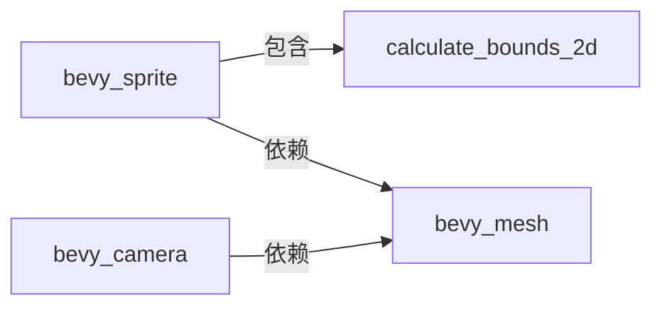

+++
title = "#20599 Move calculate_bounds_2d back to bevy_sprite"
date = "2025-08-16T00:00:00"
draft = false
template = "pull_request_page.html"
in_search_index = false

[extra]
current_language = "zh-cn"
available_languages = {"en" = { name = "English", url = "/pull_request/bevy/2025-08/pr-20599-en-20250816" }, "zh-cn" = { name = "中文", url = "/pull_request/bevy/2025-08/pr-20599-zh-cn-20250816" }}
labels = ["A-Rendering"]
+++

# PR 分析报告: Move calculate_bounds_2d back to bevy_sprite

## Basic Information
- **Title**: Move calculate_bounds_2d back to bevy_sprite
- **PR Link**: https://github.com/bevyengine/bevy/pull/20599
- **Author**: atlv24
- **Status**: MERGED
- **Labels**: A-Rendering, S-Ready-For-Final-Review
- **Created**: 2025-08-16T02:03:23Z
- **Merged**: 2025-08-16T04:58:16Z
- **Merged By**: alice-i-cecile

## Description Translation
### 目标
- 撤销 #20587 中不必要的系统迁移
- bevy_camera 已经临时依赖了 bevy_mesh，因此不会增加新的依赖

### 解决方案
- 将系统移回原处

### 测试
- cargo check --examples

## The Story of This Pull Request

### 问题背景
在之前的 PR #20587 中，`calculate_bounds_2d` 系统被从 `bevy_sprite` 迁移到了 `bevy_sprite_render`。然而，这个迁移被证明是不必要的，因为：
1. `bevy_mesh` 已经通过 `bevy_camera` 的依赖被间接引入
2. 将系统放在渲染模块打破了架构的清晰性，因为边界计算是核心逻辑而非渲染专用功能
3. 迁移导致了代码冗余和维护复杂性增加

### 解决方案实现
开发者决定将 `calculate_bounds_2d` 系统及其测试完整迁移回 `bevy_sprite` 模块。主要操作包括：

1. **依赖调整**：在 `bevy_sprite` 的 Cargo.toml 中添加 `bevy_mesh` 依赖，因为边界计算需要网格数据：
   ```diff
   # crates/bevy_sprite/Cargo.toml
   +bevy_mesh = { path = "../bevy_mesh", version = "0.17.0-dev" }
   ```

2. **系统迁移**：将完整的 `calculate_bounds_2d` 实现从 `bevy_sprite_render` 移回 `bevy_sprite`：
   ```rust
   // crates/bevy_sprite/src/lib.rs
   app.add_systems(
       PostUpdate,
       calculate_bounds_2d.in_set(VisibilitySystems::CalculateBounds),
   );
   ```

3. **清理冗余代码**：从 `bevy_sprite_render` 中完全移除该系统的实现和测试

### 技术细节
`calculate_bounds_2d` 系统负责为两类实体计算轴对齐边界框(AABB)：
1. 带有 `Mesh2d` 组件的实体
2. 带有 `Sprite` 和 `Handle<Image>` 且没有 `NoFrustumCulling` 的实体

核心计算逻辑：
```rust
if let Some(size) = sprite.custom_size
    .or_else(|| sprite.rect.map(|rect| rect.size()))
    .or_else(|| match &sprite.texture_atlas {
        None => images.get(&sprite.image).map(Image::size_f32),
        Some(atlas) => atlas.texture_rect(&atlases).map(|rect| rect.size().as_vec2()),
    })
{
    let aabb = Aabb {
        center: (-anchor.as_vec() * size).extend(0.0).into(),
        half_extents: (0.5 * size).extend(0.0).into(),
    };
    commands.entity(entity).try_insert(aabb);
}
```

### 测试保障
PR 包含三个关键测试，验证了：
1. 精灵实体正确创建 AABB
2. 精灵尺寸变化时 AABB 自动更新
3. 带自定义矩形区域的精灵计算正确 AABB

测试示例：
```rust
#[test]
fn calculate_bounds_2d_correct_aabb_for_sprite_with_custom_rect() {
    // 验证带自定义矩形区域的精灵计算正确 AABB
    let entity = app.world_mut().spawn((
        Sprite {
            rect: Some(Rect::new(0., 0., 0.5, 1.)),
            image: image_handle,
            ..Sprite::default()
        },
        Anchor::TOP_RIGHT,
    )).id();
    
    // 断言 AABB 位置和尺寸符合预期
    assert_eq!(aabb.center, Vec3A::new(-0.25, -0.5, 0.));
    assert_eq!(aabb.half_extents, Vec3A::new(0.25, 0.5, 0.));
}
```

### 架构影响
此次调整优化了模块职责划分：
- `bevy_sprite`：处理核心精灵逻辑和边界计算
- `bevy_sprite_render`：专注渲染相关功能



## Key Files Changed

### crates/bevy_sprite_render/src/lib.rs (-221/+7)
**变更原因**：移除不再属于本模块的边界计算系统  
**关键修改**：
```diff
- pub fn calculate_bounds_2d(...) {
-   // 完整实现
- }
-
- #[cfg(test)]
- mod test {
-   // 测试代码
- }
```

### crates/bevy_sprite/src/lib.rs (+215/-1)
**变更原因**：将边界计算系统移回正确模块  
**关键新增**：
```rust
app.add_systems(
    PostUpdate,
    calculate_bounds_2d.in_set(VisibilitySystems::CalculateBounds),
);

pub fn calculate_bounds_2d(...) {
    // 系统完整实现
}

#[cfg(test)]
mod test {
    // 测试套件完整实现
}
```

### crates/bevy_sprite/Cargo.toml (+1/-0)
**变更原因**：添加必要的网格依赖  
**关键修改**：
```diff
+ bevy_mesh = { path = "../bevy_mesh", version = "0.17.0-dev" }
```

## Further Reading
1. [Bevy ECS 系统设计](https://bevyengine.org/learn/book/next/programming/ecs)
2. [轴对齐边界框(AABB)原理](https://developer.nvidia.com/blog/thinking-parallel-part-i-collision-detection-gpu/)
3. [Bevy 模块化架构指南](https://github.com/bevyengine/bevy/blob/main/docs/plugins_guidelines.md)