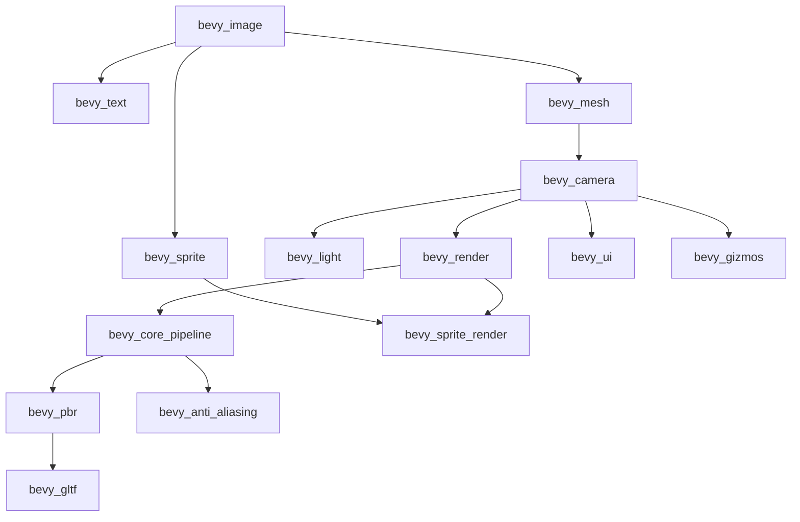

+++
title = "#20600 Fix internal features"
date = "2025-08-16T00:00:00"
draft = false
template = "pull_request_page.html"
in_search_index = true

[taxonomies]
list_display = ["show"]

[extra]
current_language = "en"
available_languages = {"en" = { name = "English", url = "/pull_request/bevy/2025-08/pr-20600-en-20250816" }, "zh-cn" = { name = "中文", url = "/pull_request/bevy/2025-08/pr-20600-zh-cn-20250816" }}
labels = ["C-Bug", "A-Rendering", "C-Dependencies"]
+++

## Fix Internal Features: Restructuring Bevy's Feature Dependencies

### Basic Information
- **Title**: Fix internal features  
- **PR Link**: https://github.com/bevyengine/bevy/pull/20600  
- **Author**: atlv24  
- **Status**: MERGED  
- **Labels**: C-Bug, A-Rendering, C-Dependencies, S-Ready-For-Final-Review  
- **Created**: 2025-08-16T02:18:08Z  
- **Merged**: 2025-08-16T14:36:50Z  
- **Merged By**: alice-i-cecile  

### Description Translation
**Objective**  
- A lot of our internal feature dependency chains are incomplete or wrong  

**Solution**  
- Fix them, and order the features by dependency ordering, to make the chain easier to understand  

**Testing**  
- its all broken currently, CI doesnt test this because it uses --all-features so we have a blind spot here. We need to figure out a way to unit test this. For now just trust i know what im doing :p  
- Additionally, theres an intentional deviation from what would be correct for main here: i did not make bevy_render feature enable bevy_light feature, even though on main bevy_render needs bevy_light. This is because I'm about to make a PR (#20604) that removes this dependency and i dont want to conflict with myself.

---

### The Story of This Pull Request
#### The Problem and Context
Bevy's internal feature system had accumulated technical debt in its dependency declarations. Features were defined in arbitrary order with incomplete dependency chains, making it difficult to understand actual requirements when enabling specific functionality. This was problematic because:

1. Features didn't reliably pull in their required dependencies  
2. The disordered structure made maintenance error-prone  
3. CI used `--all-features` which masked these issues  

These problems were particularly impactful for:
- Users enabling subsets of Bevy's features  
- Developers adding new features or modifying existing ones  
- Downstream crates depending on specific Bevy functionality  

#### The Solution Approach
The author addressed this by:
1. **Auditing dependencies**: Identifying missing feature links throughout the chain  
2. **Topological ordering**: Sorting features based on their dependency relationships  
3. **Intentional temporary deviation**: Omitting the `bevy_light` dependency from `bevy_render` to avoid conflicts with upcoming PR #20604  

Key engineering decisions:
- Group related features together (e.g., rendering pipeline components)  
- Explicitly declare all required dependencies for each feature  
- Maintain conditional dependencies (`?/` syntax) for optional features  
- Document temporary deviations via PR comments  

#### The Implementation
The changes focus entirely on `bevy_internal/Cargo.toml`'s `[features]` section. The implementation:

1. **Establishes foundation features**:
```toml
bevy_shader = ["dep:bevy_shader"]
bevy_image = ["dep:bevy_image"]
bevy_mesh = ["dep:bevy_mesh", "bevy_image"]
```
These form the base for graphics-related functionality.

2. **Builds rendering pipeline**:
```toml
bevy_camera = ["dep:bevy_camera", "bevy_mesh"]
bevy_light = ["dep:bevy_light", "bevy_camera"]
bevy_render = [
  "dep:bevy_render",
  "bevy_gizmos?/bevy_render",
  "bevy_camera",
  "bevy_shader",
  "bevy_color/wgpu-types",
  "bevy_color/encase",
]
```
This creates a clear dependency chain: `bevy_mesh` → `bevy_camera` → `bevy_light` → `bevy_render`.

3. **Corrects higher-level features**:
```toml
bevy_core_pipeline = ["dep:bevy_core_pipeline", "bevy_render"]
bevy_pbr = [
  "dep:bevy_pbr",
  "bevy_gizmos?/bevy_pbr",
  "bevy_light",
  "bevy_core_pipeline",  # Now correctly depends on core pipeline
]
```
Previously, `bevy_pbr` directly depended on `bevy_render` instead of `bevy_core_pipeline`.

4. **Fixes UI and sprite rendering**:
```toml
bevy_ui = ["dep:bevy_ui", "bevy_camera"]  # Corrected from bevy_image
bevy_sprite_render = [
  "dep:bevy_sprite_render",
  "bevy_sprite",
  "bevy_core_pipeline",  # Added missing dependency
]
```

5. **Addresses animation requirements**:
```toml
animation = ["bevy_animation", "bevy_mesh", "bevy_gltf?/bevy_animation"]  # Added bevy_mesh
```

#### Technical Insights
Key improvements in the dependency graph:
- **Transitive dependencies**: Features now properly inherit requirements (e.g., `bevy_text` → `bevy_image` → `bevy_mesh`)  
- **Conditional feature propagation**: Maintained `bevy_gizmos?/` syntax to preserve optional feature behavior  
- **Explicit over implicit**: All dependencies are now directly declared rather than relying on implicit ordering  

The temporary omission of `bevy_light` from `bevy_render` is a practical conflict-avoidance measure. While technically incomplete for the current `main` branch, it enables parallel development of #20604 which will resolve this discrepancy.

#### The Impact
These changes provide:
1. **Reliable feature sets**: Users can enable features without hidden dependencies  
2. **Maintainability**: Dependency chains are now logically ordered and explicit  
3. **Foundation for testing**: The structured format enables future dependency validation  

The primary technical lesson is that feature dependencies require:
- Explicit declaration rather than implicit ordering  
- Regular audits, especially when CI tests with `--all-features`  
- Documentation of temporary deviations during refactoring  

---

### Visual Representation


---

### Key Files Changed
#### `crates/bevy_internal/Cargo.toml`
**What changed**: Complete restructuring of feature dependencies and ordering  
**Why**: To fix incomplete dependencies and establish logical ordering  

Key modifications:
```toml
# BEFORE (excerpt):
animation = ["bevy_animation", "bevy_gltf?/bevy_animation"]

bevy_sprite = ["dep:bevy_sprite", "bevy_image"]
bevy_sprite_render = [
  "bevy_sprite",
  "dep:bevy_sprite_render",
  "bevy_gizmos?/bevy_sprite",
  "bevy_gizmos?/bevy_sprite_render",
]
bevy_pbr = [
  "dep:bevy_pbr",
  "bevy_gizmos?/bevy_pbr",
  "bevy_light",
  "bevy_render",
]
bevy_ui = ["dep:bevy_ui", "bevy_image"]

# AFTER (excerpt):
animation = ["bevy_animation", "bevy_mesh", "bevy_gltf?/bevy_animation"]

bevy_window = ["dep:bevy_window", "dep:bevy_a11y"]
bevy_shader = ["dep:bevy_shader"]
bevy_image = ["dep:bevy_image"]
bevy_sprite = ["dep:bevy_sprite", "bevy_image"]
bevy_text = ["dep:bevy_text", "bevy_image", "bevy_sprite"]
bevy_mesh = ["dep:bevy_mesh", "bevy_image"]
bevy_camera = ["dep:bevy_camera", "bevy_mesh"]
bevy_light = ["dep:bevy_light", "bevy_camera"]
bevy_render = [
  "dep:bevy_render",
  "bevy_gizmos?/bevy_render",
  "bevy_camera",
  "bevy_shader",
  "bevy_color/wgpu-types",
  "bevy_color/encase",
]
bevy_core_pipeline = ["dep:bevy_core_pipeline", "bevy_render"]
bevy_anti_aliasing = ["dep:bevy_anti_aliasing", "bevy_core_pipeline"]
bevy_pbr = [
  "dep:bevy_pbr",
  "bevy_gizmos?/bevy_pbr",
  "bevy_light",
  "bevy_core_pipeline",
]
bevy_sprite_render = [
  "dep:bevy_sprite_render",
  "bevy_sprite",
  "bevy_core_pipeline",
  "bevy_gizmos?/bevy_sprite",
  "bevy_gizmos?/bevy_sprite_render",
]
bevy_ui = ["dep:bevy_ui", "bevy_camera"]
```

---

### Further Reading
1. [Cargo Features Documentation](https://doc.rust-lang.org/cargo/reference/features.html)  
2. [Bevy's Feature-Based Compilation](https://bevyengine.org/learn/book/getting-started/features/)  
3. [Conditional Feature Dependencies in Cargo](https://doc.rust-lang.org/cargo/reference/features.html#dependency-features)  
4. Follow-up PR #20604 for `bevy_render`/`bevy_light` dependency resolution