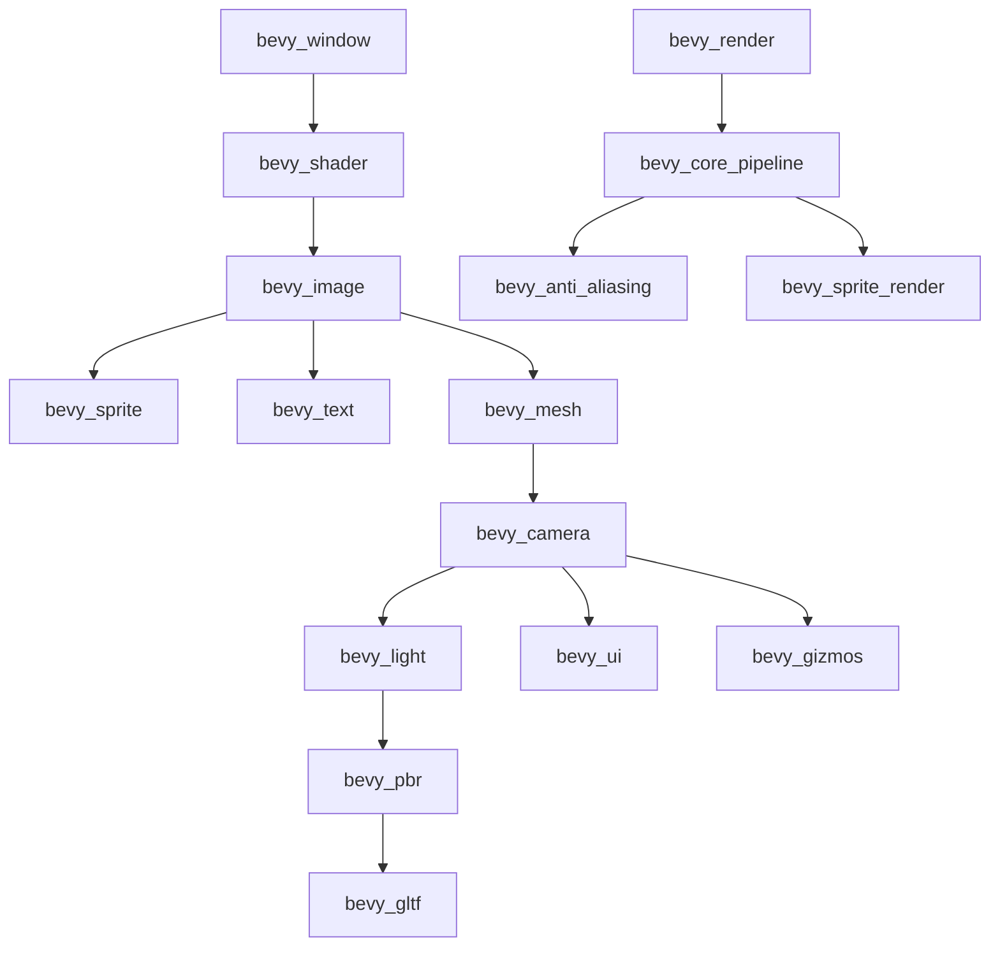

+++
title = "#20600 Fix internal features"
date = "2025-08-16T00:00:00"
draft = false
template = "pull_request_page.html"
in_search_index = false

[extra]
current_language = "zh-cn"
available_languages = {"en" = { name = "English", url = "/pull_request/bevy/2025-08/pr-20600-en-20250816" }, "zh-cn" = { name = "中文", url = "/pull_request/bevy/2025-08/pr-20600-zh-cn-20250816" }}
+++

### PR分析：修复内部特性依赖

#### 基本信点
- **标题**: Fix internal features
- **PR链接**: https://github.com/bevyengine/bevy/pull/20600
- **作者**: atlv24
- **状态**: 已合并
- **标签**: C-Bug, A-Rendering, C-Dependencies, S-Ready-For-Final-Review
- **创建时间**: 2025-08-16T02:18:08Z
- **合并时间**: 2025-08-16T14:36:50Z
- **合并者**: alice-i-cecile

#### 描述翻译
# 目标

- 我们许多内部特性（feature）的依赖链不完整或不正确

## 解决方案

- 修复它们，并按依赖顺序对特性进行排序，使依赖链更易于理解

## 测试

- 目前全部都是坏的，CI没有测试这一点，因为它使用`--all-features`，所以我们有一个盲点。我们需要想办法对此进行单元测试。现在请相信我知道自己在做什么 :p
- 另外，这里有一个与主分支正确状态的有意偏差：我没有让`bevy_render`特性启用`bevy_light`特性，尽管在主分支上`bevy_render`需要`bevy_light`。这是因为我即将提交一个PR（#20604）来移除这个依赖，我不想与自己冲突。

---

### 问题与背景
在Bevy的`bevy_internal` crate中，特性（feature）标志管理着不同引擎模块的编译依赖关系。这些特性存在两个核心问题：
1. **依赖链不完整**：部分特性缺少必要的依赖项
2. **依赖关系错误**：某些特性声明了不正确的依赖关系
3. **无序排列**：特性定义顺序混乱，难以追踪依赖关系

这些问题在CI测试中未被发现，因为CI始终使用`--all-features`参数编译。当开发者尝试组合特定特性时，可能导致编译失败或运行时错误。例如：
- `animation`特性缺少`bevy_mesh`依赖
- `bevy_gltf`错误依赖`bevy_image`而非实际需要的`bevy_pbr`
- 特性声明顺序未遵循依赖层级

### 解决方案
PR采用系统化方法重构特性依赖：
1. **依赖补全**：为缺失依赖的特性添加必要依赖项
2. **依赖修正**：更正错误的依赖声明
3. **拓扑排序**：按依赖层级重新排列特性声明顺序
4. **前瞻性调整**：为后续PR (#20604) 准备，临时移除`bevy_render`对`bevy_light`的依赖

关键原则：
- 底层特性（如`bevy_window`）先于高层特性（如`bevy_pbr`）定义
- 每个特性显式声明所有直接依赖
- 保持向后兼容，不改变现有特性名称

### 实现细节
所有修改集中在`crates/bevy_internal/Cargo.toml`文件：

**1. 依赖补全示例**  
`animation`特性添加缺失的`bevy_mesh`依赖：
```toml
# 修改前
animation = ["bevy_animation", "bevy_gltf?/bevy_animation"]

# 修改后
animation = ["bevy_animation", "bevy_mesh", "bevy_gltf?/bevy_animation"]
```

**2. 依赖修正示例**  
`bevy_gltf`从错误依赖`bevy_image`改为正确依赖`bevy_pbr`：
```toml
# 修改前
bevy_gltf = ["dep:bevy_gltf", "bevy_image"]

# 修改后
bevy_gltf = ["dep:bevy_gltf", "bevy_pbr"]
```

**3. 依赖顺序重构**  
特性按依赖层级重新组织：
```toml
# 基础层
bevy_window = ["dep:bevy_window", "dep:bevy_a11y"]
bevy_shader = ["dep:bevy_shader"]

# 资源层
bevy_image = ["dep:bevy_image"]
bevy_sprite = ["dep:bevy_sprite", "bevy_image"]
bevy_text = ["dep:bevy_text", "bevy_image", "bevy_sprite"]
bevy_mesh = ["dep:bevy_mesh", "bevy_image"]

# 场景层
bevy_camera = ["dep:bevy_camera", "bevy_mesh"]
bevy_light = ["dep:bevy_light", "bevy_camera"]

# 渲染层
bevy_render = [
  "dep:bevy_render",
  "bevy_gizmos?/bevy_render",
  "bevy_camera",
  "bevy_shader",
  "bevy_color/wgpu-types",
  "bevy_color/encase"
]
```

**4. 前瞻性调整**  
临时移除`bevy_render`的`bevy_light`依赖（将在#20604永久移除）：
```toml
# 主分支原有依赖
bevy_render = [
  ...,
  "bevy_light"  # 此项被移除
]
```

### 技术洞察
1. **特性传播机制**  
   当特性A依赖特性B时，启用A会自动启用B。正确的依赖链可避免手动启用多个特性。

2. **条件依赖处理**  
   使用`bevy_gizmos?/bevy_render`语法实现可选依赖：
   - 仅当启用`bevy_gizmos`时才传播`bevy_render`
   - 问号表示可选依赖

3. **跨crate特性转发**  
   `bevy_color/wgpu-types`语法表示：
   - 启用`bevy_color` crate的`wgpu-types`特性
   - 实现跨crate特性配置

### 影响与改进
1. **健壮性提升**  
   - 修复缺失依赖导致的潜在编译错误
   - 确保特性组合正确编译

2. **可维护性增强**  
   - 依赖层级清晰化，降低维护成本
   - 新贡献者更容易理解模块关系

3. **技术债务清理**  
   为后续优化（#20604）铺平道路

### 特性依赖关系图


### 关键文件变更
#### `crates/bevy_internal/Cargo.toml`
重构特性声明顺序并修复依赖关系：
```toml
# 修改前（片段）
animation = ["bevy_animation", "bevy_gltf?/bevy_animation"]
bevy_sprite = ["dep:bevy_sprite", "bevy_image"]
bevy_pbr = [
  "dep:bevy_pbr",
  "bevy_gizmos?/bevy_pbr",
  "bevy_light",
  "bevy_render",
]
bevy_gltf = ["dep:bevy_gltf", "bevy_image"]

# 修改后（片段）
animation = ["bevy_animation", "bevy_mesh", "bevy_gltf?/bevy_animation"]
bevy_mesh = ["dep:bevy_mesh", "bevy_image"]
bevy_camera = ["dep:bevy_camera", "bevy_mesh"]
bevy_light = ["dep:bevy_light", "bevy_camera"]
bevy_pbr = [
  "dep:bevy_pbr",
  "bevy_gizmos?/bevy_pbr",
  "bevy_light",
  "bevy_core_pipeline",  # 依赖变更
]
bevy_gltf = ["dep:bevy_gltf", "bevy_pbr"]  # 依赖修正
```

### 扩展阅读
1. [Cargo特性文档](https://doc.rust-lang.org/cargo/reference/features.html)  
2. [Bevy特性指南](https://github.com/bevyengine/bevy/blob/main/docs/plugins_guidelines.md#features)  
3. [条件编译最佳实践](https://doc.rust-lang.org/reference/conditional-compilation.html)  
4. 后续优化PR: [#20604](https://github.com/bevyengine/bevy/pull/20604)