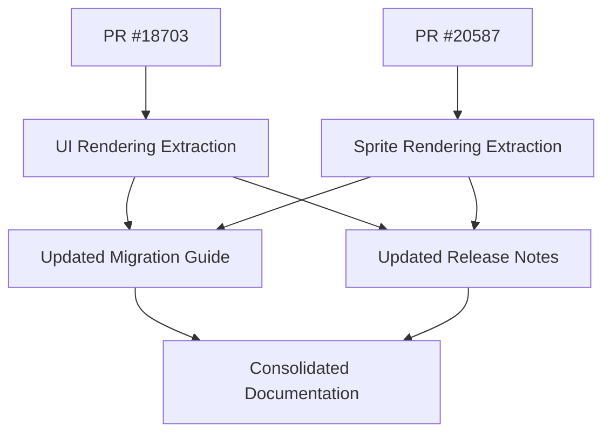

+++
title = "#20602 update and coalesce migration guides and release notes for crate refactors"
date = "2025-08-16T00:00:00"
draft = false
template = "pull_request_page.html"
in_search_index = true

[taxonomies]
list_display = ["show"]

[extra]
current_language = "en"
available_languages = {"en" = { name = "English", url = "/pull_request/bevy/2025-08/pr-20602-en-20250816" }, "zh-cn" = { name = "中文", url = "/pull_request/bevy/2025-08/pr-20602-zh-cn-20250816" }}
labels = ["C-Docs", "A-Rendering"]
+++

## Analysis of PR #20602: Update and coalesce migration guides and release notes for crate refactors

### Basic Information
- **Title**: update and coalesce migration guides and release notes for crate refactors
- **PR Link**: https://github.com/bevyengine/bevy/pull/20602
- **Author**: atlv24
- **Status**: MERGED
- **Labels**: C-Docs, A-Rendering, S-Ready-For-Final-Review
- **Created**: 2025-08-16T02:53:10Z
- **Merged**: 2025-08-16T04:59:51Z
- **Merged By**: alice-i-cecile

### Description Translation
**Objective**
- migration guide for #20587
- combine migration and note for #18703

**Solution**
- also attempt to sort the PRs roughly by importance (this is really hard to do tbh)

### The Story of This Pull Request

This documentation-focused PR addresses two primary needs in Bevy's release content. First, it provides a migration guide for PR #20587 which moved sprite rendering types to a new crate. Second, it consolidates documentation for PR #18703 (which extracted UI rendering types) into existing migration guides and release notes, eliminating redundant files.

The core problem was that recent crate extraction work (#18703 and #20587) lacked proper migration documentation and their release notes were scattered. This created potential confusion for users upgrading between versions. The solution involved:
1. Adding new sections to the main render reorganization migration guide
2. Consolidating UI rendering documentation into existing files
3. Updating release notes to reflect the broader impact of crate extractions
4. Attempting to sort PR references by importance

The author made key implementation decisions to maintain documentation clarity:
- Instead of separate files for each extraction, related changes are grouped under common headings
- Migration steps are presented with explicit before/after import paths
- Release notes now emphasize compile-time benefits for third-party crate authors

A notable challenge was sorting PR references meaningfully. As the author noted: "this is really hard to do tbh" - acknowledging the subjective nature of prioritizing changes in a large-scale refactor.

The changes improve documentation coherence by:
- Reducing documentation fragmentation
- Providing clear migration paths for both UI and sprite rendering changes
- Highlighting how multiple extractions collectively enable renderer-agnostic scenes
- Emphasizing compile-time benefits for ecosystem developers

### Visual Representation



### Key Files Changed

1. **release-content/migration-guides/bevy_render_reorganization.md**  
   Added migration instructions for UI and sprite rendering extractions:
   
   ```markdown
   @@ -1,6 +1,6 @@
    ---
    title: "`bevy_render` reorganization"
   -pull_requests: [20502, 20498, ...]
   +pull_requests: [20485, 20330, 18703, 20587, ...]
    ---
    
    @@ -23,5 +23,12 @@
    Image types [...] have been moved to a new crate, `bevy_image`.
    Import them directly or from `bevy::image` now.
    
   +Ui rendering types such as `MaterialNode`, `UiMaterial` [...] have been moved to a new crate, `bevy_ui_render`.
   +Import them directly or from `bevy::ui_render` now.
   +Furthermore, `UiPlugin` no longer has any fields. [...]
   +
   +Sprite rendering types such as `Material2d`, `Material2dPlugin` [...] have been moved to a new crate, `bevy_sprite_render`.
   +Import them directly or from `bevy::sprite_render` now.
   +
    `RenderAssetUsages` is no longer re-exported by `bevy_render`.
    Import it from `bevy_asset` or `bevy::asset` instead.
   ```

2. **release-content/migration-guides/bevy_ui_render_crate.md**  
   Removed redundant file after consolidation:
   ```markdown
   deleted file mode 100644
   --- a/release-content/migration-guides/bevy_ui_render_crate.md
   +++ /dev/null
   @@ -1,8 +0,0 @@
   ----
   -title: "`bevy_ui_render` crate"
   -pull_requests: [18703]
   ----
   -
   -The `render` and `ui_material` modules have been removed from `bevy_ui` and placed into a new crate `bevy_ui_render`.
   -
   -As a result, `UiPlugin` no longer has any fields: add or skip adding `UiRenderPlugin` to control whether or not UI is rendered.
   ```

3. **release-content/release-notes/scene-type-crates.md**  
   Expanded scope and added benefits explanation:
   ```markdown
   @@ -1,7 +1,11 @@
    ---
    title: Define scenes without depending on bevy_render
   -authors: ["@atlv24"]
   -pull_requests: [20502, 20498, ...]
   +authors: ["@atlv24", "@Ickshonpe", "@zeophlite"]
   +pull_requests: [20485, 20330, 18703, 20587, ...]
    ---
    
   -It is now possible to use cameras, lights, shaders, images, and meshes without depending on the Bevy renderer. [...]
   +It is now possible to use cameras, lights, shaders, images, meshes, sprites, text, ui, picking, animation, and scenes without depending on the Bevy renderer. [...]
   +
   +This is incredibly important for reducing compile time [...] crate authors can now depend more granularly [...]
   +
   +Another sweet side-effect is that "shader library only" crates are now possible [...]
   ```

### Further Reading
1. [Bevy's Documentation Guidelines](https://github.com/bevyengine/bevy/blob/main/docs/DOCUMENTATION_GUIDELINES.md)
2. [Semantic Versioning and Breaking Changes](https://doc.rust-lang.org/cargo/reference/semver.html)
3. [Rust API Guidelines on Documentation](https://rust-lang.github.io/api-guidelines/documentation.html)