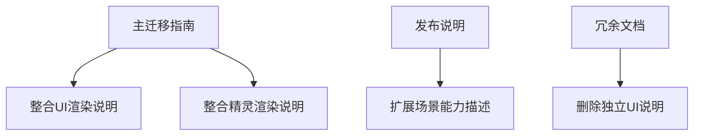

+++
title = "#20602 update and coalesce migration guides and release notes for crate refactors"
date = "2025-08-16T00:00:00"
draft = false
template = "pull_request_page.html"
in_search_index = false

[extra]
current_language = "zh-cn"
available_languages = {"en" = { name = "English", url = "/pull_request/bevy/2025-08/pr-20602-en-20250816" }, "zh-cn" = { name = "中文", url = "/pull_request/bevy/2025-08/pr-20602-zh-cn-20250816" }}
+++

## 技术分析报告：PR #20602

### 基本信息
- **标题**: update and coalesce migration guides and release notes for crate refactors
- **PR链接**: https://github.com/bevyengine/bevy/pull/20602
- **作者**: atlv24
- **状态**: 已合并
- **标签**: C-Docs, A-Rendering, S-Ready-For-Final-Review
- **创建时间**: 2025-08-16T02:53:10Z
- **合并时间**: 2025-08-16T04:59:51Z
- **合并人**: alice-i-cecile

### 描述翻译
# Objective

- 为 #20587 编写迁移指南
- 合并 #18703 的迁移说明和发布说明

## Solution

- 尝试按重要性对PR进行大致排序（这确实很难做到）

---

### PR技术分析

#### 问题背景
Bevy 正在进行大规模的模块化重构，将渲染相关组件拆分为独立crate。这导致两个主要问题：
1. 先前 #18703 引入的`bevy_ui_render` crate变更缺少迁移指南
2. 相关文档分散在多个文件中，存在内容重复和碎片化现象

重构后，开发者需要明确知道：
- 被移动的类型和模块的新位置
- 插件初始化方式的变化
- 如何控制渲染功能的启用

#### 解决方案
核心策略是文档整合和内容更新：
1. 将分散的UI渲染迁移指南合并到主渲染重组文档
2. 删除独立的`bevy_ui_render`说明文件
3. 在发布说明中补充模块化带来的好处
4. 按重要性重新排序相关PR列表

#### 实现细节
1. **迁移指南整合**  
   将UI和精灵渲染的迁移说明统一到主渲染重组文档，避免信息碎片化。新增内容明确：
   - UI渲染类型的新导入路径
   - `UiPlugin`行为变化
   - 精灵渲染类型的迁移路径

   关键修改：
   ```diff
   @@ -1,6 +1,6 @@
    ---
    title: "`bevy_render` reorganization"
   -pull_requests: [20502, 20498, ...]
   +pull_requests: [20485, 20330, 18703, 20587, ...]
    ---
   +
   +Ui rendering types such as `MaterialNode`, `UiMaterial`... moved to `bevy_ui_render`
   +Furthermore, `UiPlugin` no longer has any fields...
   +
   +Sprite rendering types... moved to `bevy_sprite_render`
   ```

2. **发布说明增强**  
   扩展场景定义能力的描述，强调模块化对编译效率和第三方集成的价值：
   ```diff
   @@ -1,7 +1,11 @@
    ---
    title: Define scenes without depending on bevy_render
   -authors: ["@atlv24"]
   +authors: ["@atlv24", "@Ickshonpe", "@zeophlite"]
    pull_requests: [20485,...]
    ---
   -It is now possible to use cameras, lights...
   +It is now possible to use cameras, lights, sprites, text, ui...
   +This is incredibly important for reducing compile time...
   +Another sweet side-effect...
   ```

3. **文档清理**  
   删除已合并的独立文档：
   ```diff
   ----
   -title: "`bevy_ui_render` crate"
   -pull_requests: [18703]
   ----
   -The `render` and `ui_material` modules have been removed...
   ```

#### 技术洞察
1. **模块化优势**  
   通过`bevy_shader`等基础crate，实现"仅着色器库"的轻量级依赖，使第三方扩展更灵活

2. **编译优化**  
   解耦渲染管线依赖链：
   ```
   bevy_render -> bevy_core_pipelines -> bevy_pbr/bevy_sprite
   ```
   允许crate并行编译，显著减少全量构建时间

3. **控制粒度**  
   通过独立插件（如`UiRenderPlugin`）精确控制渲染功能开关，替代原先的`UiPlugin`参数

#### 影响
1. **开发者体验**  
   - 单一文档包含所有渲染重组迁移指南
   - 明确标注类型移动路径和插件变更
   - 消除冗余文档维护成本

2. **架构灵活性**  
   - 第三方渲染器可选择性实现模块
   - 应用可仅导入必需渲染组件
   - 基础类型与渲染实现解耦

---

### 可视化关系


### 关键文件变更

1. **`release-content/migration-guides/bevy_render_reorganization.md` (+7/-3)**  
   - 变更原因：整合UI和精灵渲染迁移说明  
   - 关键修改：
   ```diff
   -pull_requests: [20502, 20498, ...]
   +pull_requests: [20485, 20330, 18703, 20587, ...]
   
   +Ui rendering types such as `MaterialNode`... moved to `bevy_ui_render`
   +Furthermore, `UiPlugin` no longer has any fields...
   +
   +Sprite rendering types... moved to `bevy_sprite_render`
   ```

2. **`release-content/release-notes/scene-type-crates.md` (+7/-3)**  
   - 变更原因：增强发布说明，补充模块化优势  
   - 关键修改：
   ```diff
   -authors: ["@atlv24"]
   +authors: ["@atlv24", "@Ickshonpe", "@zeophlite"]
   
   -It is now possible to use cameras, lights...
   +It is now possible to use cameras, lights, sprites, text, ui...
   +This is incredibly important for reducing compile time...
   ```

3. **`release-content/migration-guides/bevy_ui_render_crate.md` (+0/-8)**  
   - 变更原因：内容已合并到主迁移指南  
   - 文件被完全删除

4. **`release-content/release-notes/bevy_ui_render_crate.md` (+0/-7)**  
   - 变更原因：内容已合并到场景类型说明  
   - 文件被完全删除

### 延伸阅读
1. [模块化设计原则](https://en.wikipedia.org/wiki/Modular_programming)
2. [Rust crate优化实践](https://doc.rust-lang.org/cargo/guide/project-layout.html)
3. [Bevy插件系统文档](https://bevyengine.org/learn/book/getting-started/plugins/)

### 完整代码变更
```diff
diff --git a/release-content/migration-guides/bevy_render_reorganization.md b/release-content/migration-guides/bevy_render_reorganization.md
index 564076454aff2..c17f15748f0c9 100644
--- a/release-content/migration-guides/bevy_render_reorganization.md
+++ b/release-content/migration-guides/bevy_render_reorganization.md
@@ -1,6 +1,6 @@
 ---
 title: "`bevy_render` reorganization"
-pull_requests: [20502, 20498, 20485, 20496, 20493, 20492, 20491, 20488, 20487, 20486, 20483, 20480, 20479, 20478, 20477, 20473, 20472, 20471, 20470, 20392, 20390, 20388, 20345, 20344, 20330, 20051, 20000, 19997, 19991, 19985, 19973, 19965, 19963, 19962, 19960, 19959, 19958, 19957, 19956, 19955, 19954, 19953, 19949, 19943, 16620, 16619, 15700, 15666, 15650]
+pull_requests: [20485, 20330, 18703, 20587, 20502, 19997, 19991, 20000, 19949, 19943, 19953, 20498, 20496, 20493, 20492, 20491, 20488, 20487, 20486, 20483, 20480, 20479, 20478, 20477, 20473, 20472, 20471, 20470, 20392, 20390, 20388, 20345, 20344, 20051, 19985, 19973, 19965, 19963, 19962, 19960, 19959, 19958, 19957, 19956, 19955, 19954, 16620, 16619, 15700, 15666, 15650]
 ---
 
 You must now import `bevy_render::NormalizedRenderTargetExt` to use methods on `NormalizedRenderTarget`
@@ -23,5 +23,12 @@ Import them directly or from `bevy::mesh` now.
 Image types such as `Image`, `ImagePlugin`, `ImageFormat`, `ImageSampler`, `ImageAddressMode`, `ImageSamplerDescriptor`, `ImageCompareFunction`, and `ImageSamplerBorderColor` have been moved to a new crate, `bevy_image`.
 Import them directly or from `bevy::image` now.
 
+Ui rendering types such as `MaterialNode`, `UiMaterial`, `UiMaterialKey`, and modules `bevy_ui::render` and `bevy_ui::ui_material` have been moved to a new crate, `bevy_ui_render`.
+Import them directly or from `bevy::ui_render` now.
+Furthermore, `UiPlugin` no longer has any fields. To control whether or not UI is rendered, enable or disable `UiRenderPlugin`, which is included in the DefaultPlugins.
+
+Sprite rendering types such as `Material2d`, `Material2dPlugin`, `MeshMaterial2d`, `AlphaMode2d`, `Wireframe2d`, `TileData`, `TilemapChunk`, and `TilemapChunkTileData` have been moved to a new crate, `bevy_sprite_render`.
+Import them directly or from `bevy::sprite_render` now.
+
 `RenderAssetUsages` is no longer re-exported by `bevy_render`.
 Import it from `bevy_asset` or `bevy::asset` instead.
diff --git a/release-content/migration-guides/bevy_ui_render_crate.md b/release-content/migration-guides/bevy_ui_render_crate.md
deleted file mode 100644
index 0d6cb59eba5d3..0000000000000
--- a/release-content/migration-guides/bevy_ui_render_crate.md
+++ /dev/null
@@ -1,8 +0,0 @@
----
-title: "`bevy_ui_render` crate"
-pull_requests: [18703]
----
-
-The `render` and `ui_material` modules have been removed from `bevy_ui` and placed into a new crate `bevy_ui_render`.
-
-As a result, `UiPlugin` no longer has any fields: add or skip adding `UiRenderPlugin` to control whether or not UI is rendered.
diff --git a/release-content/release-notes/bevy_ui_render_crate.md b/release-content/release-notes/bevy_ui_render_crate.md
deleted file mode 100644
index 6ab31c517db27..0000000000000
--- a/release-content/release-notes/bevy_ui_render_crate.md
+++ /dev/null
@@ -1,7 +0,0 @@
----
-title: "`bevy_ui_render` crate"
-authors: ["@Ickshonpe"]
-pull_requests: [18703]
----
-
-The `render` and `ui_material` modules have been removed from `bevy_ui` and placed into a new crate `bevy_ui_render`.
diff --git a/release-content/release-notes/scene-type-crates.md b/release-content/release-notes/scene-type-crates.md
index 5027e95c86d73..2616bcadf4446 100644
--- a/release-content/release-notes/scene-type-crates.md
+++ b/release-content/release-notes/scene-type-crates.md
@@ -1,7 +1,11 @@
 ---
 title: Define scenes without depending on bevy_render
-authors: ["@atlv24"]
-pull_requests: [20502, 20498, 20485, 20496, 20493, 20492, 20491, 20488, 20487, 20486, 20483, 20480, 20479, 20478, 20477, 20473, 20472, 20471, 20470, 20392, 20390, 20388, 20345, 20344, 20330, 20051, 20000, 19997, 19991, 19985, 19973, 19965, 19963, 19962, 19960, 19959, 19958, 19957, 19956, 19955, 19954, 19953, 19949, 19943, 16620, 16619, 15700, 15666, 15650]
+authors: ["@atlv24", "@Ickshonpe", "@zeophlite"]
+pull_requests: [20485, 20330, 18703, 20587, 20502, 19997, 19991, 20000, 19949, 19943, 19953, 20498, 20496, 20493, 20492, 20491, 20488, 20487, 20486, 20483, 20480, 20479, 20478, 20477, 20473, 20472, 20471, 20470, 20392, 20390, 20388, 20345, 20344, 20051, 19985, 19973, 19965, 19963, 19962, 19960, 19959, 19958, 19957, 19956, 19955, 19954, 16620, 16619, 15700, 15666, 15650]
 ---
 
-It is now possible to use cameras, lights, shaders, images, and meshes without depending on the Bevy renderer. This makes it possible for 3rd party custom renderers to be drop-in replacements for rendering existing scenes.
+It is now possible to use cameras, lights, shaders, images, meshes, sprites, text, ui, picking, animation, and scenes without depending on the Bevy renderer. This makes it possible for 3rd party custom renderers to be drop-in replacements for rendering existing scenes.
+
+This is incredibly important for reducing compile time, especially for 3rd party crates: crate authors can now depend more granularly on the specific crates they need, meaning greater chances for compilation parallelism emerge as not everything is bottlenecked on waiting for the bevy_render -> bevy_core_pipelines -> bevy_pbr/bevy_sprite chain to compile.
+
+Another sweet side-effect is that "shader library only" crates are now possible with minimal dependencies thanks to bevy_shader.
```