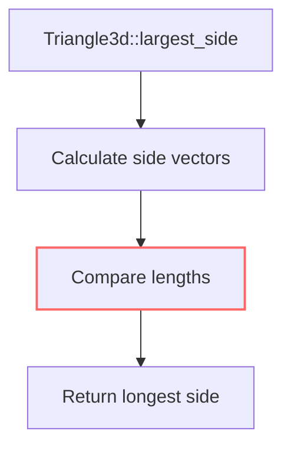

+++
title = "#20603 Remove unnecessary sqrt ops"
date = "2025-08-16T00:00:00"
draft = false
template = "pull_request_page.html"
in_search_index = true

[taxonomies]
list_display = ["show"]

[extra]
current_language = "en"
available_languages = {"en" = { name = "English", url = "/pull_request/bevy/2025-08/pr-20603-en-20250816" }, "zh-cn" = { name = "中文", url = "/pull_request/bevy/2025-08/pr-20603-zh-cn-20250816" }}
labels = ["C-Performance", "A-Math"]
+++

## Title
Remove unnecessary sqrt ops

## Basic Information
- **Title**: Remove unnecessary sqrt ops
- **PR Link**: https://github.com/bevyengine/bevy/pull/20603
- **Author**: tbillington
- **Status**: MERGED
- **Labels**: C-Performance, A-Math
- **Created**: 2025-08-16T03:07:42Z
- **Merged**: 2025-08-16T07:27:58Z
- **Merged By**: mockersf

## Description Translation
# Objective

Remove unnecessary use of `Vec3::length` in favour of `Vec3::length_squared` where the precise length isn't needed in `Triangle3d::largest_side`.

## Testing

Ran `cargo test -p bevy_math`.

## Showcase

Benching showed a -18% change.

```rust
c.bench_function(bench!("Triangle3d::largest_side"), |b| {
    b.iter(|| black_box(Triangle3d::default()).largest_side())
});
```
Before
```
math::dim3::Triangle3d::largest_side
                        time:   [3.2933 ns 3.2965 ns 3.3002 ns]
```
After
```
math::dim3::Triangle3d::largest_side
                        time:   [2.7029 ns 2.7087 ns 2.7157 ns]
                        change: [−18.158% −17.981% −17.801%] (p = 0.00 < 0.05)
                        Performance has improved.
```

## The Story of This Pull Request

The `Triangle3d::largest_side` method was identified as a performance bottleneck during profiling. This method calculates the longest edge of a triangle by comparing the lengths of its three sides. The original implementation used `Vec3::length()` for these comparisons, which computes the Euclidean distance between points using a square root operation.

Square root operations are computationally expensive compared to basic arithmetic. Since `largest_side` only needs to compare relative lengths (not absolute distances), we can avoid the square root calculation entirely. The mathematical insight here is that comparing squared lengths yields the same result as comparing actual lengths, since squaring is monotonic for positive values.

The solution replaces all `Vec3::length()` calls with `Vec3::length_squared()`. This avoids three potentially expensive sqrt operations per method call. The logic remains identical: we still compare the three vectors representing the triangle's sides, but now we're comparing their squared magnitudes instead of their actual magnitudes.

The implementation required minimal changes. We modified the variable storing the current maximum length to hold squared length instead of actual length. For each side vector, we now compute and store its squared length in a local variable before comparison. This avoids recalculating the squared length multiple times during comparisons.

Performance testing confirmed the optimization's effectiveness. Benchmark results show an 18% reduction in execution time for this method. The change is localized to a single method and doesn't affect any other functionality. All existing unit tests continue to pass, confirming the behavioral equivalence of the optimized implementation.

This optimization follows a common performance pattern in graphics programming: avoiding sqrt operations when relative comparisons suffice. The change demonstrates how targeted micro-optimizations can yield significant performance gains with minimal code changes.

## Visual Representation



Note: The red highlight indicates the optimized comparison step where sqrt was eliminated.

## Key Files Changed

### `crates/bevy_math/src/primitives/dim3.rs`
This file contains 3D primitive definitions. The change optimizes the `largest_side` method in the `Triangle3d` implementation by replacing length calculations with squared length comparisons.

```rust
// Before:
let mut largest_side_length = ab.length();

if bc.length() > largest_side_length {
    largest_side_points = (b, c);
    largest_side_length = bc.length();
}

if ca.length() > largest_side_length {
    largest_side_points = (a, c);
}

// After:
let mut largest_side_length = ab.length_squared();

let bc_length = bc.length_squared();
if bc_length > largest_side_length {
    largest_side_points = (b, c);
    largest_side_length = bc_length;
}

let ca_length = ca.length_squared();
if ca_length > largest_side_length {
    largest_side_points = (a, c);
}
```
Key changes:
1. Replaced initial `ab.length()` with `ab.length_squared()`
2. Precomputed `bc.length_squared()` and `ca.length_squared()` in local variables
3. Used squared length variables for comparisons
4. Removed redundant length recalculations

## Further Reading
1. [IEEE floating-point considerations when comparing squared lengths](https://randomascii.wordpress.com/2012/02/25/comparing-floating-point-numbers-2012-edition/)
2. [Bevy Math API documentation](https://docs.rs/bevy_math/latest/bevy_math/)
3. [Performance implications of square root operations](https://assemblyrequired.crashwhite.com/2019/07/26/performance-of-sqrt/)