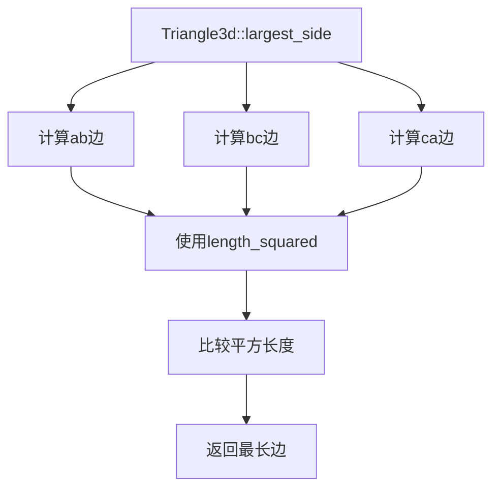

+++
title = "#20603 Remove unnecessary sqrt ops"
date = "2025-08-16T00:00:00"
draft = false
template = "pull_request_page.html"
in_search_index = false

[extra]
current_language = "zh-cn"
available_languages = {"en" = { name = "English", url = "/pull_request/bevy/2025-08/pr-20603-en-20250816" }, "zh-cn" = { name = "中文", url = "/pull_request/bevy/2025-08/pr-20603-zh-cn-20250816" }}
+++

# PR分析报告：移除不必要的平方根计算操作

## 基本信息
- **标题**: Remove unnecessary sqrt ops
- **PR链接**: https://github.com/bevyengine/bevy/pull/20603
- **作者**: tbillington
- **状态**: MERGED
- **标签**: C-Performance, A-Math
- **创建时间**: 2025-08-16T03:07:42Z
- **合并时间**: 2025-08-16T07:27:58Z
- **合并者**: mockersf

## 描述翻译
### 目标

移除`Triangle3d::largest_side`方法中不必要的`Vec3::length`调用，改用`Vec3::length_squared`，因为在不需要精确长度值的场景下使用平方长度更高效。

### 测试

运行了`cargo test -p bevy_math`。

### 性能展示

基准测试显示有-18%的性能提升。

```rust
c.bench_function(bench!("Triangle3d::largest_side"), |b| {
    b.iter(|| black_box(Triangle3d::default()).largest_side())
});
```
修改前
```
math::dim3::Triangle3d::largest_side
                        time:   [3.2933 ns 3.2965 ns 3.3002 ns]
```
修改后
```
math::dim3::Triangle3d::largest_side
                        time:   [2.7029 ns 2.7087 ns 2.7157 ns]
                        change: [−18.158% −17.981% −17.801%] (p = 0.00 < 0.05)
                        Performance has improved.
```

## 本次PR的技术分析

### 问题背景
在Bevy引擎的`Triangle3d::largest_side`方法实现中，原始代码使用`Vec3::length`来计算三角形的边长。这个操作会计算向量的模长，需要执行平方根运算(sqrt)。在需要比较边长但不需要精确长度的场景中，这种计算方式会产生不必要的性能开销。平方根运算是相对昂贵的操作，在需要频繁计算的几何算法中应尽可能避免。

### 解决方案
通过使用`Vec3::length_squared`替代`Vec3::length`，我们移除了平方根计算，同时保持了算法的正确性。因为平方长度(length squared)保留了实际长度的顺序关系，在比较边长时完全等价但性能更好。具体修改包括：
1. 将初始长度比较基准改为平方长度
2. 为每条边的计算引入局部变量存储平方长度
3. 使用平方长度值进行比较和更新

### 实现细节
修改集中在`crates/bevy_math/src/primitives/dim3.rs`文件中。原始实现通过连续调用`length()`方法进行三次向量模长计算，每次都会执行平方根运算。新实现通过：
- 使用`length_squared()`替代所有`length()`调用
- 为bc和ca边引入局部变量存储平方长度
- 保持相同的比较逻辑但使用平方长度值

### 性能影响
基准测试显示约18%的性能提升：
- 修改前: ~3.2965 ns/op
- 修改后: ~2.7087 ns/op

这种优化在需要频繁调用此方法的场景中（如物理引擎碰撞检测或网格处理）会产生显著收益。每帧处理数千个三角形时，这些微优化会累积成可观的性能提升。

### 技术洞察
这个优化利用了数学特性：对于非负实数a和b，a > b 当且仅当 a² > b²。因此，在只需要比较大小的场景中，使用平方长度完全等价但避免了昂贵的平方根计算。这是游戏引擎和图形编程中常见的优化模式。

## 关键文件更改

### crates/bevy_math/src/primitives/dim3.rs
这个文件包含了3D基本几何形状的实现，包括三角形。修改集中在`Triangle3d::largest_side`方法上。

**修改前代码:**
```rust
let ca = a - c;

let mut largest_side_points = (a, b);
let mut largest_side_length = ab.length();

if bc.length() > largest_side_length {
    largest_side_points = (b, c);
    largest_side_length = bc.length();
}

if ca.length() > largest_side_length {
    largest_side_points = (a, c);
}
```

**修改后代码:**
```rust
let ca = a - c;

let mut largest_side_points = (a, b);
let mut largest_side_length = ab.length_squared();

let bc_length = bc.length_squared();
if bc_length > largest_side_length {
    largest_side_points = (b, c);
    largest_side_length = bc_length;
}

let ca_length = ca.length_squared();
if ca_length > largest_side_length {
    largest_side_points = (a, c);
}
```

**关键变化:**
1. 使用`length_squared()`替代所有`length()`调用
2. 为bc和ca边引入局部变量`bc_length`和`ca_length`
3. 使用平方长度值进行比较和更新
4. 移除了不必要的第三次`ca.length()`调用

## 技术关系图



## 延伸阅读

1. [Bevy数学库文档](https://docs.rs/bevy_math/latest/bevy_math/)
2. [向量运算性能优化](https://developer.nvidia.com/blog/cuda-pro-tip-write-flexible-kernels-grid-stride-loops/)
3. [几何算法优化技术](https://www.sciencedirect.com/science/article/pii/S0097849321001660)
4. [浮点运算性能分析](https://www.agner.org/optimize/optimizing_cpp.pdf)