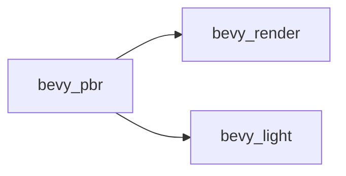

+++
title = "#20604 make bevy_render not depend on bevy_light"
date = "2025-08-16T00:00:00"
draft = false
template = "pull_request_page.html"
in_search_index = true

[taxonomies]
list_display = ["show"]

[extra]
current_language = "en"
available_languages = {"en" = { name = "English", url = "/pull_request/bevy/2025-08/pr-20604-en-20250816" }, "zh-cn" = { name = "中文", url = "/pull_request/bevy/2025-08/pr-20604-zh-cn-20250816" }}
labels = ["A-Rendering", "P-Regression"]
+++

# Analysis of PR #20604: make bevy_render not depend on bevy_light

## Basic Information
- **Title**: make bevy_render not depend on bevy_light
- **PR Link**: https://github.com/bevyengine/bevy/pull/20604
- **Author**: atlv24
- **Status**: MERGED
- **Labels**: A-Rendering, S-Ready-For-Final-Review, P-Regression
- **Created**: 2025-08-16T03:17:50Z
- **Merged**: 2025-08-16T22:29:51Z
- **Merged By**: alice-i-cecile

## Description Translation
# Objective

- Use manual extract to remove a dep i thought was needed cus of orphan rule

## Solution

- do it

## Testing

- lighting example

## The Story of This Pull Request

This PR addresses a dependency issue between `bevy_render` and `bevy_light` caused by Rust's orphan rules. The orphan rule prevents implementing foreign traits (from external crates) on foreign types (also from external crates). Previously, `bevy_render` contained implementations of `ExtractComponent` and `ExtractResource` for types defined in `bevy_light` (`ClusteredDecal`, `AmbientLight`, `ShadowFilteringMethod`). This forced `bevy_render` to depend on `bevy_light`, creating an unnecessary coupling.

The solution replaces automatic component extraction with manual extraction systems in `bevy_pbr`. This approach moves the extraction logic closer to where these components are actually used while eliminating the problematic dependency. The key changes involve:

1. Removing `bevy_light` dependency from `bevy_render`'s Cargo.toml
2. Deleting `extract_impls.rs` which contained orphan implementations
3. Implementing manual extraction systems in `bevy_pbr` for:
   - `ClusteredDecal`
   - `AmbientLight` (both as resource and component)
   - `ShadowFilteringMethod`
4. Replacing `ExtractComponentPlugin` usage with `SyncComponentPlugin`

These manual extraction systems follow a consistent pattern of querying components in the main world and inserting them into the render world. For example, the `extract_shadow_filtering_method` system:

```rust
pub fn extract_shadow_filtering_method(
    mut commands: Commands,
    mut previous_len: Local<usize>,
    query: Extract<Query<(RenderEntity, &ShadowFilteringMethod)>>,
) {
    let mut values = Vec::with_capacity(*previous_len);
    for (entity, query_item) in &query {
        values.push((entity, *query_item));
    }
    *previous_len = values.len();
    commands.try_insert_batch(values);
}
```

This pattern maintains the same functionality while resolving the orphan rule limitation. The changes centralize PBR-related extraction logic in `bevy_pbr` where it logically belongs, rather than having it split across crates.

Testing was performed using the lighting example to verify rendering behavior remained consistent after the dependency removal.

## Visual Representation



The dependency graph simplifies by removing the direct link between `bevy_render` and `bevy_light`, with `bevy_pbr` now serving as the sole connection point for these systems.

## Key Files Changed

### `crates/bevy_pbr/src/render/light.rs` (+49/-1)
Added manual extraction systems for lighting components:
```rust
// Extraction for ShadowFilteringMethod
pub fn extract_shadow_filtering_method(...) {
    // Implementation logic
}

// Extraction for AmbientLight (resource)
pub fn extract_ambient_light_resource(...) {
    // Implementation logic
}

// Extraction for AmbientLight (component)
pub fn extract_ambient_light(...) {
    // Implementation logic
}
```

### `crates/bevy_render/src/extract_impls.rs` (+0/-41)
Deleted entire file containing orphan implementations:
```rust
// Before (deleted file contents):
impl ExtractComponent for ClusteredDecal { ... }
impl ExtractResource for AmbientLight { ... }
impl ExtractComponent for AmbientLight { ... }
impl ExtractComponent for ShadowFilteringMethod { ... }
```

### `crates/bevy_pbr/src/decal/clustered.rs` (+19/-4)
Replaced automatic extraction with manual system:
```rust
// Before:
app.add_plugins(ExtractComponentPlugin::<ClusteredDecal>::default());

// After:
app.add_plugins(SyncComponentPlugin::<ClusteredDecal>::default());
...
fn extract_clustered_decal(...) { ... }
```

### `crates/bevy_pbr/src/lib.rs` (+5/-4)
Updated plugin registrations and scheduling:
```rust
// Before:
app.add_plugins(ExtractResourcePlugin::<AmbientLight>::default());
app.add_plugins(ExtractComponentPlugin::<ShadowFilteringMethod>::default());

// After:
app.add_plugins(SyncComponentPlugin::<ShadowFilteringMethod>::default());
app.add_plugins(SyncComponentPlugin::<AmbientLight>::default());
...
// Added to extraction schedule:
extract_ambient_light_resource,
extract_ambient_light,
extract_shadow_filtering_method,
```

### `crates/bevy_pbr/Cargo.toml` (+1/-3)
Simplified dependency declaration:
```toml
# Before:
bevy_render = { path = "../bevy_render", features = ["bevy_light"], ... }

# After:
bevy_render = { path = "../bevy_render", ... }
```

## Further Reading
- [Rust Orphan Rule Explanation](https://doc.rust-lang.org/book/ch10-02-traits.html#implementing-a-trait-on-a-type)
- [Bevy ECS Extraction Documentation](https://bevyengine.org/learn/book/getting-started/ecs/)
- [Component Extraction Patterns in Bevy](https://github.com/bevyengine/bevy/blob/main/examples/ecs/component_change_detection.rs)