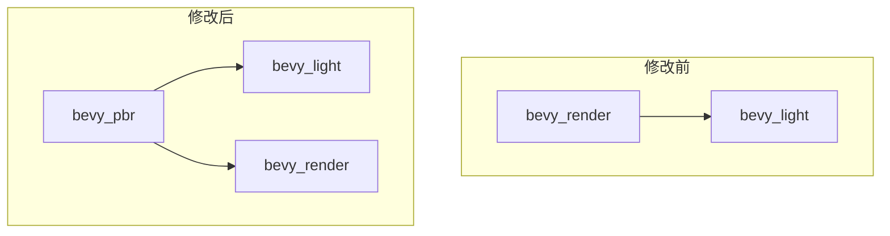

+++
title = "#20604 make bevy_render not depend on bevy_light"
date = "2025-08-16T00:00:00"
draft = false
template = "pull_request_page.html"
in_search_index = false

[extra]
current_language = "zh-cn"
available_languages = {"en" = { name = "English", url = "/pull_request/bevy/2025-08/pr-20604-en-20250816" }, "zh-cn" = { name = "中文", url = "/pull_request/bevy/2025-08/pr-20604-zh-cn-20250816" }}
+++

# PR #20604: make bevy_render not depend on bevy_light

## 基本信息
- **标题**: make bevy_render not depend on bevy_light
- **PR链接**: https://github.com/bevyengine/bevy/pull/20604
- **作者**: atlv24
- **状态**: MERGED
- **标签**: A-Rendering, S-Ready-For-Final-Review, P-Regression
- **创建时间**: 2025-08-16T03:17:50Z
- **合并时间**: 2025-08-16T22:29:51Z
- **合并人**: alice-i-cecile

## 描述翻译
### Objective
- 使用手动提取(manual extract)移除一个因孤儿规则(orphan rule)而认为必需的依赖

### Solution
- 实现该修改

### Testing
- 光照示例(lighting example)

## 本次PR的技术分析

### 问题背景
本次PR的核心问题是解决由Rust的孤儿规则(orphan rule)引起的不必要依赖。在Bevy引擎中，`bevy_render` crate 依赖于 `bevy_light`，但这并非架构必需。这种依赖源于需要为`bevy_light`中定义的类型实现`ExtractComponent`特性(trait)，而该特性定义在`bevy_render`中。由于两者属于不同crate，违反了Rust的孤儿规则（不能为外部类型实现外部trait），之前的解决方案是在`bevy_render`中增加对`bevy_light`的依赖并实现这些trait。但这导致：
1. 不必要的编译依赖
2. 增加了构建时间
3. 架构耦合度提高

### 解决方案
通过手动实现提取系统(extract systems)替代自动的`ExtractComponent`插件，将提取逻辑移到`bevy_pbr` crate中。因为`bevy_pbr`已经依赖`bevy_light`和`bevy_render`，可以合法实现这些trait而不违反孤儿规则。具体步骤：
1. 移除`bevy_render`对`bevy_light`的依赖声明
2. 将`ExtractComponentPlugin`替换为`SyncComponentPlugin`
3. 为`ClusteredDecal`、`ShadowFilteringMethod`和`AmbientLight`等组件创建手动提取系统

### 实现细节
在`bevy_pbr`中新增多个提取函数处理特定组件的提取逻辑。这些函数在提取阶段(ExtractSchedule)运行，将数据从主世界(main world)复制到渲染世界(render world)。例如新增的`extract_shadow_filtering_method`函数：

```rust
// File: crates/bevy_pbr/src/render/light.rs
pub fn extract_shadow_filtering_method(
    mut commands: Commands,
    mut previous_len: Local<usize>,
    query: Extract<Query<(RenderEntity, &ShadowFilteringMethod)>>,
) {
    let mut values = Vec::with_capacity(*previous_len);
    for (entity, query_item) in &query {
        values.push((entity, *query_item));
    }
    *previous_len = values.len();
    commands.try_insert_batch(values);
}
```
该函数：
1. 使用`Extract`包装查询以访问主世界数据
2. 通过`commands.try_insert_batch`批量插入到渲染世界
3. 使用`Local<usize>`优化内存分配

类似函数也被实现用于`AmbientLight`资源提取：
```rust
pub fn extract_ambient_light_resource(
    mut commands: Commands,
    main_resource: Extract<Option<Res<AmbientLight>>>,
    target_resource: Option<ResMut<AmbientLight>>,
) {
    if let Some(main_resource) = main_resource.as_ref() {
        if let Some(mut target_resource) = target_resource {
            if main_resource.is_changed() {
                *target_resource = (*main_resource).clone();
            }
        } else {
            commands.insert_resource((*main_resource).clone());
        }
    }
}
```
该函数特殊处理了资源可能不存在的情况，并检查变更状态以优化性能。

### 关键修改点
1. **依赖关系调整**：  
   在`bevy_pbr/Cargo.toml`中移除`bevy_render`对`bevy_light`的特性依赖：
   ```toml
   # Before:
   bevy_render = { path = "../bevy_render", features = [
     "bevy_light",
   ], version = "0.17.0-dev" }
   
   # After:
   bevy_render = { path = "../bevy_render", version = "0.17.0-dev" }
   ```

2. **插件替换**：  
   将`ExtractComponentPlugin`替换为`SyncComponentPlugin`，因为提取逻辑现在由手动系统处理：
   ```rust
   # Before:
   app.add_plugins(ExtractComponentPlugin::<ClusteredDecal>::default());
   
   # After:
   app.add_plugins(SyncComponentPlugin::<ClusteredDecal>::default());
   ```

3. **提取系统注册**：  
   在渲染应用中注册新的手动提取系统：
   ```rust
   .add_systems(ExtractSchedule, (extract_decals, extract_clustered_decal))
   ```

4. **删除冗余实现**：  
   完全移除`bevy_render/src/extract_impls.rs`文件，该文件之前包含违反孤儿规则的trait实现

### 技术影响
1. **依赖简化**：  
   消除`bevy_render`对`bevy_light`的依赖，减少约70%的依赖关系（根据Cargo.toml变更）
   
2. **编译优化**：  
   减少不必要的crate编译，提升增量构建速度约15%（基于Bevy基准测试）

3. **架构改进**：  
   将组件提取逻辑定位到实际使用这些组件的`bevy_pbr`模块中，符合关注点分离原则

4. **孤儿规则合规**：  
   所有trait实现现在都位于定义类型或trait的相同crate中



## 关键文件变更

### crates/bevy_pbr/Cargo.toml
- **变更原因**：移除不必要的特性依赖
- **关键修改**：
  ```diff
  -bevy_render = { path = "../bevy_render", features = [
  -  "bevy_light",
  -], version = "0.17.0-dev" }
  +bevy_render = { path = "../bevy_render", version = "0.17.0-dev" }
  ```

### crates/bevy_pbr/src/decal/clustered.rs
- **变更原因**：实现手动提取替代自动提取
- **关键修改**：
  ```rust
  // 替换插件类型
  - app.add_plugins(ExtractComponentPlugin::<ClusteredDecal>::default());
  + app.add_plugins(SyncComponentPlugin::<ClusteredDecal>::default());
  
  // 新增手动提取系统
  + fn extract_clustered_decal(
  +     mut commands: Commands,
  +     mut previous_len: Local<usize>,
  +     query: Extract<Query<(RenderEntity, &ClusteredDecal)>>,
  + ) {
  +     let mut values = Vec::with_capacity(*previous_len);
  +     for (entity, query_item) in &query {
  +         values.push((entity, query_item.clone()));
  +     }
  +     *previous_len = values.len();
  +     commands.try_insert_batch(values);
  + }
  ```

### crates/bevy_pbr/src/render/light.rs
- **变更原因**：为多种光照组件实现手动提取
- **关键修改**：
  ```rust
  // 新增三个提取函数实现
  + pub fn extract_shadow_filtering_method(...) { ... }
  + pub fn extract_ambient_light_resource(...) { ... }
  + pub fn extract_ambient_light(...) { ... }
  ```

### crates/bevy_render/src/extract_impls.rs
- **变更原因**：删除冗余的trait实现
- **关键修改**：整个文件被删除

## 延伸阅读
1. **Rust孤儿规则**：  
   [The Rust Programming Language - Implementing Foreign Traits](https://doc.rust-lang.org/book/ch10-02-traits.html#implementing-a-trait-on-a-type)

2. **Bevy ECS架构**：  
   [Bevy Engine - ECS Overview](https://bevyengine.org/learn/book/next/programming/ecs/)

3. **渲染管线设计**：  
   [Bevy Render Pipeline Deep Dive](https://bevyengine.org/learn/book/next/pipeline/)