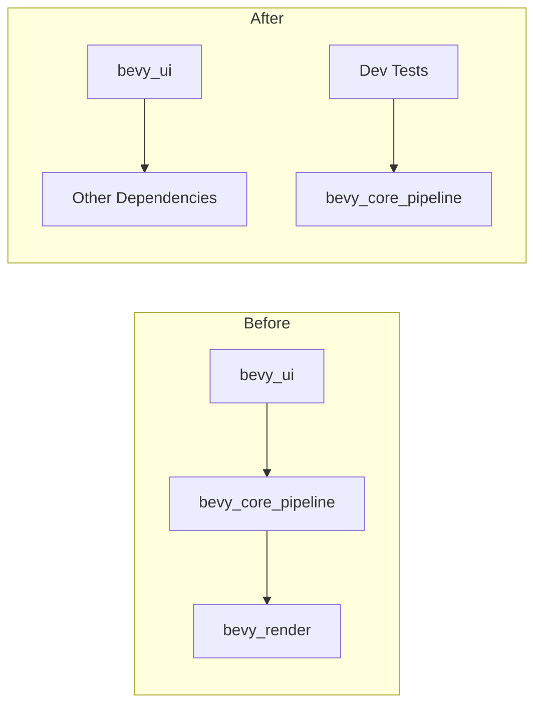

+++
title = "#20605 UI doesn't need render"
date = "2025-08-16T00:00:00"
draft = false
template = "pull_request_page.html"
in_search_index = true

[taxonomies]
list_display = ["show"]

[extra]
current_language = "en"
available_languages = {"en" = { name = "English", url = "/pull_request/bevy/2025-08/pr-20605-en-20250816" }, "zh-cn" = { name = "中文", url = "/pull_request/bevy/2025-08/pr-20605-zh-cn-20250816" }}
labels = ["A-Rendering", "C-Dependencies", "A-UI"]
+++

## UI Doesn't Need Render: Simplifying Bevy's UI Dependencies

### Basic Information
- **Title**: UI doesn't need render
- **PR Link**: https://github.com/bevyengine/bevy/pull/20605
- **Author**: Zeophlite
- **Status**: MERGED
- **Labels**: A-Rendering, C-Dependencies, A-UI, S-Needs-Review
- **Created**: 2025-08-16T04:54:49Z
- **Merged**: 2025-08-16T07:00:03Z
- **Merged By**: mockersf

### Description Translation
**Objective**  
- `bevy_ui` doesn't need `bevy_render`  

**Solution**  
- Remove it  

**Testing**  
- CI  

### The Story of This Pull Request

The core problem addressed in this PR was an unnecessary dependency between Bevy's UI system and its rendering pipeline. `bevy_ui` had a direct dependency on `bevy_core_pipeline`, which itself depends on `bevy_render`. This created a dependency chain where UI functionality pulled in rendering components even when they weren't strictly required for UI operations. 

In game engine architecture, minimizing dependencies is crucial for several reasons:
1. It reduces compile times for developers
2. It decreases binary size for projects not using full rendering capabilities
3. It simplifies dependency graphs and reduces potential conflicts
4. It enables headless operation for server-side or tooling use cases

The solution approach was straightforward: remove the unneeded dependencies. After analysis, the author determined that:
- `bevy_core_pipeline` wasn't directly used by core UI functionality
- The `serialize` feature didn't require `bevy_render`
- Tests could use `bevy_core_pipeline` directly instead of pulling it through `bevy_render`

The implementation consisted of three coordinated changes to `bevy_ui`'s dependency declarations:
1. Removing `bevy_core_pipeline` from main dependencies
2. Replacing `bevy_render` with `bevy_core_pipeline` in dev-dependencies
3. Removing `bevy_render/serialize` from the serialize feature

These changes required no code modifications beyond the dependency declarations, indicating the original dependency was likely accidental rather than functional. The CI pipeline served as sufficient validation since no behavioral changes were introduced.

The impact of this change is:
- Cleaner separation between UI and rendering systems
- Reduced build times for UI-focused projects
- Smaller dependency footprint for minimal Bevy configurations
- Improved architecture demonstrating Bevy's modular design principles

### Visual Representation



### Key Files Changed

**File**: `crates/bevy_ui/Cargo.toml`  
**Changes**: Dependency cleanup removing rendering dependencies from UI crate  

Before:
```toml
bevy_core_pipeline = { path = "../bevy_core_pipeline", version = "0.17.0-dev" }

[dev-dependencies]
bevy_render = { path = "../bevy_render", version = "0.17.0-dev" }

[features]
serialize = [
  # ...
  "bevy_render/serialize",
]
```

After:
```toml
# bevy_core_pipeline removed from main dependencies

[dev-dependencies]
bevy_core_pipeline = { path = "../bevy_core_pipeline", version = "0.17.0-dev" }

[features]
serialize = [
  # ...
  # bevy_render/serialize removed
]
```

### Further Reading
1. [Cargo Dependency Specification](https://doc.rust-lang.org/cargo/reference/specifying-dependencies.html)  
2. [Bevy's ECS Architecture](https://bevyengine.org/learn/book/getting-started/ecs/)  
3. [Rust Workspace Optimization](https://doc.rust-lang.org/cargo/reference/workspaces.html)  

This PR demonstrates effective dependency management in Rust projects, showing how to audit and streamline crate dependencies to maintain lean, focused components within a larger system.