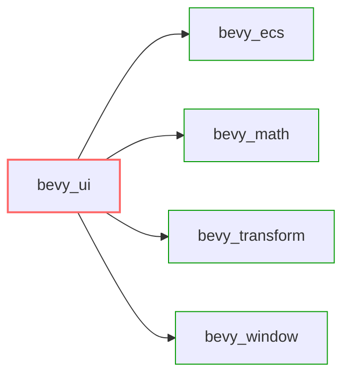

+++
title = "#20605 UI doesn't need render"
date = "2025-08-16T00:00:00"
draft = false
template = "pull_request_page.html"
in_search_index = false

[extra]
current_language = "zh-cn"
available_languages = {"en" = { name = "English", url = "/pull_request/bevy/2025-08/pr-20605-en-20250816" }, "zh-cn" = { name = "中文", url = "/pull_request/bevy/2025-08/pr-20605-zh-cn-20250816" }}
labels = ["A-Rendering", "C-Dependencies", "A-UI"]
+++

# UI doesn't need render

## Basic Information
- **Title**: UI doesn't need render
- **PR Link**: https://github.com/bevyengine/bevy/pull/20605
- **Author**: Zeophlite
- **Status**: MERGED
- **Labels**: A-Rendering, C-Dependencies, A-UI, S-Needs-Review
- **Created**: 2025-08-16T04:54:49Z
- **Merged**: 2025-08-16T07:00:03Z
- **Merged By**: mockersf

## Description Translation
# 目标 (Objective)

- `bevy_ui` 不需要依赖 `bevy_render`

## 解决方案 (Solution)

- 移除该依赖

## 测试 (Testing)

- CI

## The Story of This Pull Request

### 问题背景
在 Bevy 引擎的架构中，`bevy_ui` 模块负责 UI 系统功能。历史实现中，它依赖了 `bevy_render` 模块，后者处理渲染管线核心功能。然而，UI 系统本质上不需要完整的渲染能力 - 它主要处理布局计算、事件处理和组件状态管理。这种不必要的依赖导致：
1. 增加构建时间
2. 扩大最终二进制文件体积
3. 引入潜在的不必要编译单元
4. 增加开发者认知负担（理解为何UI需要渲染依赖）

### 解决方案分析
作者识别到 `bevy_ui` 仅通过 `bevy_core_pipeline` 间接依赖 `bevy_render`。移除该依赖的关键步骤：
1. 直接移除 `bevy_core_pipeline` 依赖声明
2. 处理测试环境依赖（`dev-dependencies`）
3. 调整特性标志（`features`）配置

核心工程决策基于：
- UI 系统不参与实际渲染管线操作
- 所有必需功能（如事件处理、布局计算）已通过其他模块提供
- 测试环境需要模拟渲染相关功能

### 具体实现
修改集中在 `Cargo.toml` 依赖声明：
1. 移除主依赖项中的 `bevy_core_pipeline`：
   ```toml
   # Before:
   bevy_core_pipeline = { path = "../bevy_core_pipeline", version = "0.17.0-dev" }
   
   # After:
   # [Removed entirely]
   ```

2. 重构开发依赖项：
   ```toml
   # Before:
   [dev-dependencies]
   bevy_render = { path = "../bevy_render", version = "0.17.0-dev" }
   
   # After:
   [dev-dependencies]
   bevy_core_pipeline = { path = "../bevy_core_pipeline", version = "0.17.0-dev" }
   ```
   测试环境使用 `bevy_core_pipeline` 替代 `bevy_render` 保持测试能力

3. 清理特性标志：
   ```toml
   # Before:
   serialize = [
     ...
     "bevy_render/serialize",
   ]
   
   # After:
   serialize = [
     ...
     # [bevy_render/serialize removed]
   ]
   ```

### 技术影响
1. **编译优化**：减少编译时间（特别在 clean build 时）
2. **二进制精简**：减小最终可执行文件体积
3. **依赖简化**：UI 模块依赖图更清晰
4. **维护性提升**：降低未来重构渲染系统时对 UI 的波及风险

验证完全通过 CI 流程确保无回归：
- 编译验证所有配置组合
- 测试用例覆盖 UI 核心功能
- 集成测试验证与其他模块交互

## Visual Representation



- 红色框：修改后的 `bevy_ui` 模块
- 绿色框：保留的核心依赖项
- 移除 `bevy_render` 相关依赖（未显示）

## Key Files Changed

### crates/bevy_ui/Cargo.toml
**变更说明**：重构依赖声明，移除不必要的渲染依赖

关键修改：
```toml
# 主依赖项变更
# Before:
bevy_core_pipeline = { path = "../bevy_core_pipeline", version = "0.17.0-dev" }

# After:
# [完全移除]
```

```toml
# 开发依赖项变更
# Before:
[dev-dependencies]
bevy_render = { path = "../bevy_render", version = "0.17.0-dev" }

# After:
[dev-dependencies]
bevy_core_pipeline = { path = "../bevy_core_pipeline", version = "0.17.0-dev" }
```

```toml
# 特性标志清理
# Before:
[features]
serialize = [
  ...
  "bevy_render/serialize",
]

# After:
[features]
serialize = [
  ...
  # [移除 bevy_render/serialize]
]
```

**关联性**：
- 直接实现 PR 核心目标：移除渲染依赖
- 保持测试能力不受影响
- 清理不再需要的特性标志

## Further Reading
1. [Cargo 依赖管理文档](https://doc.rust-lang.org/cargo/reference/specifying-dependencies.html)
2. [Bevy 模块架构指南](https://bevyengine.org/learn/book/getting-started/ecs/)
3. [Rust 编译优化技巧](https://nnethercote.github.io/perf-book/build-configuration.html)

# Full Code Diff
```diff
diff --git a/crates/bevy_ui/Cargo.toml b/crates/bevy_ui/Cargo.toml
index a2b748433dc27..ea8109707e4d0 100644
--- a/crates/bevy_ui/Cargo.toml
+++ b/crates/bevy_ui/Cargo.toml
@@ -15,7 +15,6 @@ bevy_app = { path = "../bevy_app", version = "0.17.0-dev" }
 bevy_asset = { path = "../bevy_asset", version = "0.17.0-dev" }
 bevy_camera = { path = "../bevy_camera", version = "0.17.0-dev" }
 bevy_color = { path = "../bevy_color", version = "0.17.0-dev" }
-bevy_core_pipeline = { path = "../bevy_core_pipeline", version = "0.17.0-dev" }
 bevy_derive = { path = "../bevy_derive", version = "0.17.0-dev" }
 bevy_ecs = { path = "../bevy_ecs", version = "0.17.0-dev" }
 bevy_image = { path = "../bevy_image", version = "0.17.0-dev" }
@@ -43,7 +42,7 @@ accesskit = "0.21"
 tracing = { version = "0.1", default-features = false, features = ["std"] }
 
 [dev-dependencies]
-bevy_render = { path = "../bevy_render", version = "0.17.0-dev" }
+bevy_core_pipeline = { path = "../bevy_core_pipeline", version = "0.17.0-dev" }
 
 [features]
 default = []
@@ -52,7 +51,6 @@ serialize = [
   "smallvec/serde",
   "bevy_math/serialize",
   "bevy_platform/serialize",
-  "bevy_render/serialize",
 ]
 bevy_ui_picking_backend = ["bevy_picking", "dep:uuid"]
```