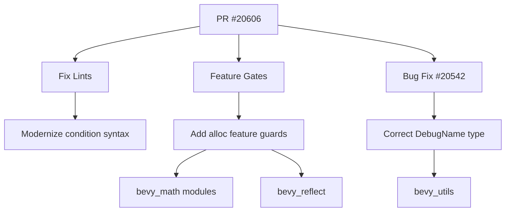

+++
title = "#20606 Fix some lints and feature gates"
date = "2025-08-16T00:00:00"
draft = false
template = "pull_request_page.html"
in_search_index = true

[taxonomies]
list_display = ["show"]

[extra]
current_language = "en"
available_languages = {"en" = { name = "English", url = "/pull_request/bevy/2025-08/pr-20606-en-20250816" }, "zh-cn" = { name = "中文", url = "/pull_request/bevy/2025-08/pr-20606-zh-cn-20250816" }}
labels = ["C-Code-Quality"]
+++

## Fix some lints and feature gates

### Basic Information
- **Title**: Fix some lints and feature gates
- **PR Link**: https://github.com/bevyengine/bevy/pull/20606
- **Author**: mockersf
- **Status**: MERGED
- **Labels**: C-Code-Quality, S-Ready-For-Final-Review
- **Created**: 2025-08-16T07:45:06Z
- **Merged**: 2025-08-16T20:13:38Z
- **Merged By**: mockersf

### Description Translation
# Objective

- Some more lints
- Also fixes #20542

## Solution

- Fix them

### The Story of This Pull Request

This PR addresses two main technical concerns in the Bevy codebase: improving code quality by fixing linter warnings and resolving feature-gating issues. The changes were necessary to maintain build correctness across different feature configurations and to follow modern Rust idioms.

The initial problem involved inconsistent handling of feature gates, particularly around the `alloc` feature. When certain features were disabled, unused imports and implementations remained in the code, causing compiler warnings. Additionally, issue #20542 reported a type error in the `DebugName` implementation that needed correction. The PR also included a minor refactor to simplify conditional logic using Rust's newer `let-else` syntax.

For the feature-gating issues, the solution involved adding `#[cfg(feature = "alloc")]` attributes to imports and implementations that depend on heap allocation. This ensures the compiler only includes these code paths when the relevant feature is enabled. The changes were spread across multiple math modules where polygon-related functionality requires allocation.

The bug in `DebugName` was straightforward - a reference was being returned where a direct value was expected. The fix modified the return statement to match the expected `&str` type rather than `&&str`. This resolved the type mismatch and fixed the reported issue.

In `sync_file_asset.rs`, the solution modernized the meta file filtering logic by using Rust 1.58's `if let` chaining syntax. This replaced a nested if-statement with a single, more readable condition that combines pattern matching and boolean logic.

These changes collectively improve the codebase in three ways:
1. They eliminate compiler warnings for unused code when features are disabled
2. They fix a concrete type error affecting debug functionality
3. They modernize syntax for better readability

The implementation required careful attention to conditional compilation attributes. For example, in `primitive_impls.rs`, the `ConvexPolygon` import was moved inside the `alloc` feature gate since this type depends on heap allocation. Similarly, in `dim2.rs`, the `TryFrom` implementation for `ConvexPolygon` was properly feature-gated since it depends on `Polygon` which requires allocation.

The changes demonstrate good practices for feature gating in Rust crates and show how to properly handle conditional compilation to keep builds clean across different configurations. The PR also illustrates the importance of precise type matching in trait implementations, as shown in the `DebugName` fix.

### Visual Representation



### Key Files Changed

1. **`crates/bevy_asset/src/io/file/sync_file_asset.rs`**  
   Simplified condition for filtering meta files using modern Rust syntax:

```rust
// Before:
if let Some(ext) = path.extension().and_then(|e| e.to_str()) {
    if ext.eq_ignore_ascii_case("meta") {
        return None;
    }
}

// After:
if let Some(ext) = path.extension().and_then(|e| e.to_str())
    && ext.eq_ignore_ascii_case("meta")
{
    return None;
}
```

2. **`crates/bevy_math/src/bounding/bounded2d/primitive_impls.rs`**  
   Corrected feature-gating for alloc-dependent types:

```rust
// Before (unconditional import):
use crate::primitives::{..., ConvexPolygon, ...};

// After (conditional import):
#[cfg(feature = "alloc")]
use crate::primitives::{ConvexPolygon, Polygon, Polyline2d};
```

3. **`crates/bevy_math/src/primitives/dim2.rs`**  
   Added missing feature guards:

```rust
// Added feature guard for error type
#[cfg(feature = "alloc")]
use thiserror::Error;

// Added feature guard for conversion implementation
#[cfg(feature = "alloc")]
impl TryFrom<Polygon> for ConvexPolygon { ... }
```

4. **`crates/bevy_utils/src/debug_info.rs`**  
   Fixed type error in DebugName implementation:

```rust
// Before:
return &FEATURE_DISABLED;

// After:
return FEATURE_DISABLED;
```

5. **`crates/bevy_reflect/src/lib.rs`**  
   Added feature guard for auto-registration exports:

```rust
// Added conditional compilation
#[cfg(any(feature = "auto_register_static", feature = "auto_register_inventory"))]
pub use __automatic_type_registration_impl::*;
```

### Further Reading
1. [Rust Feature Gates Documentation](https://doc.rust-lang.org/cargo/reference/features.html)
2. [Rust 1.58 if-let Chains](https://blog.rust-lang.org/2022/01/13/Rust-1.58.0.html#let-else-statements)
3. [Deref Trait Documentation](https://doc.rust-lang.org/std/ops/trait.Deref.html)
4. [Conditional Compilation in Rust](https://doc.rust-lang.org/reference/conditional-compilation.html)