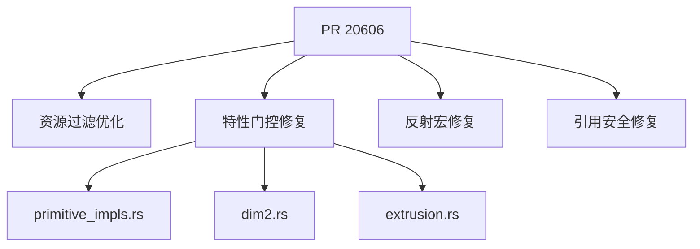

+++
title = "#20606 Fix some lints and feature gates"
date = "2025-08-16T00:00:00"
draft = false
template = "pull_request_page.html"
in_search_index = false

[extra]
current_language = "zh-cn"
available_languages = {"en" = { name = "English", url = "/pull_request/bevy/2025-08/pr-20606-en-20250816" }, "zh-cn" = { name = "中文", url = "/pull_request/bevy/2025-08/pr-20606-zh-cn-20250816" }}
+++

# Fix some lints and feature gates

## 基础信息
- **标题**: Fix some lints and feature gates
- **PR链接**: https://github.com/bevyengine/bevy/pull/20606
- **作者**: mockersf
- **状态**: 已合并
- **标签**: C-Code-Quality, S-Ready-For-Final-Review
- **创建时间**: 2025-08-16T07:45:06Z
- **合并时间**: 2025-08-16T20:13:38Z
- **合并者**: mockersf

## 描述翻译
# 目标 (Objective)

- 修复一些代码检查 (lints)
- 同时修复 #20542

## 解决方案 (Solution)

- 修复它们

## 这个Pull Request的故事

这个PR主要解决了两个技术问题：修复了多个代码检查警告(lints)并正确设置了特性门控(feature gates)。这些修改虽然分散在不同模块，但都针对特定问题进行了精准调整。

### 问题识别
在代码库演进过程中，发现了几个需要修复的问题：
1. **资源文件过滤逻辑**：`sync_file_asset.rs`中的元文件过滤使用了冗余的条件检查
2. **特性门控缺失**：多个数学模块在`alloc`特性禁用时暴露了编译问题（#20542）
3. **反射宏导出问题**：`bevy_reflect`的条件编译配置不完整
4. **悬垂引用风险**：`debug_info.rs`在特定配置下可能返回临时值的引用

### 解决方案实现
针对每个问题实施了最小化修改：

**资源过滤优化**：  
在`sync_file_asset.rs`中简化了元文件过滤逻辑，将嵌套条件合并为单个`if let`守卫表达式：
```diff
- if let Some(ext) = path.extension().and_then(|e| e.to_str()) {
-     if ext.eq_ignore_ascii_case("meta") {
-         return None;
-     }
+ if let Some(ext) = path.extension().and_then(|e| e.to_str())
+     && ext.eq_ignore_ascii_case("meta")
+ {
+     return None;
}
```
这种修改使代码更简洁，同时保持相同的行为——跳过所有`.meta`文件。

**特性门控修复**：  
数学模块有三个关键修改：
1. 在`primitive_impls.rs`中，将`ConvexPolygon`移到`alloc`特性保护块内
```diff
 #[cfg(feature = "alloc")]
-use crate::primitives::{Polygon, Polyline2d};
+use crate::primitives::{ConvexPolygon, Polygon, Polyline2d};
```
2. 在`dim2.rs`中为`ConvexPolygon`转换实现添加特性保护
```diff
+#[cfg(feature = "alloc")]
 impl TryFrom<Polygon> for ConvexPolygon {
```
3. 在`extrusion.rs`中为`Polygon`的3D边界计算添加特性保护
```diff
+#[cfg(feature = "alloc")]
 impl BoundedExtrusion for Polygon {
```
这些修改确保当`alloc`特性禁用时，相关代码不会编译，解决了#20542报告的编译错误。

**反射宏修复**：  
修正了`bevy_reflect`的条件编译配置：
```diff
+        #[cfg(any(feature = "auto_register_static", feature = "auto_register_inventory"))]
         pub use __automatic_type_registration_impl::*;
```
这确保宏只在相关特性启用时导出，避免编译错误。

**引用安全修复**：  
在`debug_info.rs`中修复了可能的悬垂引用：
```diff
-        return &FEATURE_DISABLED;
+        return FEATURE_DISABLED;
```
修改后直接返回静态字符串切片，避免返回临时值的引用。

### 技术影响
这些修改带来了直接改进：
1. 代码更符合Rust惯用法（如使用`if let`守卫）
2. 修复了禁用`alloc`特性时的编译失败问题
3. 消除了潜在的悬垂引用风险
4. 确保条件编译配置正确应用
5. 保持代码在不同特性组合下的健壮性

## 视觉表示



## 关键文件变更

### `crates/bevy_asset/src/io/file/sync_file_asset.rs` (+4/-4)
**修改原因**：简化元文件过滤逻辑  
**关键变更**：
```diff
-                        if let Some(ext) = path.extension().and_then(|e| e.to_str()) {
-                            if ext.eq_ignore_ascii_case("meta") {
-                                return None;
-                            }
+                        if let Some(ext) = path.extension().and_then(|e| e.to_str())
+                            && ext.eq_ignore_ascii_case("meta")
+                        {
+                            return None;
```

### `crates/bevy_math/src/bounding/bounded2d/primitive_impls.rs` (+3/-3)
**修改原因**：调整`alloc`特性下的导入  
**关键变更**：
```diff
 #[cfg(feature = "alloc")]
-use crate::primitives::{Polygon, Polyline2d};
+use crate::primitives::{ConvexPolygon, Polygon, Polyline2d};
```

### `crates/bevy_math/src/primitives/dim2.rs` (+2/-0)
**修改原因**：为`ConvexPolygon`转换添加特性保护  
**关键变更**：
```diff
+#[cfg(feature = "alloc")]
 impl TryFrom<Polygon> for ConvexPolygon {
```

### `crates/bevy_math/src/bounding/bounded3d/extrusion.rs` (+1/-0)
**修改原因**：为`Polygon`的3D边界实现添加特性保护  
**关键变更**：
```diff
+#[cfg(feature = "alloc")]
 impl BoundedExtrusion for Polygon {
```

### `crates/bevy_utils/src/debug_info.rs` (+1/-1)
**修改原因**：修复可能的悬垂引用  
**关键变更**：
```diff
-        return &FEATURE_DISABLED;
+        return FEATURE_DISABLED;
```

## 进一步阅读
1. [Rust特性门控文档](https://doc.rust-lang.org/cargo/reference/features.html)
2. [if let守卫语法](https://doc.rust-lang.org/reference/expressions/if-expr.html#if-let-expressions)
3. [静态生命周期与引用安全](https://doc.rust-lang.org/book/ch10-03-lifetime-syntax.html#the-static-lifetime)