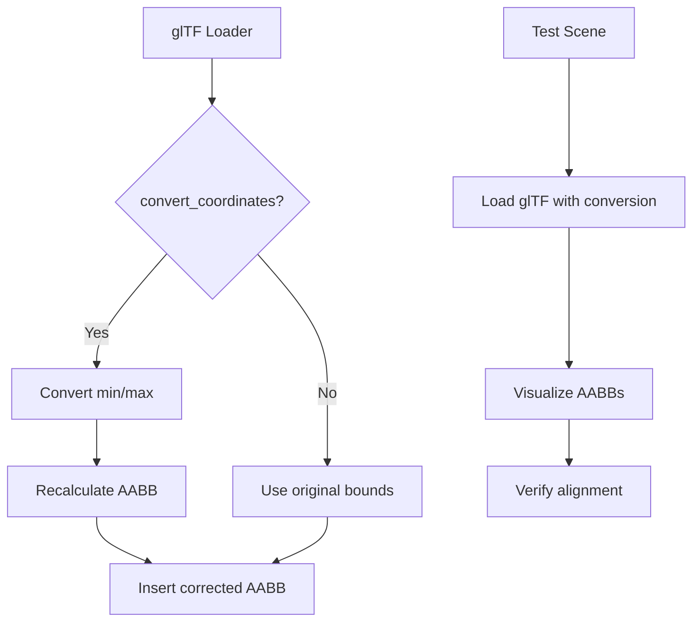

+++
title = "#20608 Fix glTF coordinate conversion not converting mesh bounds"
date = "2025-08-17T00:00:00"
draft = false
template = "pull_request_page.html"
in_search_index = true

[taxonomies]
list_display = ["show"]

[extra]
current_language = "en"
available_languages = {"en" = { name = "English", url = "/pull_request/bevy/2025-08/pr-20608-en-20250817" }, "zh-cn" = { name = "中文", url = "/pull_request/bevy/2025-08/pr-20608-zh-cn-20250817" }}
labels = ["C-Bug", "A-glTF", "M-Deliberate-Rendering-Change"]
+++

### Fix glTF coordinate conversion not converting mesh bounds

#### Basic Information
- **Title**: Fix glTF coordinate conversion not converting mesh bounds
- **PR Link**: https://github.com/bevyengine/bevy/pull/20608
- **Author**: greeble-dev
- **Status**: MERGED
- **Labels**: C-Bug, S-Ready-For-Final-Review, A-glTF, M-Deliberate-Rendering-Change
- **Created**: 2025-08-16T14:38:22Z
- **Merged**: 2025-08-17T16:57:38Z
- **Merged By**: alice-i-cecile

#### Description Translation
glTF coordinate conversion is applied to mesh assets, but not their bounds:


After the fix:


The PR also adds the above scene to `testbed_3d`.

## Testing

```sh
cargo run --example testbed_3d
```

---

### The Story of This Pull Request

#### The Problem and Context
When importing glTF assets into Bevy, a coordinate system conversion is applied to transform vertices from glTF's right-handed coordinate system (Y-up) to Bevy's left-handed system (Y-up). This conversion typically involves flipping the Z-axis. However, while mesh vertices were correctly transformed, the axis-aligned bounding boxes (AABBs) associated with these meshes were not being converted. This resulted in bounding boxes that didn't match the actual transformed geometry, as shown in the first screenshot. 

The discrepancy caused visual artifacts in systems that rely on accurate bounds, such as:
1. Frustum culling (incorrectly culled objects)
2. Physics collisions (mismatched collision volumes)
3. Raycasting (inaccurate intersection tests)

#### The Solution Approach
The solution required applying the same coordinate transformation to AABB min/max points as was already applied to mesh vertices. Key considerations:
1. The transformation must be conditional on `convert_coordinates` flag
2. After conversion, min/max values may swap due to axis flipping
3. The new AABB must be reconstructed from post-conversion extremes

No alternatives were considered since the solution directly addressed the inconsistency in transformation application.

#### The Implementation
The core fix modifies the glTF loader's mesh processing logic. When loading primitive meshes, we now:
1. Extract raw min/max bounds from glTF data
2. Conditionally apply coordinate conversion
3. Recalculate actual min/max after potential axis flips
4. Insert the corrected AABB

```rust
// crates/bevy_gltf/src/loader/mod.rs
let mut bounds_min = Vec3::from_slice(&bounds.min);
let mut bounds_max = Vec3::from_slice(&bounds.max);

if convert_coordinates {
    let converted_min = bounds_min.convert_coordinates();
    let converted_max = bounds_max.convert_coordinates();
    
    bounds_min = converted_min.min(converted_max);
    bounds_max = converted_min.max(converted_max);
}

mesh_entity.insert(Aabb::from_min_max(bounds_min, bounds_max));
```
The `min()`/`max()` operations ensure correct component-wise ordering after potential axis flips.

#### Testing and Validation
A new test scene was added to verify the fix:
1. Loads a glTF model (`faces.glb`) with coordinate conversion enabled
2. Attaches AABB visualization to all meshes
3. Adds coordinate axes for spatial reference

```rust
// examples/testbed/3d.rs
commands.spawn((
    SceneRoot(asset_server.load_with_settings(
        GltfAssetLabel::Scene(0).from_asset("models/Faces/faces.glb"),
        |s: &mut GltfLoaderSettings| {
            s.use_model_forward_direction = Some(true);
        },
    )),
    DespawnOnExitState(CURRENT_SCENE),
))
.observe(show_aabbs);
```
The `show_aabbs` system attaches `ShowAabbGizmo` to all mesh entities after loading. Running the testbed example (`cargo run --example testbed_3d`) cycles through scenes including this new validation case.

#### Technical Insights
1. **Bounds Recalculation**: After coordinate conversion, we can't assume original min remains min due to axis flips. The component-wise `min()`/`max()` operations guarantee valid AABB construction.
2. **Minimal Overhead**: The fix adds negligible runtime cost since it operates on two points per mesh.
3. **Consistency**: Aligns AABB handling with vertex processing, maintaining system invariants.

#### Impact
1. Fixes mismatched bounds in coordinate-converted glTF assets
2. Ensures correct behavior in bounding-dependent systems
3. Adds validation mechanism to prevent regression
4. Maintains backward compatibility with existing assets

---

### Visual Representation


---

### Key Files Changed

#### 1. `crates/bevy_gltf/src/loader/mod.rs`
**Purpose**: Fixes AABB conversion logic in glTF importer  
**Changes**:
```diff
-                mesh_entity.insert(Aabb::from_min_max(
-                    Vec3::from_slice(&bounds.min),
-                    Vec3::from_slice(&bounds.max),
-                ));
+                let mut bounds_min = Vec3::from_slice(&bounds.min);
+                let mut bounds_max = Vec3::from_slice(&bounds.max);
+
+                if convert_coordinates {
+                    let converted_min = bounds_min.convert_coordinates();
+                    let converted_max = bounds_max.convert_coordinates();
+
+                    bounds_min = converted_min.min(converted_max);
+                    bounds_max = converted_min.max(converted_max);
+                }
+
+                mesh_entity.insert(Aabb::from_min_max(bounds_min, bounds_max));
```

#### 2. `examples/testbed/3d.rs`
**Purpose**: Adds validation scene for coordinate conversion  
**Changes**:
```diff
 enum Scene {
     Bloom,
     Gltf,
     Animation,
     Gizmos,
+    GltfCoordinateConversion,
 }
```
```rust
// Scene setup and systems registration
.add_systems(
    OnEnter(Scene::GltfCoordinateConversion),
    gltf_coordinate_conversion::setup,
)
.add_systems(
    Update,
    gltf_coordinate_conversion::draw_gizmos
        .run_if(in_state(Scene::GltfCoordinateConversion)),
```

```rust
// New test scene implementation
mod gltf_coordinate_conversion {
    pub fn setup(...) {
        // Camera, lights, and model loading
        commands.spawn((
            SceneRoot(asset_server.load_with_settings(...)),
            DespawnOnExitState(CURRENT_SCENE),
        ))
        .observe(show_aabbs);
    }
    
    pub fn show_aabbs(...) {
        // Attach AABB visualization to meshes
        commands.entity(child).insert(ShowAabbGizmo { ... });
    }
}
```

---

### Further Reading
1. [glTF Coordinate Systems](https://registry.khronos.org/glTF/specs/2.0/glTF-2.0.html#coordinate-system-and-units) - Official specification
2. [Bevy Coordinate Conversion](https://github.com/bevyengine/bevy/blob/main/crates/bevy_gltf/src/coord.rs) - Implementation details
3. [AABB in Game Physics](https://developer.nvidia.com/gpugems/gpugems/part-i-natural-effects/chapter-6-built-hardware-accelerated-collision-detection) - Practical applications
4. [Bevy Testbed Architecture](https://github.com/bevyengine/bevy/tree/main/examples/testbed) - Example system design