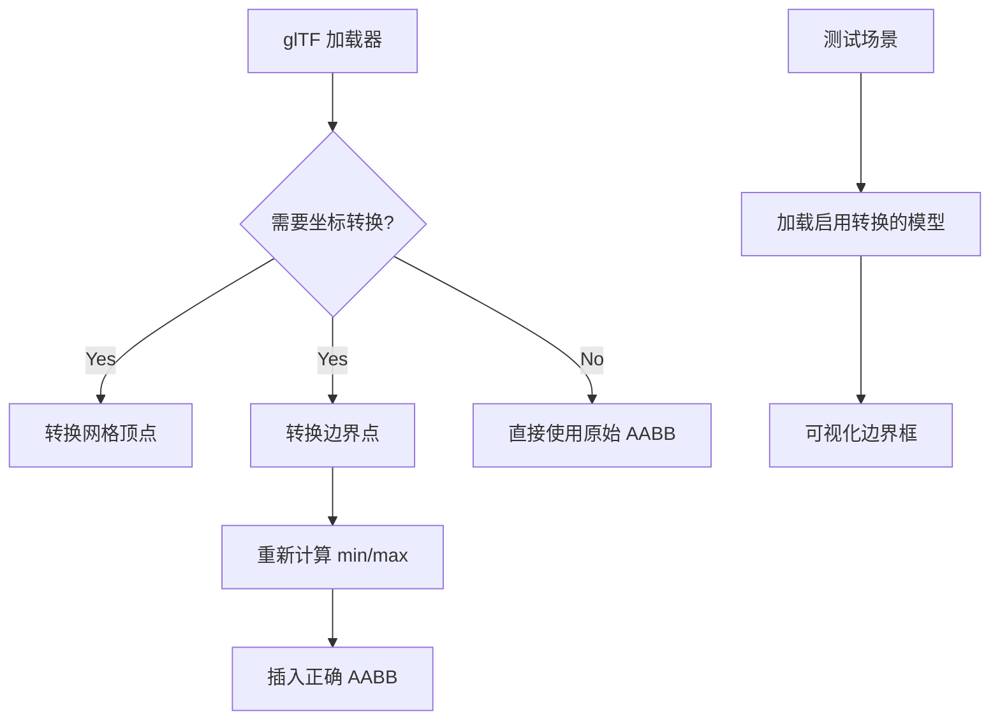

+++
title = "#20608 Fix glTF coordinate conversion not converting mesh bounds"
date = "2025-08-17T00:00:00"
draft = false
template = "pull_request_page.html"
in_search_index = false

[extra]
current_language = "zh-cn"
available_languages = {"en" = { name = "English", url = "/pull_request/bevy/2025-08/pr-20608-en-20250817" }, "zh-cn" = { name = "中文", url = "/pull_request/bevy/2025-08/pr-20608-zh-cn-20250817" }}
+++

## 标题
修复 glTF 坐标转换未应用于网格边界的问题

## 基本信息
- **标题**: Fix glTF coordinate conversion not converting mesh bounds
- **PR 链接**: https://github.com/bevyengine/bevy/pull/20608
- **作者**: greeble-dev
- **状态**: 已合并
- **标签**: C-Bug, S-Ready-For-Final-Review, A-glTF, M-Deliberate-Rendering-Change
- **创建时间**: 2025-08-16T14:38:22Z
- **合并时间**: 2025-08-17T16:57:38Z
- **合并者**: alice-i-cecile

## 描述翻译
glTF 坐标转换应用于网格资源，但未应用于其边界：


修复后：


此 PR 还将上述场景添加到 `testbed_3d`。

## 测试

```sh
cargo run --example testbed_3d
```

## 本 PR 的技术分析

### 问题与背景
在 Bevy 引擎中处理 glTF 资源时存在一个关键问题：当进行坐标系转换时(从 glTF 的右手坐标系转换为 Bevy 的左手坐标系)，网格边界(AABB)未同步更新。具体表现为：
- 网格顶点正确应用了 Z 轴取反转换
- 但网格边界仍保持原始坐标值
- 导致渲染时边界框位置错误
- 影响依赖边界框的系统(如视锥体剔除、物理碰撞检测等)

问题可视化对比：
- 修复前：边界框与模型位置不匹配
- 修复后：边界框正确包裹模型

### 解决方案
核心解决思路：在加载网格时同步应用坐标转换到边界框：
1. 检测是否启用坐标转换(`convert_coordinates`标志)
2. 对边界框的 min/max 点应用相同转换
3. 处理转换后 min/max 点可能反转的情况
4. 确保最终边界框正确包裹转换后的网格

关键工程决策：
- 在现有 glTF 加载流程中增加边界处理
- 复用已有的坐标转换逻辑
- 显式处理转换后 min/max 点顺序问题
- 添加专用测试场景验证修复效果

### 技术实现
在 `crates/bevy_gltf/src/loader/mod.rs` 中修改网格边界处理逻辑：

```rust
// 修改前：
mesh_entity.insert(Aabb::from_min_max(
    Vec3::from_slice(&bounds.min),
    Vec3::from_slice(&bounds.max),
));

// 修改后：
let mut bounds_min = Vec3::from_slice(&bounds.min);
let mut bounds_max = Vec3::from_slice(&bounds.max);

if convert_coordinates {
    let converted_min = bounds_min.convert_coordinates();
    let converted_max = bounds_max.convert_coordinates();

    bounds_min = converted_min.min(converted_max);
    bounds_max = converted_min.max(converted_max);
}

mesh_entity.insert(Aabb::from_min_max(bounds_min, bounds_max));
```

关键实现细节：
1. 显式解耦边界点处理：单独获取 min/max 点
2. 条件检查：仅在启用坐标转换时应用
3. 转换后重计算：使用 `min()`/`max()` 确保正确边界顺序
4. 保持原有 API：最终仍使用 `Aabb::from_min_max` 创建边界框

### 测试验证
新增 `GltfCoordinateConversion` 测试场景：
- 在 `examples/testbed/3d.rs` 中添加专用场景模块
- 加载启用了坐标转换的 glTF 模型
- 添加边界框可视化组件

```rust
mod gltf_coordinate_conversion {
    // ... 场景设置代码 ...
    
    commands.spawn((
        SceneRoot(asset_server.load_with_settings(
            GltfAssetLabel::Scene(0).from_asset("models/Faces/faces.glb"),
            |s: &mut GltfLoaderSettings| {
                s.use_model_forward_direction = Some(true); // 启用坐标转换
            },
        )),
        DespawnOnExitState(CURRENT_SCENE),
    ))
    .observe(show_aabbs); // 观察场景加载状态
    
    // 添加边界框可视化
    fn show_aabbs(...) {
        commands.entity(child).insert(ShowAabbGizmo {
            color: Some(BLACK.into()),
        });
    }
}
```

### 技术洞察
1. **坐标系转换**：glTF 使用右手坐标系(Y-up)，Bevy 使用左手坐标系(Y-up)，需 Z 轴取反转换
2. **边界框特性**：AABB 依赖 min/max 点顺序，坐标转换可能导致点关系反转
3. **系统集成**：修改点位于 glTF 加载管线，确保所有网格统一处理
4. **测试策略**：新增独立测试场景，避免影响现有功能

### 影响与改进
1. **功能修复**：确保边界框与转换后网格位置一致
2. **渲染正确性**：修复依赖边界框的系统(如视锥体剔除)
3. **调试支持**：新增专用测试场景便于问题复现
4. **维护性**：显式处理边界转换逻辑，避免类似问题

## 可视化表示



## 关键文件变更

### `crates/bevy_gltf/src/loader/mod.rs`
**变更原因**：修复 glTF 坐标转换未应用于网格边界的问题  
**关键修改**：
```rust
// 修改前：
mesh_entity.insert(Aabb::from_min_max(
    Vec3::from_slice(&bounds.min),
    Vec3::from_slice(&bounds.max),
));

// 修改后：
let mut bounds_min = Vec3::from_slice(&bounds.min);
let mut bounds_max = Vec3::from_slice(&bounds.max);

if convert_coordinates {
    let converted_min = bounds_min.convert_coordinates();
    let converted_max = bounds_max.convert_coordinates();

    bounds_min = converted_min.min(converted_max);
    bounds_max = converted_min.max(converted_max);
}

mesh_entity.insert(Aabb::from_min_max(bounds_min, bounds_max));
```

### `examples/testbed/3d.rs`
**变更原因**：添加测试场景验证修复效果  
**关键修改**：
1. 添加新场景枚举项
```rust
enum Scene {
    // ...
    GltfCoordinateConversion, // 新增测试场景
}
```
2. 注册场景系统
```rust
.add_systems(
    OnEnter(Scene::GltfCoordinateConversion),
    gltf_coordinate_conversion::setup,
)
.add_systems(
    Update,
    gltf_coordinate_conversion::draw_gizmos
        .run_if(in_state(Scene::GltfCoordinateConversion)),
);
```
3. 添加完整测试场景实现
```rust
mod gltf_coordinate_conversion {
    // ... 完整场景实现 ...
}
```

## 延伸阅读
1. [glTF 坐标系规范](https://github.com/KhronosGroup/glTF/tree/main/specification/2.0#coordinate-system-and-units)
2. [Bevy 坐标系文档](https://bevyengine.org/learn/book/introduction/#coordinate-system)
3. [Bevy glTF 加载器源码](https://github.com/bevyengine/bevy/blob/main/crates/bevy_gltf/src/loader.rs)
4. [轴对齐边界框(AABB)原理](https://developer.nvidia.com/blog/thinking-parallel-part-i-collision-detection-gpu/)