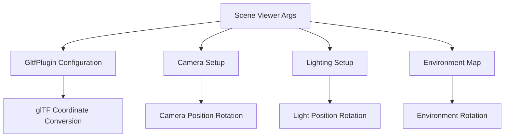

+++
title = "#20609 Add option to `scene_viewer` that enables glTF coordinate conversion"
date = "2025-08-19T00:00:00"
draft = false
template = "pull_request_page.html"
in_search_index = true

[taxonomies]
list_display = ["show"]

[extra]
current_language = "en"
available_languages = {"en" = { name = "English", url = "/pull_request/bevy/2025-08/pr-20609-en-20250819" }, "zh-cn" = { name = "中文", url = "/pull_request/bevy/2025-08/pr-20609-zh-cn-20250819" }}
labels = ["A-Rendering", "C-Examples", "D-Straightforward", "A-glTF"]
+++

# Add option to `scene_viewer` that enables glTF coordinate conversion

## Basic Information
- **Title**: Add option to `scene_viewer` that enables glTF coordinate conversion
- **PR Link**: https://github.com/bevyengine/bevy/pull/20609
- **Author**: greeble-dev
- **Status**: MERGED
- **Labels**: A-Rendering, C-Examples, S-Ready-For-Final-Review, X-Uncontroversial, D-Straightforward, A-glTF
- **Created**: 2025-08-16T14:56:28Z
- **Merged**: 2025-08-19T16:53:13Z
- **Merged By**: alice-i-cecile

## Description
Add a `--use-model-forward-direction` option to the `scene_viewer` example. This enables `GltfPlugin::use_model_forward_direction`, which is useful for testing issues like #20608.

I suspect the option can be `bool` rather than `Option<bool>`, but it's consistent with other `scene_viewer` options.

## Testing

```sh
cargo run --example scene_viewer -- "assets/models/faces/faces.glb" --use-model-forward-direction
```

## The Story of This Pull Request

This PR addresses a practical need in Bevy's tooling by adding support for testing glTF coordinate system conversions in the scene viewer example. The core issue stems from different 3D modeling tools using different coordinate systems - some use Y-up while others use Z-up. Bevy's `GltfPlugin` already had a `use_model_forward_direction` option to handle these conversions, but there was no straightforward way to test this functionality in the scene viewer.

The implementation follows a clean, consistent pattern with existing scene viewer options. The developer added a new command-line switch `--use-model-forward-direction` that toggles the glTF plugin's coordinate conversion behavior. When enabled, this option ensures that glTF models are loaded with their intended forward direction rather than being forced into Bevy's default coordinate system.

A key insight in this implementation is the need to maintain consistent camera and lighting orientation regardless of coordinate system conversion. The developer added a helper method `rotation()` that returns either an identity quaternion (no rotation) or a 180-degree Y-axis rotation when coordinate conversion is enabled. This ensures the scene maintains a consistent viewing angle relative to the camera, making visual comparisons meaningful.

The changes affect three main components in the scene setup:
1. Camera positioning - the camera's initial position is rotated to match the coordinate system
2. Environment map lighting - the environment light's rotation is adjusted
3. Directional light positioning - the default light's position is rotated accordingly

This approach demonstrates good software design by keeping the coordinate conversion logic centralized in the `Args` implementation rather than scattering rotation calculations throughout the scene setup code.

## Visual Representation



## Key Files Changed

**File: examples/tools/scene_viewer/main.rs**

Changes include adding the new command-line option, implementing the rotation helper method, configuring the GltfPlugin, and applying the rotation to camera, environment, and light transforms.

```rust
// Added to Args struct
#[argh(switch)]
use_model_forward_direction: Option<bool>,

// New helper method implementation
impl Args {
    fn rotation(&self) -> Quat {
        if self.use_model_forward_direction == Some(true) {
            Quat::from_xyzw(0.0, 1.0, 0.0, 0.0)
        } else {
            Quat::IDENTITY
        }
    }
}

// GltfPlugin configuration
.set(GltfPlugin {
    use_model_forward_direction: args.use_model_forward_direction.unwrap_or(false),
    ..default()
})

// Camera position adjustment
Transform::from_translation(
    Vec3::from(aabb.center) + size * (args.rotation() * Vec3::new(0.5, 0.25, 0.5)),
)

// Environment map rotation adjustment
EnvironmentMapLight {
    rotation: args.rotation(),
    ..default()
}

// Directional light position adjustment
Transform::from_translation(args.rotation() * Vec3::new(1.0, 1.0, 0.0))
```

## Further Reading

- [Bevy glTF Plugin Documentation](https://docs.rs/bevy/latest/bevy/gltf/struct.GltfPlugin.html)
- [glTF Coordinate System Specification](https://github.com/KhronosGroup/glTF/blob/master/specification/2.0/README.md#coordinate-system-and-units)
- [Bevy Scene Viewer Example](https://github.com/bevyengine/bevy/blob/main/examples/tools/scene_viewer)
- [Issue #20608 - glTF coordinate system discussion](https://github.com/bevyengine/bevy/issues/20608)