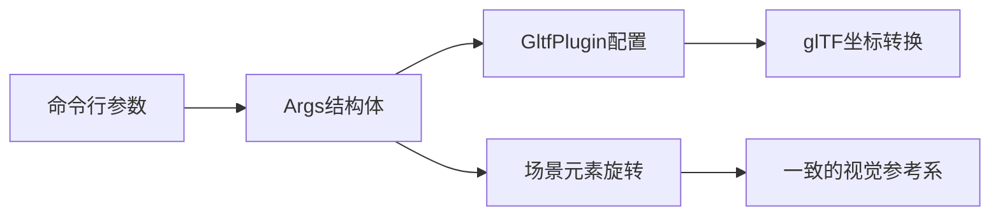

+++
title = "#20609 Add option to `scene_viewer` that enables glTF coordinate conversion"
date = "2025-08-19T00:00:00"
draft = false
template = "pull_request_page.html"
in_search_index = false

[extra]
current_language = "zh-cn"
available_languages = {"en" = { name = "English", url = "/pull_request/bevy/2025-08/pr-20609-en-20250819" }, "zh-cn" = { name = "中文", url = "/pull_request/bevy/2025-08/pr-20609-zh-cn-20250819" }}
+++

# Add option to `scene_viewer` that enables glTF coordinate conversion

## 基本信息
- **标题**: Add option to `scene_viewer` that enables glTF coordinate conversion
- **PR链接**: https://github.com/bevyengine/bevy/pull/20609
- **作者**: greeble-dev
- **状态**: 已合并
- **标签**: A-Rendering, C-Examples, S-Ready-For-Final-Review, X-Uncontroversial, D-Straightforward, A-glTF
- **创建时间**: 2025-08-16T14:56:28Z
- **合并时间**: 2025-08-19T16:53:13Z
- **合并者**: alice-i-cecile

## 描述翻译
为 `scene_viewer` 示例添加 `--use-model-forward-direction` 选项。这启用了 `GltfPlugin::use_model_forward_direction`，对于测试 #20608 等问题很有用。

我怀疑这个选项可以是 `bool` 而不是 `Option<bool>`，但为了与其他 `scene_viewer` 选项保持一致而采用这种方式。

## 测试

```sh
cargo run --example scene_viewer -- "assets/models/faces/faces.glb" --use-model-forward-direction
```

## 这个PR的故事

### 问题和背景

在3D图形开发中，不同的工具和格式使用不同的坐标系统约定是一个常见问题。glTF格式支持多种坐标系统，但Bevy引擎使用特定的坐标约定。当开发者需要测试glTF模型在不同坐标系统下的表现时，缺乏一个简单的方法来切换gltf插件的坐标转换行为。

具体来说，`GltfPlugin` 有一个 `use_model_forward_direction` 配置选项，但在 `scene_viewer` 示例工具中没有暴露这个选项给用户。这使得测试和调试与坐标系统相关的问题（如issue #20608）变得困难，因为无法方便地在不同配置下查看同一场景的表现。

### 解决方案

这个PR采取了直接但有效的方法：在 `scene_viewer` 命令行参数中添加一个新的开关选项 `--use-model-forward-direction`，并将这个选项传递给 `GltfPlugin` 的相应配置。

实现的关键洞察是：当启用坐标转换时，不仅需要配置gltf插件，还需要调整场景中的其他元素（相机、灯光）的朝向，以保持一致的视觉参考系。这确保了无论是否启用坐标转换，场景都会以相同的方式面向相机，便于进行比较测试。

### 实现细节

主要的实现集中在 `examples/tools/scene_viewer/main.rs` 文件中。首先在 `Args` 结构体中添加了新选项：

```rust
#[argh(switch)]
use_model_forward_direction: Option<bool>,
```

然后添加了一个辅助方法来根据这个选项计算相应的旋转：

```rust
impl Args {
    fn rotation(&self) -> Quat {
        if self.use_model_forward_direction == Some(true) {
            // 如果场景被转换了，那么旋转其他所有东西来匹配
            // 这使得比较更容易 - 场景总是会以相同的方式面向相机
            Quat::from_xyzw(0.0, 1.0, 0.0, 0.0)
        } else {
            Quat::IDENTITY
        }
    }
}
```

在main函数中，这个选项被传递给GltfPlugin：

```rust
.set(GltfPlugin {
    use_model_forward_direction: args.use_model_forward_direction.unwrap_or(false),
    ..default()
}),
```

最后，在设置相机和灯光时使用了这个旋转：

```rust
Transform::from_translation(
    Vec3::from(aabb.center) + size * (args.rotation() * Vec3::new(0.5, 0.25, 0.5)),
)
```

```rust
Transform::from_translation(args.rotation() * Vec3::new(1.0, 1.0, 0.0))
```

### 技术考量

作者考虑过使用简单的 `bool` 类型而不是 `Option<bool>`，但为了与 `scene_viewer` 中其他选项保持一致而保持了现有模式。这种一致性很重要，因为它保持了代码的可预测性和可维护性。

旋转四元数 `Quat::from_xyzw(0.0, 1.0, 0.0, 0.0)` 表示一个180度的旋转，这有效地将Z-forward的坐标系转换为Y-forward（或反之），具体取决于原始坐标系的定义。

### 影响和价值

这个改动虽然不大，但提供了重要的测试能力。现在开发者可以：

1. 轻松测试glTF模型在不同坐标系统约定下的表现
2. 调试与坐标系统相关的问题
3. 验证Bevy的坐标转换功能是否正确工作

这对于处理跨不同DCC工具（如Blender、Maya等）和游戏引擎的资产流水线特别有价值，因为这些工具可能使用不同的默认坐标朝向。

## 可视化表示



## 关键文件变更

### `examples/tools/scene_viewer/main.rs` (+28/-3)

这个文件是主要的修改目标，添加了新的命令行选项和相关功能。

**主要变更：**

1. 添加了新的命令行选项：
```rust
/// enable `GltfPlugin::use_model_forward_direction`
#[argh(switch)]
use_model_forward_direction: Option<bool>,
```

2. 实现了旋转计算方法：
```rust
impl Args {
    fn rotation(&self) -> Quat {
        if self.use_model_forward_direction == Some(true) {
            Quat::from_xyzw(0.0, 1.0, 0.0, 0.0)
        } else {
            Quat::IDENTITY
        }
    }
}
```

3. 配置了GltfPlugin：
```rust
.set(GltfPlugin {
    use_model_forward_direction: args.use_model_forward_direction.unwrap_or(false),
    ..default()
}),
```

4. 应用旋转到相机和灯光：
```rust
// 相机位置计算
Vec3::from(aabb.center) + size * (args.rotation() * Vec3::new(0.5, 0.25, 0.5))

// 灯光位置计算  
args.rotation() * Vec3::new(1.0, 1.0, 0.0)
```

这些变更共同实现了在启用gltf坐标转换时保持场景视觉一致性的功能。

## 进一步阅读

1. [Bevy glTF插件文档](https://docs.rs/bevy/latest/bevy/gltf/struct.GltfPlugin.html)
2. [glTF坐标系统规范](https://github.com/KhronosGroup/glTF/blob/master/specification/2.0/README.md#coordinate-system-and-units)
3. [四元数在3D旋转中的应用](https://en.wikipedia.org/wiki/Quaternions_and_spatial_rotation)
4. [Bevy场景查看器示例](https://github.com/bevyengine/bevy/blob/main/examples/tools/scene_viewer.rs)