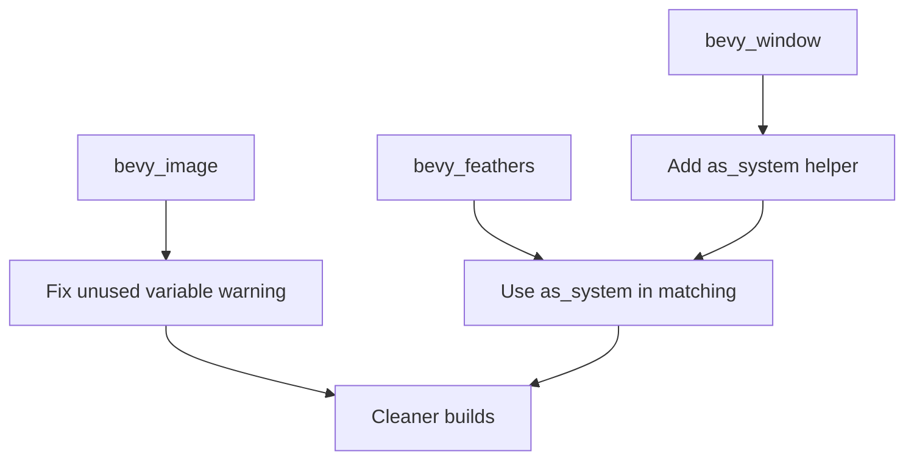

+++
title = "#20612 Fix some more lints"
date = "2025-08-17T00:00:00"
draft = false
template = "pull_request_page.html"
in_search_index = true

[taxonomies]
list_display = ["show"]

[extra]
current_language = "en"
available_languages = {"en" = { name = "English", url = "/pull_request/bevy/2025-08/pr-20612-en-20250817" }, "zh-cn" = { name = "中文", url = "/pull_request/bevy/2025-08/pr-20612-zh-cn-20250817" }}
labels = ["C-Code-Quality", "A-Cross-Cutting", "D-Modest"]
+++

## Fix some more lints

### Basic Information
- **Title**: Fix some more lints
- **PR Link**: https://github.com/bevyengine/bevy/pull/20612
- **Author**: mockersf
- **Status**: MERGED
- **Labels**: C-Code-Quality, A-Cross-Cutting, X-Uncontroversial, D-Modest, S-Needs-Review
- **Created**: 2025-08-16T21:40:02Z
- **Merged**: 2025-08-17T18:18:51Z
- **Merged By**: mockersf

### Description Translation
# Objective

- Fix some more lints
- run `cargo build --no-default-features --features bluenoise_texture` without triggering a lint for unused variables
- build bevy_feathers with all combinations of feature flag on cursor without complaints about the match:
  - `cargo check -p bevy_feathers`
  - `cargo check -p bevy_feathers --features custom_cursor`
  - `cargo check -p bevy_feathers --features bevy_window/custom_cursor`

## Solution

- fix the lints. those were a bit more complex to fix and could have maybe be done in other ways

### The Story of This Pull Request

#### The Problem and Context
This PR addresses two distinct lint warnings that appeared under specific build configurations. First, in the KTX2 texture loader (`bevy_image` crate), an unused variable warning appeared when building with `--no-default-features --features bluenoise_texture`. The `levels` vector was partially initialized but unused in some code paths due to conditional compilation. Second, in the `bevy_feathers` cursor handling, match expressions produced unreachable pattern warnings when compiling with different combinations of the `custom_cursor` feature flag. These warnings indicated potential code maintenance issues and needed resolution to maintain clean builds.

#### The Solution Approach
For the KTX2 loader, the solution restructured variable initialization to ensure the `levels` vector is always properly initialized and used. For the cursor system, a helper method was added to `CursorIcon` to abstract feature-dependent behavior, simplifying the match expression in `bevy_feathers`. Both solutions required careful handling of conditional compilation attributes to ensure correct behavior across feature flag combinations.

#### The Implementation
In `ktx2.rs`, the initialization of the `levels` vector was moved inside the supercompression scheme match arms. This ensures the vector is only declared once but initialized in each specific decompression branch:

```rust
let mut levels: Vec<Vec<u8>>;
match supercompression_scheme {
    SupercompressionScheme::ZLIB => {
        levels = Vec::with_capacity(ktx2.levels().len());
        // Decompression loop
    }
    // Other schemes handled similarly
}
```

For the cursor system, a new `as_system()` method was added to `CursorIcon` in `bevy_window`:

```rust
pub fn as_system(&self) -> Option<&SystemCursorIcon> {
    #[cfg(feature = "custom_cursor")]
    {
        if let CursorIcon::System(icon) = self { Some(icon) } else { None }
    }
    #[cfg(not(feature = "custom_cursor"))]
    {
        let CursorIcon::System(icon) = self;
        Some(icon)
    }
}
```

This method was then used in `bevy_feathers` to simplify the cursor comparison logic:

```rust
match (self, cursor_icon, cursor_icon.as_system()) {
    #[cfg(feature = "custom_cursor")]
    (EntityCursor::Custom(custom), CursorIcon::Custom(other), _) => ...,
    (EntityCursor::System(system), _, Some(cursor_icon)) => ...,
    _ => false
}
```

#### Technical Insights
The key insight was handling conditional compilation through abstraction layers. The `as_system()` method encapsulates the feature-dependent behavior of `CursorIcon`, allowing callers to ignore implementation details. This follows the principle of information hiding and reduces conditional complexity in consuming code. For the KTX2 loader, restructuring initialization paths ensures all code paths properly initialize variables, avoiding partial initialization issues.

#### The Impact
These changes eliminate specific lint warnings under targeted build configurations, resulting in cleaner compilation output. The cursor system now handles all feature flag combinations without warnings, improving maintainability. The changes also demonstrate effective patterns for handling conditional compilation in Rust, particularly through helper methods that abstract feature-dependent behavior.

### Visual Representation



### Key Files Changed

1. **crates/bevy_image/src/ktx2.rs** (+21/-14)  
   Restructured KTX2 decompression to avoid unused variable warning:
```rust
// Before:
let mut levels = Vec::new();
if let Some(scheme) = supercompression_scheme {
    for level in ktx2.levels() {
        match scheme {
            // Decompress and push to levels
        }
    }
}

// After:
let mut levels: Vec<Vec<u8>>;
match supercompression_scheme {
    SupercompressionScheme::ZLIB => {
        levels = Vec::with_capacity(ktx2.levels().len());
        for level in ktx2.levels() {
            // Decompress and push to levels
        }
    }
    // Other schemes
}
```

2. **crates/bevy_window/src/cursor/mod.rs** (+19/-0)  
   Added helper method for cursor feature abstraction:
```rust
impl CursorIcon {
    pub fn as_system(&self) -> Option<&SystemCursorIcon> {
        // Feature-dependent implementation
    }
}
```

3. **crates/bevy_feathers/src/cursor.rs** (+7/-5)  
   Simplified cursor matching using new helper:
```rust
// Before:
match (self, cursor_icon) {
    #[cfg(feature = "custom_cursor")]
    (EntityCursor::Custom(a), CursorIcon::Custom(b)) => ...,
    (EntityCursor::System(a), CursorIcon::System(b)) => ...,
}

// After:
match (self, cursor_icon, cursor_icon.as_system()) {
    #[cfg(feature = "custom_cursor")]
    (EntityCursor::Custom(a), CursorIcon::Custom(b), _) => ...,
    (EntityCursor::System(a), _, Some(b)) => ...,
}
```

### Further Reading
- [Rust Conditional Compilation](https://doc.rust-lang.org/reference/conditional-compilation.html)  
- [Clippy Lint Documentation](https://rust-lang.github.io/rust-clippy/master/)  
- [Feature Flag Best Practices](https://martinfowler.com/articles/feature-toggles.html)