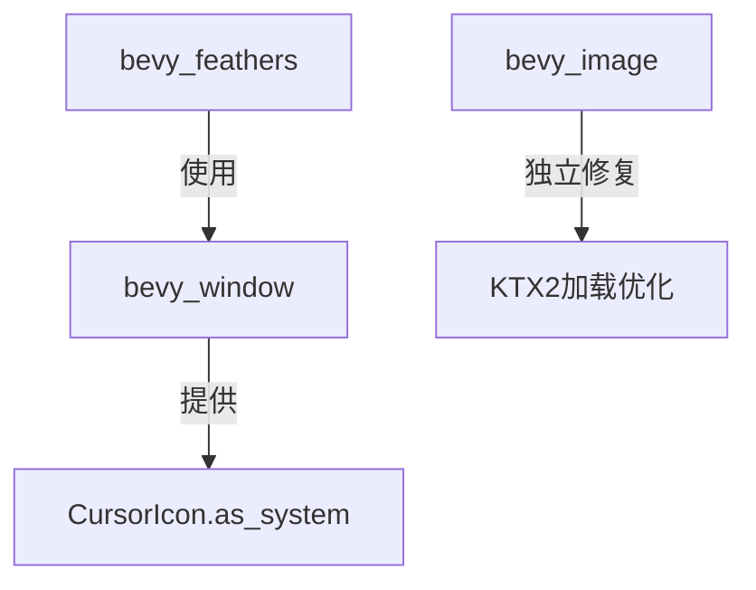

+++
title = "#20612 Fix some more lints"
date = "2025-08-17T00:00:00"
draft = false
template = "pull_request_page.html"
in_search_index = false

[extra]
current_language = "zh-cn"
available_languages = {"en" = { name = "English", url = "/pull_request/bevy/2025-08/pr-20612-en-20250817" }, "zh-cn" = { name = "中文", url = "/pull_request/bevy/2025-08/pr-20612-zh-cn-20250817" }}
+++

## Fix some more lints - 技术分析报告

### 基本信息
- **标题**: Fix some more lints
- **PR链接**: https://github.com/bevyengine/bevy/pull/20612
- **作者**: mockersf
- **状态**: 已合并
- **标签**: C-Code-Quality, A-Cross-Cutting, X-Uncontroversial, D-Modest, S-Needs-Review
- **创建时间**: 2025-08-16T21:40:02Z
- **合并时间**: 2025-08-17T18:18:51Z
- **合并者**: mockersf

### 描述翻译
#### Objective
- 修复更多的 lints
- 运行 `cargo build --no-default-features --features bluenoise_texture` 时不触发未使用变量的 lint
- 在各种光标特性标志组合下构建 bevy_feathers 时不会出现关于 match 的警告：
  - `cargo check -p bevy_feathers`
  - `cargo check -p bevy_feathers --features custom_cursor`
  - `cargo check -p bevy_feathers --features bevy_window/custom_cursor`

#### Solution
- 修复这些 lints。这些修复有点复杂，可能有其他实现方式

---

### PR 的技术分析

#### 问题背景
这个 PR 主要解决两个独立但相关的 lint 警告问题：

1. **KTX2 纹理加载中的未使用变量警告**  
   当使用特定特性组合构建时（如 `--no-default-features --features bluenoise_texture`），KTX2 加载代码中的 `level` 变量在某些条件下未被使用，触发 Rust 的未使用变量警告。这在 CI 构建或严格警告设置的开发环境中会产生干扰。

2. **光标匹配逻辑的无法到达分支警告**  
   在 `bevy_feathers` 模块中，当启用或禁用 `custom_cursor` 特性时，`match` 表达式中的某些分支在特定特性组合下无法到达，导致编译器警告。这影响了三种构建配置下的代码健壮性。

#### 解决方案实现

**KTX2 加载器的重构**  
原始实现在循环内部处理超级压缩方案，但当某些特性未启用时，循环变量 `level` 未被使用：

```rust
// Before:
let mut levels = Vec::new();
if let Some(supercompression_scheme) = supercompression_scheme {
    for (level_index, level) in ktx2.levels().enumerate() {
        match supercompression_scheme {
            // ... 特性相关处理 ...
        }
    }
}
```

修改后，将压缩方案匹配移到循环外部，确保变量只在需要时初始化：

```rust
// After:
let mut levels: Vec<Vec<u8>>;
if let Some(supercompression_scheme) = supercompression_scheme {
    match supercompression_scheme {
        #[cfg(feature = "flate2")]
        SupercompressionScheme::ZLIB => {
            levels = Vec::with_capacity(ktx2.levels().len());
            for (level_index, level) in ktx2.levels().enumerate() {
                // 实际解压处理
            }
        }
        // 其他压缩方案处理...
    }
}
```

关键改进：
- 延迟初始化 `levels` 变量到具体压缩分支内
- 每个压缩方案独立处理层级遍历
- 消除未使用变量的警告条件

**光标匹配逻辑的重构**  
原始实现在特性组合下存在分支可到达性问题：

```rust
// Before:
match (self, cursor_icon) {
    #[cfg(feature = "custom_cursor")]
    (EntityCursor::Custom(custom), CursorIcon::Custom(other)) => ...,
    (EntityCursor::System(system), CursorIcon::System(cursor_icon)) => ...,
    _ => false,
}
```

解决方案引入新方法 `as_system()` 并重构匹配逻辑：

```rust
// After:
match (self, cursor_icon, cursor_icon.as_system()) {
    #[cfg(feature = "custom_cursor")]
    (EntityCursor::Custom(custom), CursorIcon::Custom(other), _) => ...,
    (EntityCursor::System(system), _, Some(cursor_icon)) => ...,
    _ => false,
}
```

新增辅助方法统一处理系统光标获取：

```rust
// bevy_window 中新增
impl CursorIcon {
    pub fn as_system(&self) -> Option<&SystemCursorIcon> {
        #[cfg(feature = "custom_cursor")]
        { /* 有条件返回 */ }
        #[cfg(not(feature = "custom_cursor"))]
        { /* 无条件返回 */ }
    }
}
```

#### 技术洞察
1. **条件编译边界处理**  
   通过 `as_system()` 方法封装特性相关逻辑，为上层提供稳定接口，解决了跨crate特性标志的兼容性问题。

2. **防御性初始化策略**  
   KTX2 修改采用"按需初始化"模式，避免了未使用变量警告，同时保持内存分配效率（预分配 `with_capacity`）。

3. **模式匹配增强**  
   三元组匹配模式 `(A, B, C)` 结合特性标志，解决了枚举变体在条件编译下的分支可达性问题。

#### 影响总结
- 消除特定构建配置下的编译器警告
- 提高代码对特性标志组合的适应性
- 保持原有功能不变
- 新增方法为光标系统提供更健壮的抽象

---

### 组件关系


### 关键文件变更

**crates/bevy_image/src/ktx2.rs** (+21/-14)  
重构KTX2加载逻辑，解决未使用变量警告：
```rust
// 修改后核心逻辑
let mut levels: Vec<Vec<u8>>;
if let Some(supercompression_scheme) = supercompression_scheme {
    match supercompression_scheme {
        #[cfg(feature = "flate2")]
        SupercompressionScheme::ZLIB => {
            levels = Vec::with_capacity(ktx2.levels().len());
            for (level_index, level) in ktx2.levels().enumerate() {
                // 解压处理...
            }
        }
        // 其他压缩方案...
    }
}
```

**crates/bevy_window/src/cursor/mod.rs** (+19/-0)  
新增光标辅助方法：
```rust
impl CursorIcon {
    pub fn as_system(&self) -> Option<&SystemCursorIcon> {
        #[cfg(feature = "custom_cursor")]
        {
            if let CursorIcon::System(icon) = self {
                Some(icon)
            } else {
                None
            }
        }
        #[cfg(not(feature = "custom_cursor"))]
        {
            let CursorIcon::System(icon) = self;
            Some(icon)
        }
    }
}
```

**crates/bevy_feathers/src/cursor.rs** (+7/-5)  
重构光标匹配逻辑：
```rust
match (self, cursor_icon, cursor_icon.as_system()) {
    #[cfg(feature = "custom_cursor")]
    (EntityCursor::Custom(custom), CursorIcon::Custom(other), _) => ...,
    (EntityCursor::System(system), _, Some(cursor_icon)) => ...,
    _ => false,
}
```

### 延伸阅读
1. [Rust条件编译文档](https://doc.rust-lang.org/reference/conditional-compilation.html)
2. [Rust模式匹配进阶](https://doc.rust-lang.org/book/ch18-03-pattern-syntax.html)
3. [Bevy特性标志最佳实践](https://github.com/bevyengine/bevy/discussions/2020)