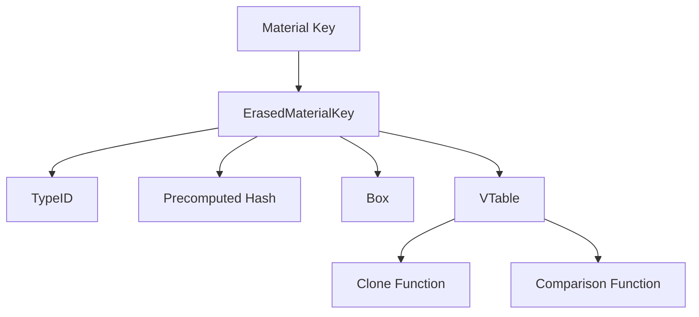

+++
title = "#20614 Use boxed storage for material erasure."
date = "2025-08-17T00:00:00"
draft = false
template = "pull_request_page.html"
in_search_index = true

[taxonomies]
list_display = ["show"]

[extra]
current_language = "en"
available_languages = {"en" = { name = "English", url = "/pull_request/bevy/2025-08/pr-20614-en-20250817" }, "zh-cn" = { name = "中文", url = "/pull_request/bevy/2025-08/pr-20614-zh-cn-20250817" }}
labels = ["A-Rendering", "C-Usability"]
+++

# Analysis of PR #20614: Use boxed storage for material erasure

## Basic Information
- **Title**: Use boxed storage for material erasure.
- **PR Link**: https://github.com/bevyengine/bevy/pull/20614
- **Author**: tychedelia
- **Status**: MERGED
- **Labels**: A-Rendering, C-Usability, S-Ready-For-Final-Review
- **Created**: 2025-08-17T01:12:24Z
- **Merged**: 2025-08-17T16:57:23Z
- **Merged By**: alice-i-cecile

## Description Translation
# Objective

#19667 added a `bytemuck::Pod` type constraint on `AsBindGroup::Data` which, while technically a reasonable constraint to expect from material keys, imposed a breaking change on our users which may be confusing / difficult for them to work around. It's not technically invalid to store arbitrary types in a material key, just probably bad practice.

Additionally, the performance concerns here were probably overstated: 1. cold specialization makes re-specialization less likely. 2. we can mitigate going through the vtable unnecessarily by pre-computing our hash which should still make the boxed storage fast in almost all cases where we don't get a collision.

## Solution

Use `Box<dyn Any>` for erasure.

## The Story of This Pull Request

This PR addresses a breaking change introduced by #19667, which added a `bytemuck::Pod` constraint to material key types. While technically sound, this constraint proved problematic for users who needed more flexible material key implementations. The core issue was that `bytemuck::Pod` requires types to be plain old data with no padding or complex representations, limiting what developers could use as material keys.

The solution replaces the byte-based storage with type-erased boxed storage. Instead of requiring material keys to be POD types that can be serialized to bytes, we now store them as `Box<dyn Any>` and handle comparison/hashing through a vtable. This maintains the necessary functionality while removing the restrictive constraint.

Key implementation details include:
1. Creating `ErasedMaterialKey` to wrap type-erased material keys
2. Precomputing hashes at key creation time to optimize lookups
3. Using a vtable for dynamic dispatch of clone and comparison operations
4. Removing `bytemuck` constraints from all material-related traits and structs

The new `ErasedMaterialKey` struct handles the type erasure:
```rust
#[derive(Debug)]
pub struct ErasedMaterialKey {
    type_id: TypeId,
    hash: u64,
    value: Box<dyn Any + Send + Sync>,
    vtable: Arc<ErasedMaterialKeyVTable>,
}
```

The vtable contains function pointers for type-specific operations:
```rust
#[derive(Debug)]
pub struct ErasedMaterialKeyVTable {
    clone_fn: fn(&dyn Any) -> Box<dyn Any + Send + Sync>,
    partial_eq_fn: fn(&dyn Any, &dyn Any) -> bool,
}
```

Performance considerations were addressed by:
- Precomputing the hash during key creation
- Storing the type ID for fast type checking
- Using Arc for vtable sharing to reduce duplication

This approach maintains the efficiency of material lookups while providing greater flexibility. The precomputed hash ensures that the vtable is only accessed for equality checks when hashes collide, which should be rare.

The PR also updates multiple examples to demonstrate the simpler material key definitions now possible. For instance, boolean flags in material keys no longer need to be represented as u32 values:
```rust
// Before:
#[repr(C)]
#[derive(Eq, PartialEq, Hash, Copy, Clone, bytemuck::Pod, bytemuck::Zeroable)]
struct CustomMaterialKey {
    is_red: u32,
}

// After:
#[repr(C)]
#[derive(Eq, PartialEq, Hash, Copy, Clone)]
struct CustomMaterialKey {
    is_red: bool,
}
```

This change simplifies material implementations and reduces potential errors from manual conversions.

## Visual Representation



## Key Files Changed

### `crates/bevy_pbr/src/material.rs` (+91/-8)
Core implementation of the material erasure system. Introduced `ErasedMaterialKey` and integrated it throughout the material system.

Key changes:
```rust
// Before:
pub struct ErasedMaterialPipelineKey {
    pub mesh_key: MeshPipelineKey,
    pub material_key: SmallVec<[u8; 8]>,
    pub type_id: TypeId,
}

// After:
pub struct ErasedMaterialPipelineKey {
    pub mesh_key: MeshPipelineKey,
    pub material_key: ErasedMaterialKey,
    pub type_id: TypeId,
}

// New type definition:
#[derive(Debug)]
pub struct ErasedMaterialKey {
    type_id: TypeId,
    hash: u64,
    value: Box<dyn Any + Send + Sync>,
    vtable: Arc<ErasedMaterialKeyVTable>,
}
```

### `crates/bevy_render/src/render_resource/bind_group.rs` (+5/-7)
Relaxed constraints on material data types in the `AsBindGroup` trait.

Key change:
```rust
// Before:
pub trait AsBindGroup {
    type Data: bytemuck::Pod + bytemuck::Zeroable + Send + Sync;
    // ...
}

// After:
pub trait AsBindGroup {
    type Data: Send + Sync;
    // ...
}
```

### `examples/shader/shader_defs.rs` (+4/-6)
Updated example to use more natural boolean type in material key.

Key change:
```rust
// Before:
#[repr(C)]
#[derive(Eq, PartialEq, Hash, Copy, Clone, bytemuck::Pod, bytemuck::Zeroable)]
struct CustomMaterialKey {
    is_red: u32,
}

// After:
#[repr(C)]
#[derive(Eq, PartialEq, Hash, Copy, Clone)]
struct CustomMaterialKey {
    is_red: bool,
}
```

### `examples/shader/shader_material_wesl.rs` (+4/-4)
Similar update to another example material.

Key change:
```rust
// Before:
#[repr(C)]
#[derive(Eq, PartialEq, Hash, Copy, Clone, bytemuck::Pod, bytemuck::Zeroable)]
struct CustomMaterialKey {
    party_mode: u32,
}

// After:
#[repr(C)]
#[derive(Eq, PartialEq, Hash, Copy, Clone)]
struct CustomMaterialKey {
    party_mode: bool,
}
```

### `crates/bevy_sprite_render/src/mesh2d/material.rs` (+2/-2)
Minor updates to support the new material key type.

## Further Reading
- Rust `Any` trait documentation: https://doc.rust-lang.org/std/any/trait.Any.html
- Bevy Material System: https://bevyengine.org/learn/book/getting-started/materials/
- Type Erasure Patterns: https://www.cs.sjsu.edu/~pearce/oom/patterns/erasure.htm