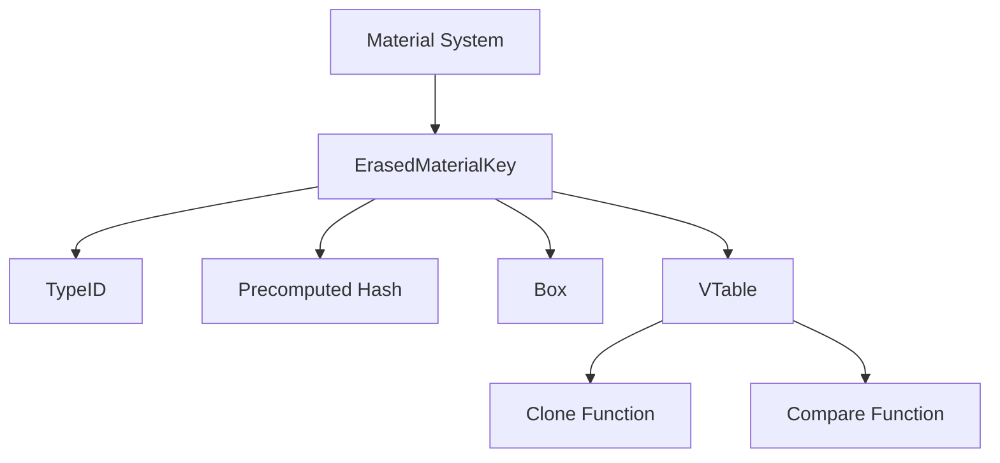

+++
title = "#20614 Use boxed storage for material erasure"
date = "2025-08-17T00:00:00"
draft = false
template = "pull_request_page.html"
in_search_index = false

[extra]
current_language = "zh-cn"
available_languages = {"en" = { name = "English", url = "/pull_request/bevy/2025-08/pr-20614-en-20250817" }, "zh-cn" = { name = "中文", url = "/pull_request/bevy/2025-08/pr-20614-zh-cn-20250817" }}
labels = ["A-Rendering", "C-Usability"]
+++

# 分析报告：Use boxed storage for material erasure

## Basic Information
- **Title**: Use boxed storage for material erasure
- **PR Link**: https://github.com/bevyengine/bevy/pull/20614
- **Author**: tychedelia
- **Status**: MERGED
- **Labels**: A-Rendering, C-Usability, S-Ready-For-Final-Review
- **Created**: 2025-08-17T01:12:24Z
- **Merged**: 2025-08-17T16:57:23Z
- **Merged By**: alice-i-cecile

## Description Translation
### 目标
#19667 在 `AsBindGroup::Data` 上添加了 `bytemuck::Pod` 类型约束，虽然技术上是对材质键的合理要求，但对用户造成了破坏性变更(breaking change)，可能引起困惑或难以解决。技术上存储任意类型在材质键中并非无效，只是通常属于不良实践。

此外，性能担忧可能被高估：1. 冷特化(cold specialization)降低了重新特化的可能性 2. 通过预计算哈希可避免不必要的虚表(vtable)访问，在无哈希碰撞的情况下仍能保持装箱存储的性能。

### 解决方案
使用 `Box<dyn Any>` 进行类型擦除(erasure)。

## 技术分析

### 问题背景与约束
PR #19667 引入了 `bytemuck::Pod` 约束，要求所有材质键必须是 Plain Old Data (POD) 类型。虽然这优化了内存布局，但带来了两个主要问题：
1. **破坏性变更**：用户现有的非 POD 材质键类型不再合规
2. **过度约束**：技术上材质键可存储任意类型（尽管通常不推荐）
3. **性能担忧被夸大**：冷特化减少重新特化，预计算哈希可避免虚表访问开销

原实现使用 `SmallVec<[u8; 8]>` 存储序列化的材质键：
```rust
// Before:
pub struct ErasedMaterialPipelineKey {
    pub mesh_key: MeshPipelineKey,
    pub material_key: SmallVec<[u8; 8]>, // 字节序列
    pub type_id: TypeId,
}
```

### 解决方案设计
核心方案是引入 `ErasedMaterialKey` 类型，使用类型擦除替代 POD 约束：
```rust
pub struct ErasedMaterialKey {
    type_id: TypeId,  // 原始类型标识
    hash: u64,        // 预计算哈希值
    value: Box<dyn Any + Send + Sync>, // 类型擦除的值
    vtable: Arc<ErasedMaterialKeyVTable>, // 操作虚表
}
```
关键设计要点：
1. **类型擦除**：通过 `Box<dyn Any>` 存储任意类型
2. **预计算哈希**：构造时计算哈希值，避免运行时开销
3. **虚表优化**：存储类型特定操作（克隆/比较）
4. **类型安全**：通过 `TypeId` 确保运行时类型匹配

### 实现细节
#### 虚表结构
定义操作函数指针，实现类型安全的动态调用：
```rust
pub struct ErasedMaterialKeyVTable {
    clone_fn: fn(&dyn Any) -> Box<dyn Any + Send + Sync>,
    partial_eq_fn: fn(&dyn Any, &dyn Any) -> bool,
}
```

#### 类型安全转换
提供安全的方法访问原始类型：
```rust
impl ErasedMaterialKey {
    pub fn to_key<T: Clone + 'static>(&self) -> T {
        debug_assert_eq!(self.type_id, TypeId::of::<T>());
        self.value.downcast_ref::<T>().unwrap().clone()
    }
}
```

#### 特质实现
实现关键特质保持原有接口：
```rust
impl PartialEq for ErasedMaterialKey {
    fn eq(&self, other: &Self) -> bool {
        self.type_id == other.type_id &&
            (self.vtable.partial_eq_fn)(self.value.as_ref(), other.value.as_ref())
    }
}

impl Hash for ErasedMaterialKey {
    fn hash<H: Hasher>(&self, state: &mut H) {
        self.type_id.hash(state);
        self.hash.hash(state);
    }
}
```

### 架构调整
1. **移除 POD 约束**：
   ```diff
   // bevy_render/src/render_resource/bind_group.rs
   - type Data: bytemuck::Pod + bytemuck::Zeroable + Send + Sync;
   + type Data: Send + Sync;
   ```
   
2. **材质管线适配**：
   ```rust
   // bevy_pbr/src/material.rs
   let material_key = ErasedMaterialKey::new(bind_group_data);
   
   fn specialize<M: Material>(...) {
       let material_key = erased_key.material_key.to_key();
       // 使用解包后的键
   }
   ```

3. **示例更新**：
   ```diff
   // examples/shader/shader_defs.rs
   #[repr(C)]
   - #[derive(Eq, PartialEq, Hash, Copy, Clone, bytemuck::Pod, bytemuck::Zeroable)]
   + #[derive(Eq, PartialEq, Hash, Copy, Clone)]
   struct CustomMaterialKey {
   -    is_red: u32,
   +    is_red: bool,
   }
   ```

### 性能考量
1. **预计算哈希**：构造时计算并存储哈希值，后续比较直接使用
2. **类型ID快速过滤**：比较操作先检查 TypeId
3. **虚表调用优化**：仅在类型匹配时触发动态调用
4. **装箱成本**：引入单次堆分配，但特化操作频次较低

## 视觉表示



## Key Files Changed

### crates/bevy_pbr/src/material.rs (+91/-8)
**变更原因**：实现核心的 `ErasedMaterialKey` 类型和集成逻辑  
**关键修改**：
```rust
// 新增 ErasedMaterialKey 结构
#[derive(Debug)]
pub struct ErasedMaterialKey {
    type_id: TypeId,
    hash: u64,
    value: Box<dyn Any + Send + Sync>,
    vtable: Arc<ErasedMaterialKeyVTable>,
}

// 替换原字节数组存储
pub struct ErasedMaterialPipelineKey {
    pub mesh_key: MeshPipelineKey,
-   pub material_key: SmallVec<[u8; 8]>,
+   pub material_key: ErasedMaterialKey,
    pub type_id: TypeId,
}
```

### crates/bevy_render/src/render_resource/bind_group.rs (+5/-7)
**变更原因**：移除 `AsBindGroup::Data` 的 POD 约束  
**关键修改**：
```diff
pub trait AsBindGroup {
-   type Data: bytemuck::Pod + bytemuck::Zeroable + Send + Sync;
+   type Data: Send + Sync;
}
```

### examples/shader/shader_defs.rs (+4/-6)
**变更原因**：更新示例使用新材质键格式  
**关键修改**：
```diff
#[repr(C)]
- #[derive(Eq, PartialEq, Hash, Copy, Clone, bytemuck::Pod, bytemuck::Zeroable)]
+ #[derive(Eq, PartialEq, Hash, Copy, Clone)]
struct CustomMaterialKey {
-   is_red: u32,
+   is_red: bool,
}
```

### examples/shader/shader_material_wesl.rs (+4/-4)
**变更原因**：同步示例材质键实现  
**关键修改**：
```diff
#[repr(C)]
- #[derive(Eq, PartialEq, Hash, Copy, Clone, bytemuck::Pod, bytemuck::Zeroable)]
+ #[derive(Eq, PartialEq, Hash, Copy, Clone)]
struct CustomMaterialKey {
-   party_mode: u32,
+   party_mode: bool,
}
```

### crates/bevy_sprite_render/src/mesh2d/material.rs (+2/-2)
**变更原因**：修复材质键克隆问题  
**关键修改**：
```diff
fn clone(&self) -> Self {
    Self {
        mesh_key: self.mesh_key,
-       bind_group_data: self.bind_group_data,
+       bind_group_data: self.bind_group_data.clone(),
    }
}
```

## 影响与结论
1. **兼容性恢复**：允许非 POD 类型的材质键，解决破坏性变更问题
2. **架构灵活性**：材质系统不再依赖特定内存布局
3. **性能平衡**：预计算哈希和类型过滤保持运行时效率
4. **代码现代化**：使用类型安全的动态分发替代原始字节操作

此变更展示了如何在保持性能的同时，通过类型擦除和动态分发技术平衡类型安全性与灵活性。对于需要处理异构类型的系统，这种模式提供了可扩展的解决方案。

## Further Reading
1. [Rust 类型擦除模式](https://doc.rust-lang.org/book/ch17-02-trait-objects.html)
2. [动态分发与虚表原理](https://alschwalm.com/blog/static/2017/03/07/exploring-dynamic-dispatch-in-rust/)
3. [Bevy 材质系统文档](https://bevyengine.org/learn/book/next/assets/materials/)