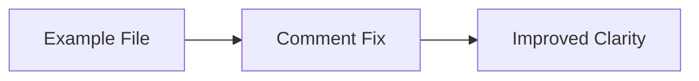

+++
title = "#20616 Fix small typo on ecs error handling example comment"
date = "2025-08-17T00:00:00"
draft = false
template = "pull_request_page.html"
in_search_index = true

[taxonomies]
list_display = ["show"]

[extra]
current_language = "en"
available_languages = {"en" = { name = "English", url = "/pull_request/bevy/2025-08/pr-20616-en-20250817" }, "zh-cn" = { name = "中文", url = "/pull_request/bevy/2025-08/pr-20616-zh-cn-20250817" }}
labels = ["A-ECS", "C-Examples"]
+++

### Title
Comment Typo Fix in ECS Error Handling Example

## Basic Information
- **Title**: Fix small typo on ecs error handling example comment
- **PR Link**: https://github.com/bevyengine/bevy/pull/20616
- **Author**: afonsolage
- **Status**: MERGED
- **Labels**: A-ECS, C-Examples, S-Ready-For-Final-Review
- **Created**: 2025-08-17T08:11:17Z
- **Merged**: 2025-08-17T17:10:40Z
- **Merged By**: alice-i-cecile

## Description Translation
Fixed small typo in comments

# Objective

- Fixes a small typo on error handling example comments.

## Solution

N/A

## Testing

N/A

## The Story of This Pull Request
While working with Bevy's ECS error handling example, a developer noticed a grammatical error in the explanatory comments. The comment incorrectly stated "Here we it using" instead of the grammatically correct "Here we are using". This minor typo could cause confusion for developers reading the example, particularly those learning about Bevy's error handling mechanisms.

The error occurred in a comment explaining how to configure global error handlers in Bevy applications. Since examples serve as educational resources, maintaining clear and correct documentation is important for effective knowledge transfer. The typo fix required minimal changes but improved the clarity of the documentation.

The fix was straightforward: replacing "we it using" with "we are using" in the comment. This maintains consistency with surrounding comments that use proper grammar while preserving all technical content. The change was reviewed and merged quickly since it didn't affect any functional code and clearly improved the example's quality.

## Visual Representation



## Key Files Changed

### `examples/ecs/error_handling.rs`
**Change Description:** Fixed grammatical error in documentation comment  
**Impact:** Improves readability and clarity for developers learning about error handlers  

**Code Diff:**
```rust
// Before:
// We can change this by setting a custom error handler, which applies to the entire app
// (you can also set it for specific `World`s).
// Here we it using one of the built-in error handlers.

// After:
// We can change this by setting a custom error handler, which applies to the entire app
// (you can also set it for specific `World`s).
// Here we are using one of the built-in error handlers.
```

## Further Reading
- [Bevy Error Handling Documentation](https://docs.rs/bevy/latest/bevy/app/struct.App.html#method.set_error_handler)
- [Rust API Guidelines on Documentation](https://rust-lang.github.io/api-guidelines/documentation.html)

# Full Code Diff
```diff
diff --git a/examples/ecs/error_handling.rs b/examples/ecs/error_handling.rs
index 5baaa8d062797..7d3e007b8ae7e 100644
--- a/examples/ecs/error_handling.rs
+++ b/examples/ecs/error_handling.rs
@@ -15,7 +15,7 @@ fn main() {
     //
     // We can change this by setting a custom error handler, which applies to the entire app
     // (you can also set it for specific `World`s).
-    // Here we it using one of the built-in error handlers.
+    // Here we are using one of the built-in error handlers.
     // Bevy provides built-in handlers for `panic`, `error`, `warn`, `info`,
     // `debug`, `trace` and `ignore`.
     app.set_error_handler(warn);
```