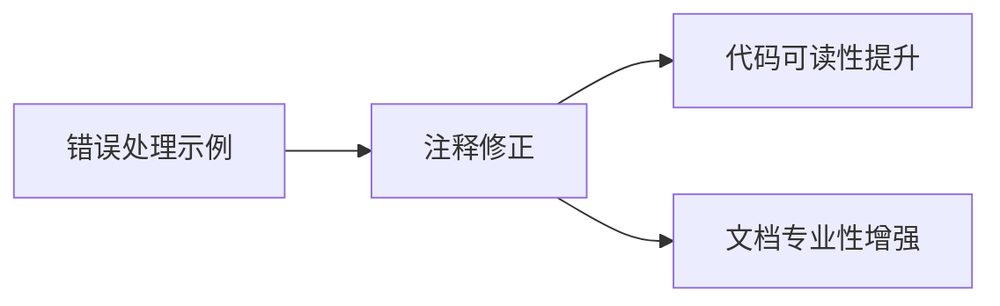

+++
title = "#20616 Fix small typo on ecs error handling example comment"
date = "2025-08-17T00:00:00"
draft = false
template = "pull_request_page.html"
in_search_index = false

[extra]
current_language = "zh-cn"
available_languages = {"en" = { name = "English", url = "/pull_request/bevy/2025-08/pr-20616-en-20250817" }, "zh-cn" = { name = "中文", url = "/pull_request/bevy/2025-08/pr-20616-zh-cn-20250817" }}
+++

# Fix small typo on ecs error handling example comment

## Basic Information
- **标题**: Fix small typo on ecs error handling example comment
- **PR 链接**: https://github.com/bevyengine/bevy/pull/20616
- **作者**: afonsolage
- **状态**: 已合并
- **标签**: A-ECS, C-Examples, S-Ready-For-Final-Review
- **创建时间**: 2025-08-17T08:11:17Z
- **合并时间**: 2025-08-17T17:10:40Z
- **合并者**: alice-i-cecile

## 描述翻译
修复了注释中的小拼写错误

# 目标

- 修复错误处理示例注释中的小拼写错误

## 解决方案

无

## 测试

无

## 本次 Pull Request 的技术分析

### 问题背景
在 Bevy 引擎的 ECS (Entity Component System) 错误处理示例中，存在一个注释中的小拼写错误。具体出现在 `examples/ecs/error_handling.rs` 文件的第18行注释中。原始注释写道："Here we it using one of the built-in error handlers"，其中 "we it" 明显是语法错误。这种错误虽然不影响代码执行，但会影响代码示例的可读性和专业性，特别是对于学习 Bevy ECS 错误处理机制的新用户。

### 解决方案实现
修复方案直接明了：将错误的语法修正为正确的表达方式。原句中的 "we it" 被替换为 "we are"，使整句话变为符合英语语法的正确表达："Here we are using one of the built-in error handlers"。这个修改只涉及单个字符的变动（将 "it" 改为 "are"），但准确传达了注释的意图。

### 技术意义
1. **示例代码质量**：作为官方示例，注释的准确性直接影响开发者对框架的理解。拼写错误可能分散学习注意力或导致理解偏差。
2. **错误处理上下文**：该注释位于错误处理配置代码上方，解释如何设置全局错误处理器：
   ```rust
   // We can change this by setting a custom error handler...
   // Here we are using one of the built-in error handlers.
   app.set_error_handler(warn);
   ```
   修正后更清晰地说明开发者正在使用内置的 warn 级别错误处理器。

3. **维护成本**：及时修正小问题可以防止它们累积成技术债务，保持代码库的整洁度。

### 影响评估
- **用户体验提升**：学习 Bevy ECS 错误处理机制的开发者现在能获得更专业的文档体验
- **贡献者体验**：展示了 Bevy 社区对细节的关注，鼓励更多精炼的贡献
- **零风险变更**：纯注释修改不影响任何实际功能或性能

## 可视化关系


## 关键文件变更

### `examples/ecs/error_handling.rs`
**变更说明**：修正了错误处理示例注释中的拼写错误，将语法错误的表述改为正确形式

```rust
// 变更前：
// Here we it using one of the built-in error handlers.

// 变更后：
// Here we are using one of the built-in error handlers.
```

## 延伸阅读
1. [Bevy 官方错误处理指南](https://bevyengine.org/learn/book/error-handling/)
2. [Rust 文档注释规范](https://doc.rust-lang.org/rustdoc/how-to-write-documentation.html)
3. [Bevy ECS 系统错误处理实践](https://bevy-cheatbook.github.io/error-handling.html)

## 完整代码变更
```diff
diff --git a/examples/ecs/error_handling.rs b/examples/ecs/error_handling.rs
index 5baaa8d062797..7d3e007b8ae7e 100644
--- a/examples/ecs/error_handling.rs
+++ b/examples/ecs/error_handling.rs
@@ -15,7 +15,7 @@ fn main() {
     //
     // We can change this by setting a custom error handler, which applies to the entire app
     // (you can also set it for specific `World`s).
-    // Here we it using one of the built-in error handlers.
+    // Here we are using one of the built-in error handlers.
     // Bevy provides built-in handlers for `panic`, `error`, `warn`, `info`,
     // `debug`, `trace` and `ignore`.
     app.set_error_handler(warn);
```