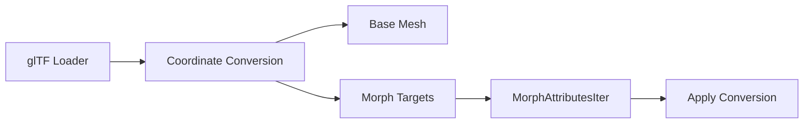

+++
title = "#20617 Fix glTF coordinate conversion not converting morph targets"
date = "2025-08-17T00:00:00"
draft = false
template = "pull_request_page.html"
in_search_index = true

[taxonomies]
list_display = ["show"]

[extra]
current_language = "en"
available_languages = {"en" = { name = "English", url = "/pull_request/bevy/2025-08/pr-20617-en-20250817" }, "zh-cn" = { name = "中文", url = "/pull_request/bevy/2025-08/pr-20617-zh-cn-20250817" }}
labels = ["C-Bug", "A-Rendering", "D-Straightforward", "A-glTF"]
+++

## Fix glTF Coordinate Conversion for Morph Targets

### Basic Information
- **Title**: Fix glTF coordinate conversion not converting morph targets
- **PR Link**: https://github.com/bevyengine/bevy/pull/20617
- **Author**: greeble-dev
- **Status**: MERGED
- **Labels**: C-Bug, A-Rendering, S-Ready-For-Final-Review, D-Straightforward, A-glTF
- **Created**: 2025-08-17T09:44:30Z
- **Merged**: 2025-08-17T17:45:49Z
- **Merged By**: alice-i-cecile

### Description Translation
glTF coordinate conversion wasn't being applied to morph target attributes.

Before fix:


After fix:


There's also a mildly opinionated change to the morph attribute iterator. I found the original code hard to understand because it relied on tuples for the position/normal/tangent, so I've changed them to named members.

### Testing

Using the scene viewer changes from #20609:

```sh
cargo run --example scene_viewer -- "assets/models/animated/MorphStressTest.gltf"
cargo run --example scene_viewer -- "assets/models/animated/MorphStressTest.gltf" --use-model-forward-direction
```

Also tested on a couple of models from https://github.com/KhronosGroup/glTF-Sample-Models.

### The Story of This Pull Request

#### The Problem
When loading glTF models with morph targets, Bevy wasn't applying coordinate system conversions to morph target attributes. This caused visual artifacts when models used coordinate systems different from Bevy's default (right-handed Y-up). The base mesh vertices were being converted correctly, but morph target deltas were ignored during conversion, resulting in misaligned morph effects.

#### Solution Approach
The fix required:
1. Propagating the `convert_coordinates` flag to the morph target processing logic
2. Applying the same coordinate transformation to morph attributes that was already used for base vertices
3. Refactoring the iterator to improve readability and maintainability

The key insight was recognizing that morph targets define deltas in the same coordinate space as base vertices, so they require identical transformations to maintain relative positioning.

#### Implementation Details
The solution modifies the `PrimitiveMorphAttributesIter` to:
1. Store the `convert_coordinates` flag explicitly
2. Use named fields instead of tuple positions
3. Apply coordinate conversion to each attribute after retrieval

The iterator now conditionally transforms positions, normals, and tangents using the same `convert_coordinates()` method applied to base vertices:

```rust
if self.convert_coordinates {
    attributes = MorphAttributes {
        position: attributes.position.convert_coordinates(),
        normal: attributes.normal.convert_coordinates(),
        tangent: attributes.tangent.convert_coordinates(),
    }
}
```

This ensures morph target deltas are in the same coordinate space as the base mesh after conversion.

#### Technical Insights
The refactor from tuple-based to field-based struct significantly improves code clarity:
```rust
// Before: Tuple struct
struct PrimitiveMorphAttributesIter<'s>(
    (
        Option<Iter<'s, [f32; 3]>>,
        Option<Iter<'s, [f32; 3]>>,
        Option<Iter<'s, [f32; 3]>>,
    ),
);

// After: Named fields
struct PrimitiveMorphAttributesIter<'s> {
    convert_coordinates: bool,
    positions: Option<Iter<'s, [f32; 3]>>,
    normals: Option<Iter<'s, [f32; 3]>>,
    tangents: Option<Iter<'s, [f32; 3]>>,
}
```

Named fields eliminate positional ambiguity and make the code more self-documenting. The change also minimizes future maintenance risk when adding new fields.

#### Impact
This fix:
1. Corrects morph target rendering for models requiring coordinate conversion
2. Maintains consistency between base mesh and morph target transformations
3. Improves code readability with minimal performance impact (branch per vertex is negligible)
4. Preserves existing behavior when `convert_coordinates` is false

### Visual Representation


### Key Files Changed
#### crates/bevy_gltf/src/loader/mod.rs
**Purpose**: Fix coordinate conversion for morph targets and improve iterator readability

**Key Changes**:
1. Updated morph target iterator initialization
2. Refactored iterator struct
3. Added coordinate conversion logic

```rust
// Before:
let morph_target_image = MorphTargetImage::new(
    morph_target_reader.map(PrimitiveMorphAttributesIter),
    mesh.count_vertices(),
    RenderAssetUsages::default(),
)?;

struct PrimitiveMorphAttributesIter<'s>(
    pub  (
        Option<Iter<'s, [f32; 3]>>,
        Option<Iter<'s, [f32; 3]>>,
        Option<Iter<'s, [f32; 3]>>,
    ),
);

// After:
let morph_target_image = MorphTargetImage::new(
    morph_target_reader.map(|i| PrimitiveMorphAttributesIter {
        convert_coordinates,
        positions: i.0,
        normals: i.1,
        tangents: i.2,
    }),
    mesh.count_vertices(),
    RenderAssetUsages::default(),
)?;

struct PrimitiveMorphAttributesIter<'s> {
    convert_coordinates: bool,
    positions: Option<Iter<'s, [f32; 3]>>,
    normals: Option<Iter<'s, [f32; 3]>>,
    tangents: Option<Iter<'s, [f32; 3]>>,
}
```

```rust
// Iterator logic before:
Some(MorphAttributes {
    position: position.map(Into::into).unwrap_or(Vec3::ZERO),
    normal: normal.map(Into::into).unwrap_or(Vec3::ZERO),
    tangent: tangent.map(Into::into).unwrap_or(Vec3::ZERO),
})

// Iterator logic after:
let mut attributes = MorphAttributes { ... };
if self.convert_coordinates {
    attributes = MorphAttributes {
        position: attributes.position.convert_coordinates(),
        normal: attributes.normal.convert_coordinates(),
        tangent: attributes.tangent.convert_coordinates(),
    }
}
Some(attributes)
```

### Further Reading
1. [glTF Coordinate Systems](https://registry.khronos.org/glTF/specs/2.0/glTF-2.0.html#coordinate-system-and-units)
2. [Bevy Coordinate Systems](https://bevyengine.org/learn/book/getting-started/coordinate-system/)
3. [Morph Target Implementation](https://github.com/bevyengine/bevy/blob/main/crates/bevy_render/src/mesh/morph.rs)