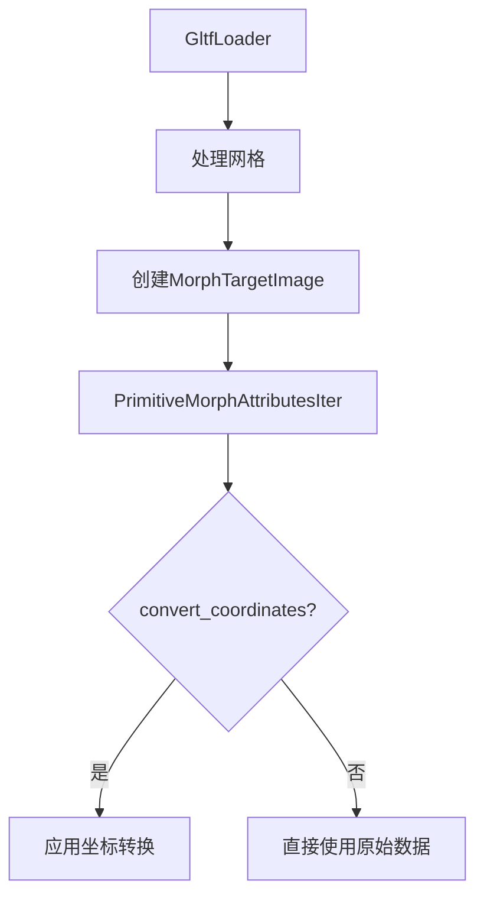

+++
title = "#20617 Fix glTF coordinate conversion not converting morph targets"
date = "2025-08-17T00:00:00"
draft = false
template = "pull_request_page.html"
in_search_index = false

[extra]
current_language = "zh-cn"
available_languages = {"en" = { name = "English", url = "/pull_request/bevy/2025-08/pr-20617-en-20250817" }, "zh-cn" = { name = "中文", url = "/pull_request/bevy/2025-08/pr-20617-zh-cn-20250817" }}
+++

# Fix glTF coordinate conversion not converting morph targets

## 基本信息
- **标题**: Fix glTF coordinate conversion not converting morph targets
- **PR链接**: https://github.com/bevyengine/bevy/pull/20617
- **作者**: greeble-dev
- **状态**: 已合并
- **标签**: C-Bug, A-Rendering, S-Ready-For-Final-Review, D-Straightforward, A-glTF
- **创建时间**: 2025-08-17T09:44:30Z
- **合并时间**: 2025-08-17T17:45:49Z
- **合并人**: alice-i-cecile

## 描述翻译
glTF坐标转换未应用于变形目标(morph target)属性。

修复前：


修复后：


我还对变形属性迭代器做了轻度主观的修改。原始代码使用元组表示位置/法线/切线，可读性较差，因此改为具名字段。

## 测试

使用 #20609 中的场景查看器(scene_viewer)变更：
```sh
cargo run --example scene_viewer -- "assets/models/animated/MorphStressTest.gltf"
cargo run --example scene_viewer -- "assets/models/animated/MorphStressTest.gltf" --use-model-forward-direction
```
同时在 https://github.com/KhronosGroup/glTF-Sample-Models 的多个模型上进行了测试。

## PR技术分析

### 问题背景
在Bevy引擎加载glTF模型时，需要执行坐标系统转换(coordinate conversion)，将glTF的右手坐标系(right-handed coordinate system)转换为Bevy的左手坐标系(left-handed coordinate system)。此转换已应用于主网格(mesh)数据，但未正确应用于变形目标(morph target)属性。这导致包含变形动画的模型渲染不正确，如PR描述中的截图所示：修复前模型显示异常，修复后显示正确。

变形目标是实现面部表情、形状变化等动画效果的关键技术。每个变形目标存储相对于基础网格的顶点偏移量(vertex offsets)。坐标转换未应用于这些偏移量，导致模型在坐标系转换后出现变形错误。

### 解决方案
核心修复是在处理变形目标属性时应用相同的坐标转换逻辑：
1. 修改`PrimitiveMorphAttributesIter`结构，添加`convert_coordinates`标志
2. 在迭代器生成每个变形属性时检查该标志
3. 若需转换，对位置(position)、法线(normal)和切线(tangent)应用`convert_coordinates()`方法

同时进行了代码可读性优化：
- 将基于元组的匿名结构重构为具名字段结构
- 使数据流更清晰，减少理解成本

### 实现细节
关键变更发生在`PrimitiveMorphAttributesIter`结构及其迭代器实现中。之前该结构使用匿名元组存储属性迭代器：
```rust
struct PrimitiveMorphAttributesIter<'s>(
    pub (
        Option<Iter<'s, [f32; 3]>>,
        Option<Iter<'s, [f32; 3]>>,
        Option<Iter<'s, [f32; 3]>>,
    ),
);
```
重构后使用具名字段：
```rust
struct PrimitiveMorphAttributesIter<'s> {
    convert_coordinates: bool,
    positions: Option<Iter<'s, [f32; 3]>>,
    normals: Option<Iter<'s, [f32; 3]>>,
    tangents: Option<Iter<'s, [f32; 3]>>,
}
```
在迭代逻辑中新增坐标转换处理：
```rust
if self.convert_coordinates {
    attributes = MorphAttributes {
        position: attributes.position.convert_coordinates(),
        normal: attributes.normal.convert_coordinates(),
        tangent: attributes.tangent.convert_coordinates(),
    }
}
```
在调用处，现在显式传递`convert_coordinates`参数：
```rust
MorphTargetImage::new(
    morph_target_reader.map(|i| PrimitiveMorphAttributesIter {
        convert_coordinates, // 新增参数
        positions: i.0,
        normals: i.1,
        tangents: i.2,
    }),
    mesh.count_vertices(),
    RenderAssetUsages::default(),
)?;
```

### 技术考量
1. **性能影响**：转换逻辑在迭代过程中执行，对每个顶点属性执行3次向量转换。由于变形目标通常在CPU预处理，且顶点数有限，实际性能影响可忽略
2. **一致性**：确保主网格和变形目标应用相同的转换规则，符合最小意外原则(principle of least astonishment)
3. **扩展性**：具名结构体设计更易添加新属性（如未来支持切线空间变形）

### 影响
1. 修复后，所有glTF变形目标动画在Bevy中正确渲染
2. 代码可读性提升，降低后续维护成本
3. 统一了坐标转换处理路径，减少类似错误发生概率

## 可视化表示



## 关键文件变更

### crates/bevy_gltf/src/loader/mod.rs
**变更原因**：修复变形目标坐标转换缺失问题，提升迭代器代码可读性

**关键代码变更**：
```rust
// 变更前：
struct PrimitiveMorphAttributesIter<'s>(
    pub  (
        Option<Iter<'s, [f32; 3]>>,
        Option<Iter<'s, [f32; 3]>>,
        Option<Iter<'s, [f32; 3]>>,
    ),
);

impl<'s> Iterator for PrimitiveMorphAttributesIter<'s> {
    fn next(&mut self) -> Option<Self::Item> {
        let position = self.0 .0.as_mut().and_then(Iterator::next);
        // ...其他属性处理
        Some(MorphAttributes {
            position: position.map(Into::into).unwrap_or(Vec3::ZERO),
            // ...
        })
    }
}

// 变更后：
struct PrimitiveMorphAttributesIter<'s> {
    convert_coordinates: bool,
    positions: Option<Iter<'s, [f32; 3]>>,
    normals: Option<Iter<'s, [f32; 3]>>,
    tangents: Option<Iter<'s, [f32; 3]>>,
}

impl<'s> Iterator for PrimitiveMorphAttributesIter<'s> {
    fn next(&mut self) -> Option<Self::Item> {
        let position = self.positions.as_mut().and_then(Iterator::next);
        // ...其他属性处理
        
        let mut attributes = MorphAttributes { /* 初始化 */ };
        
        // 新增坐标转换逻辑
        if self.convert_coordinates {
            attributes = MorphAttributes {
                position: attributes.position.convert_coordinates(),
                // ...其他属性转换
            }
        }
        
        Some(attributes)
    }
}
```

## 扩展阅读
1. [glTF变形目标规范](https://github.com/KhronosGroup/glTF/tree/master/specification/2.0#morph-targets)
2. [Bevy坐标系统文档](https://bevyengine.org/learn/book/getting-started/coordinate-system/)
3. [glTF示例模型库](https://github.com/KhronosGroup/glTF-Sample-Models)