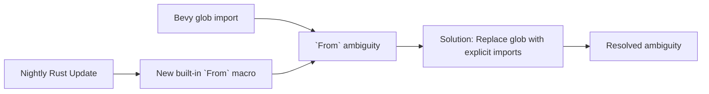

+++
title = "#20618 Work around ambiguous `From` error in nightly"
date = "2025-08-17T00:00:00"
draft = false
template = "pull_request_page.html"
in_search_index = true

[taxonomies]
list_display = ["show"]

[extra]
current_language = "en"
available_languages = {"en" = { name = "English", url = "/pull_request/bevy/2025-08/pr-20618-en-20250817" }, "zh-cn" = { name = "中文", url = "/pull_request/bevy/2025-08/pr-20618-zh-cn-20250817" }}
labels = ["C-Bug", "D-Trivial", "A-ECS", "A-Build-System"]
+++

## Work around ambiguous `From` error in nightly

### Basic Information
- **Title**: Work around ambiguous `From` error in nightly
- **PR Link**: https://github.com/bevyengine/bevy/pull/20618
- **Author**: greeble-dev
- **Status**: MERGED
- **Labels**: C-Bug, D-Trivial, A-ECS, A-Build-System, S-Ready-For-Final-Review, P-Compile-Failure
- **Created**: 2025-08-17T10:25:48Z
- **Merged**: 2025-08-17T16:11:10Z
- **Merged By**: alice-i-cecile

### Description Translation
A new `From` built-in macro in nightly Rust caused a compilation error due to ambiguous name resolution in a glob import:

```
Compiling bevy_ecs v0.17.0-dev (/Users/runner/work/bevy/bevy/crates/bevy_ecs)
error[E0659]: `From` is ambiguous
    --> crates/bevy_ecs/src/entity/clone_entities.rs:1391:14
     |
1391 |     #[derive(From)]
     |              ^^^^ ambiguous name
     |
     = note: ambiguous because of a conflict between a name from a glob import and an outer scope during import or macro resolution
note: `From` could refer to the derive macro imported here
    --> crates/bevy_ecs/src/entity/clone_entities.rs:1379:9
     |
1379 |     use super::*;
     |         ^^^^^^^^
     = help: consider adding an explicit import of `From` to disambiguate
     = help: or use `self::From` to refer to this derive macro unambiguously
note: `From` could also refer to the derive macro defined here
    --> /Users/runner/.rustup/toolchains/nightly-aarch64-apple-darwin/lib/rustlib/src/rust/library/core/src/prelude/mod.rs:59:13
     |
  59 |     pub use super::v1::*;
     |             ^^^^^^^^^
```

This ambiguity arose between the derive macro imported via a glob and Rust's new built-in `From` macro. The fix implements a simple workaround to unblock CI, though it's unclear whether this is a Rust bug or Bevy issue.

Compiler version: `rustc 1.91.0-nightly (2e2642e64 2025-08-16)`  
Related issues:  
- `From` built-in macro tracking: https://github.com/rust-lang/rust/issues/144889  
- Regression report: https://github.com/rust-lang/rust/issues/145524  

#### Testing
```
cargo +nightly check -p bevy_ecs
```

### The Story of This Pull Request

#### The Problem and Context
Nightly Rust introduced a new built-in `From` macro through its prelude, causing a name conflict in Bevy's entity cloning implementation. The `clone_entities.rs` file contained a module using a glob import (`use super::*;`) alongside a `#[derive(From)]` attribute. This created ambiguity between the derive_macro's `From` and Rust's new built-in `From` macro. Since Bevy's CI uses nightly Rust, this became a blocking issue requiring immediate resolution.

The error manifested specifically in the `private` module where a `FilterableId` enum derived `From` implementations. The glob import brought multiple `From` identifiers into scope, conflicting with the new language feature. This is a classic namespace collision issue exacerbated by Rust's evolving standard library.

#### The Solution Approach
The solution replaces the problematic glob import with explicit imports. Instead of bringing all parent module items into scope, we selectively import only the required types and traits:
1. Explicitly import `BundleId` and `ComponentId` from their respective modules
2. Import `TypeId` from `core::any`
3. Explicitly import `derive_more::From`

This eliminates the ambiguity by ensuring only one `From` identifier (the derive macro) is in scope. The approach maintains identical functionality while resolving the name conflict. Alternatives like renaming the import (`use derive_more::From as DeriveFrom`) were considered but rejected as less readable compared to explicit imports.

#### The Implementation
The key change occurs in the `private` module. Originally, it used a glob import that unintentionally captured multiple `From` identifiers:

```rust
mod private {
    use super::*;
```

This was replaced with targeted imports:

```rust
mod private {
    use crate::{bundle::BundleId, component::ComponentId};
    use core::any::TypeId;
    use derive_more::From;
```

The explicit imports ensure only the intended `From` derive macro is available. Several documentation links were also fixed to use absolute paths (`crate::bundle::BundleId`) instead of relative paths, though these were unrelated to the core issue.

#### Technical Insights
This fix demonstrates an important principle: glob imports (`use ...::*;`) increase collision risks as dependencies evolve. They're especially problematic with standard library additions. The solution shows how explicit imports can resolve macro ambiguities without changing functionality. The `derive_more` crate's `From` derive remains essential for the `FilterableId` enum's automatic trait implementations.

#### The Impact
The change resolves the immediate compilation error in nightly Rust without affecting functionality. It unblocks Bevy's CI pipeline and maintains compatibility with Rust's evolving toolchain. The documentation fixes improve clarity but don't change behavior. Future-proofing considerations: this workaround may become unnecessary if Rust stabilizes its `From` macro with different resolution rules.

### Visual Representation



### Key Files Changed

#### `crates/bevy_ecs/src/entity/clone_entities.rs` (+9/-7)
Resolved the `From` ambiguity by replacing a glob import with explicit imports and fixed documentation links.

Before:
```rust
mod private {
    use super::*;

    /// Marker trait to allow multiple blanket implementations for [`FilterableIds`].
    pub trait Marker {}

    /// Marker type for [`FilterableId`] being a single element.
    pub struct SingleType {}
    impl Marker for SingleType {}
```

After:
```rust
mod private {
    use crate::{bundle::BundleId, component::ComponentId};
    use core::any::TypeId;
    use derive_more::From;

    /// Marker trait to allow multiple blanket implementations for [`FilterableIds`].
    pub trait Marker {}

    /// Marker type for [`FilterableId`] being a single element.
    pub struct SingleType {}
    impl Marker for SingleType {}
```

Documentation fixes (unrelated but included in same file):
```rust
// Before:
/// Supports filtering by [`TypeId`], [`ComponentId`], [`BundleId`], and [`IntoIterator`]

// After:
/// Supports filtering by [`TypeId`], [`ComponentId`], [`BundleId`](`crate::bundle::BundleId`), and [`IntoIterator`]
```

### Further Reading
1. Rust's `From` macro tracking issue: https://github.com/rust-lang/rust/issues/144889  
2. Derive_more crate documentation: https://github.com/JelteF/derive_more  
3. Rust's namespace management: https://doc.rust-lang.org/reference/names/namespaces.html  
4. Glob import considerations: https://rust-lang.github.io/rust-clippy/master/index.html#wildcard_imports  

### Full Code Diff
```diff
diff --git a/crates/bevy_ecs/src/entity/clone_entities.rs b/crates/bevy_ecs/src/entity/clone_entities.rs
index b2e78d79c1084..c8171a251735d 100644
--- a/crates/bevy_ecs/src/entity/clone_entities.rs
+++ b/crates/bevy_ecs/src/entity/clone_entities.rs
@@ -8,7 +8,7 @@ use derive_more::derive::From;
 
 use crate::{
     archetype::Archetype,
-    bundle::{Bundle, BundleId, BundleRemover, InsertMode},
+    bundle::{Bundle, BundleRemover, InsertMode},
     change_detection::MaybeLocation,
     component::{Component, ComponentCloneBehavior, ComponentCloneFn, ComponentId, ComponentInfo},
     entity::{hash_map::EntityHashMap, Entities, Entity, EntityMapper},
@@ -917,7 +917,7 @@ impl<'w> EntityClonerBuilder<'w, OptOut> {
     }
 
     /// Extends the list of components that shouldn't be cloned.
-    /// Supports filtering by [`TypeId`], [`ComponentId`], [`BundleId`], and [`IntoIterator`] yielding one of these.
+    /// Supports filtering by [`TypeId`], [`ComponentId`], [`BundleId`](`crate::bundle::BundleId`), and [`IntoIterator`] yielding one of these.
     ///
     /// If component `A` is denied here and component `B` requires `A`, then `A`
     /// is denied as well. See [`Self::without_required_by_components`] to alter
@@ -985,7 +985,7 @@ impl<'w> EntityClonerBuilder<'w, OptIn> {
     }
 
     /// Extends the list of components to clone.
-    /// Supports filtering by [`TypeId`], [`ComponentId`], [`BundleId`], and [`IntoIterator`] yielding one of these.
+    /// Supports filtering by [`TypeId`], [`ComponentId`], [`BundleId`](`crate::bundle::BundleId`), and [`IntoIterator`] yielding one of these.
     ///
     /// If component `A` is allowed here and requires component `B`, then `B`
     /// is allowed as well. See [`Self::without_required_components`]
@@ -996,7 +996,7 @@ impl<'w> EntityClonerBuilder<'w, OptIn> {
     }
 
     /// Extends the list of components to clone if the target does not contain them.
-    /// Supports filtering by [`TypeId`], [`ComponentId`], [`BundleId`], and [`IntoIterator`] yielding one of these.
+    /// Supports filtering by [`TypeId`], [`ComponentId`], [`BundleId`](`crate::bundle::BundleId`), and [`IntoIterator`] yielding one of these.
     ///
     /// If component `A` is allowed here and requires component `B`, then `B`
     /// is allowed as well. See [`Self::without_required_components`]
@@ -1376,7 +1376,9 @@ impl Required {
 }
 
 mod private {
-    use super::*;
+    use crate::{bundle::BundleId, component::ComponentId};
+    use core::any::TypeId;
+    use derive_more::From;
 
     /// Marker trait to allow multiple blanket implementations for [`FilterableIds`].
     pub trait Marker {}
@@ -1387,7 +1389,7 @@ mod private {
     pub struct VectorType {}
     impl Marker for VectorType {}
 
-    /// Defines types of ids that [`EntityClonerBuilder`] can filter components by.
+    /// Defines types of ids that [`EntityClonerBuilder`](`super::EntityClonerBuilder`) can filter components by.
     #[derive(From)]
     pub enum FilterableId {
         Type(TypeId),
@@ -1405,7 +1407,7 @@ mod private {
         }
     }
 
-    /// A trait to allow [`EntityClonerBuilder`] filter by any supported id type and their iterators,
+    /// A trait to allow [`EntityClonerBuilder`](`super::EntityClonerBuilder`) filter by any supported id type and their iterators,
     /// reducing the number of method permutations required for all id types.
     ///
     /// The supported id types that can be used to filter components are defined by [`FilterableId`], which allows following types: [`TypeId`], [`ComponentId`] and [`BundleId`].
```