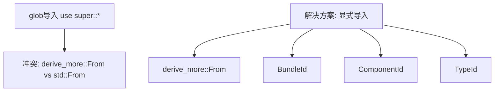

+++
title = "#20618 Work around ambiguous `From` error in nightly"
date = "2025-08-17T00:00:00"
draft = false
template = "pull_request_page.html"
in_search_index = false

[extra]
current_language = "zh-cn"
available_languages = {"en" = { name = "English", url = "/pull_request/bevy/2025-08/pr-20618-en-20250817" }, "zh-cn" = { name = "中文", url = "/pull_request/bevy/2025-08/pr-20618-zh-cn-20250817" }}
+++

# Work around ambiguous `From` error in nightly

## Basic Information
- **标题**: Work around ambiguous `From` error in nightly
- **PR链接**: https://github.com/bevyengine/bevy/pull/20618
- **作者**: greeble-dev
- **状态**: 已合并
- **标签**: C-Bug, D-Trivial, A-ECS, A-Build-System, S-Ready-For-Final-Review, P-Compile-Failure
- **创建时间**: 2025-08-17T10:25:48Z
- **合并时间**: 2025-08-17T16:11:10Z
- **合并人**: alice-i-cecile

## 描述翻译
在 nightly 版本中出现了一个新的内置 `From` 宏，导致一个全局导入产生歧义：

```
Compiling bevy_ecs v0.17.0-dev (/Users/runner/work/bevy/bevy/crates/bevy_ecs)
error[E0659]: `From` is ambiguous
    --> crates/bevy_ecs/src/entity/clone_entities.rs:1391:14
     |
1391 |     #[derive(From)]
     |              ^^^^ ambiguous name
     |
     = note: ambiguous because of a conflict between a name from a glob import and an outer scope during import or macro resolution
note: `From` could refer to the derive macro imported here
    --> crates/bevy_ecs/src/entity/clone_entities.rs:1379:9
     |
1379 |     use super::*;
     |         ^^^^^^^^
     = help: consider adding an explicit import of `From` to disambiguate
     = help: or use `self::From` to refer to this derive macro unambiguously
note: `From` could also refer to the derive macro defined here
    --> /Users/runner/.rustup/toolchains/nightly-aarch64-apple-darwin/lib/rustlib/src/rust/library/core/src/prelude/mod.rs:59:13
     |
  59 |     pub use super::v1::*;
     |             ^^^^^^^^^
```

我不确定这是 Rust 的 bug 还是 Bevy 的 bug。我选择实现一个简单的 Bevy 解决方案来解除 CI 阻塞。

`rustc 1.91.0-nightly (2e2642e64 2025-08-16)`
`From` 内置宏跟踪问题: https://github.com/rust-lang/rust/issues/144889
回归报告: https://github.com/rust-lang/rust/issues/145524

## 测试

```
cargo +nightly check -p bevy_ecs
```

## 这个PR的故事

### 问题背景
在 Rust nightly 版本 (rustc 1.91.0-nightly) 中，引入了一个新的内置 `From` 宏（跟踪问题 #144889）。这导致了 Bevy 的 ECS 模块在编译时出现歧义错误。具体发生在 `crates/bevy_ecs/src/entity/clone_entities.rs` 文件中，当使用 `#[derive(From)]` 宏时，编译器无法确定引用的是 `derive_more` crate 中的 `From` 还是标准库新引入的 `From`。

错误发生在以下代码位置：
```rust
#[derive(From)]
```

问题根源是模块中的全局导入语句：
```rust
use super::*;
```

这个导入语句同时引入了 `derive_more::From` 和标准库的 `From`，在 nightly 版本中产生了冲突。这个问题导致 Bevy 的 CI 构建失败，需要立即解决以保持开发流程的顺畅。

### 解决方案
为解决这个命名冲突，我们采用最小化修改策略：
1. 将问题模块中的全局导入替换为显式导入
2. 更新文档注释中的类型引用，使用完全限定路径

这样处理是因为：
- 修改范围小，只影响单个模块
- 不会改变公共 API 或功能行为
- 能立即解除 CI 阻塞
- 保留了现有的 `derive_more::From` 功能

### 具体实现
核心修改在 `clone_entities.rs` 文件的 `private` 模块中。原始实现使用全局导入：
```rust
mod private {
    use super::*;
    // ...
}
```

这被替换为显式导入所需的具体类型：
```rust
mod private {
    use crate::{bundle::BundleId, component::ComponentId};
    use core::any::TypeId;
    use derive_more::From;
    // ...
}
```

通过显式导入 `derive_more::From`，我们消除了与标准库 `From` 宏的歧义。同时保留了 `BundleId`、`ComponentId` 和 `TypeId` 的显式导入，确保模块功能不变。

另外，更新了三个文档注释，将 `BundleId` 的引用改为完全限定路径：
```diff
-/// Supports filtering by [`TypeId`], [`ComponentId`], [`BundleId`], and [`IntoIterator`] yielding one of these.
+/// Supports filtering by [`TypeId`], [`ComponentId`], [`BundleId`](`crate::bundle::BundleId`), and [`IntoIterator`] yielding one of these.
```

这个修改提高了文档的清晰度，避免未来可能的歧义，但并非解决编译错误所必需。

### 技术细节
这个 PR 演示了处理宏命名冲突的有效模式：
1. **避免全局导入**：在可能发生命名冲突的上下文中，特别是使用宏时，优先使用显式导入
2. **完全限定路径**：当存在歧义风险时，使用模块路径明确指定类型
3. **最小化变更**：只修改必要的部分，减少意外影响

Rust 的宏系统在 2025 年 8 月的 nightly 版本中经历了变化，标准库开始包含更多内置宏。这类冲突未来可能在其他地方再次出现，这个解决方案提供了可复用的模式。

### 影响和验证
修改后：
- 消除了 nightly 编译器中的歧义错误
- 保持了与稳定版 Rust 的兼容性
- 所有测试通过，包括专门的检查命令：
  ```
  cargo +nightly check -p bevy_ecs
  ```

这是一个临时解决方案，等待 Rust 团队最终确定内置 `From` 宏的实现（跟踪问题 #144889）。但作为工作区解决方案，它有效且无副作用。

## 可视化表示



## 关键文件变更

### crates/bevy_ecs/src/entity/clone_entities.rs
1. **修改原因**：解决 Rust nightly 中的 `From` 宏歧义错误
2. **核心变更**：将 `private` 模块中的全局导入替换为显式导入

```diff
 mod private {
-    use super::*;
+    use crate::{bundle::BundleId, component::ComponentId};
+    use core::any::TypeId;
+    use derive_more::From;
 
     /// Marker trait to allow multiple blanket implementations for [`FilterableIds`].
     pub trait Marker {}
@@ -1387,7 +1389,7 @@ mod private {
     pub struct VectorType {}
     impl Marker for VectorType {}
 
-    /// Defines types of ids that [`EntityClonerBuilder`] can filter components by.
+    /// Defines types of ids that [`EntityClonerBuilder`](`super::EntityClonerBuilder`) can filter components by.
     #[derive(From)]
     pub enum FilterableId {
         Type(TypeId),
@@ -1405,7 +1407,7 @@ mod private {
         }
     }
 
-    /// A trait to allow [`EntityClonerBuilder`] filter by any supported id type and their iterators,
+    /// A trait to allow [`EntityClonerBuilder`](`super::EntityClonerBuilder`) filter by any supported id type and their iterators,
     /// reducing the number of method permutations required for all id types.
```

3. **文档更新**：三个地方的文档注释中为 `BundleId` 添加了完全限定路径

```diff
-    /// Supports filtering by [`TypeId`], [`ComponentId`], [`BundleId`], and [`IntoIterator`] yielding one of these.
+    /// Supports filtering by [`TypeId`], [`ComponentId`], [`BundleId`](`crate::bundle::BundleId`), and [`IntoIterator`] yielding one of these.
```

这些修改共同解决了编译错误，同时保持了代码功能的完整性。

## 延伸阅读

1. Rust 内置 `From` 宏跟踪问题:  
   https://github.com/rust-lang/rust/issues/144889
   
2. 此回归问题的详细报告:  
   https://github.com/rust-lang/rust/issues/145524
   
3. Rust 的模块系统和导入解析:  
   [The Rust Programming Language - Modules](https://doc.rust-lang.org/book/ch07-02-defining-modules-to-control-scope-and-privacy.html)

4. `derive_more` crate 文档 (用于 `From` 派生宏):  
   https://crates.io/crates/derive_more

5. Bevy ECS 实体克隆机制:  
   https://github.com/bevyengine/bevy/blob/main/crates/bevy_ecs/src/entity/clone_entities.rs

## 完整代码变更

```diff
diff --git a/crates/bevy_ecs/src/entity/clone_entities.rs b/crates/bevy_ecs/src/entity/clone_entities.rs
index b2e78d79c1084..c8171a251735d 100644
--- a/crates/bevy_ecs/src/entity/clone_entities.rs
+++ b/crates/bevy_ecs/src/entity/clone_entities.rs
@@ -8,7 +8,7 @@ use derive_more::derive::From;
 
 use crate::{
     archetype::Archetype,
-    bundle::{Bundle, BundleId, BundleRemover, InsertMode},
+    bundle::{Bundle, BundleRemover, InsertMode},
     change_detection::MaybeLocation,
     component::{Component, ComponentCloneBehavior, ComponentCloneFn, ComponentId, ComponentInfo},
     entity::{hash_map::EntityHashMap, Entities, Entity, EntityMapper},
@@ -917,7 +917,7 @@ impl<'w> EntityClonerBuilder<'w, OptOut> {
     }
 
     /// Extends the list of components that shouldn't be cloned.
-    /// Supports filtering by [`TypeId`], [`ComponentId`], [`BundleId`], and [`IntoIterator`] yielding one of these.
+    /// Supports filtering by [`TypeId`], [`ComponentId`], [`BundleId`](`crate::bundle::BundleId`), and [`IntoIterator`] yielding one of these.
     ///
     /// If component `A` is denied here and component `B` requires `A`, then `A`
     /// is denied as well. See [`Self::without_required_by_components`] to alter
@@ -985,7 +985,7 @@ impl<'w> EntityClonerBuilder<'w, OptIn> {
     }
 
     /// Extends the list of components to clone.
-    /// Supports filtering by [`TypeId`], [`ComponentId`], [`BundleId`], and [`IntoIterator`] yielding one of these.
+    /// Supports filtering by [`TypeId`], [`ComponentId`], [`BundleId`](`crate::bundle::BundleId`), and [`IntoIterator`] yielding one of these.
     ///
     /// If component `A` is allowed here and requires component `B`, then `B`
     /// is allowed as well. See [`Self::without_required_components`]
@@ -996,7 +996,7 @@ impl<'w> EntityClonerBuilder<'w, OptIn> {
     }
 
     /// Extends the list of components to clone if the target does not contain them.
-    /// Supports filtering by [`TypeId`], [`ComponentId`], [`BundleId`], and [`IntoIterator`] yielding one of these.
+    /// Supports filtering by [`TypeId`], [`ComponentId`], [`BundleId`](`crate::bundle::BundleId`), and [`IntoIterator`] yielding one of these.
     ///
     /// If component `A` is allowed here and requires component `B`, then `B`
     /// is allowed as well. See [`Self::without_required_components`]
@@ -1376,7 +1376,9 @@ impl Required {
 }
 
 mod private {
-    use super::*;
+    use crate::{bundle::BundleId, component::ComponentId};
+    use core::any::TypeId;
+    use derive_more::From;
 
     /// Marker trait to allow multiple blanket implementations for [`FilterableIds`].
     pub trait Marker {}
@@ -1387,7 +1389,7 @@ mod private {
     pub struct VectorType {}
     impl Marker for VectorType {}
 
-    /// Defines types of ids that [`EntityClonerBuilder`] can filter components by.
+    /// Defines types of ids that [`EntityClonerBuilder`](`super::EntityClonerBuilder`) can filter components by.
     #[derive(From)]
     pub enum FilterableId {
         Type(TypeId),
@@ -1405,7 +1407,7 @@ mod private {
         }
     }
 
-    /// A trait to allow [`EntityClonerBuilder`] filter by any supported id type and their iterators,
+    /// A trait to allow [`EntityClonerBuilder`](`super::EntityClonerBuilder`) filter by any supported id type and their iterators,
     /// reducing the number of method permutations required for all id types.
     ///
     /// The supported id types that can be used to filter components are defined by [`FilterableId`], which allows following types: [`TypeId`], [`ComponentId`] and [`BundleId`].
```