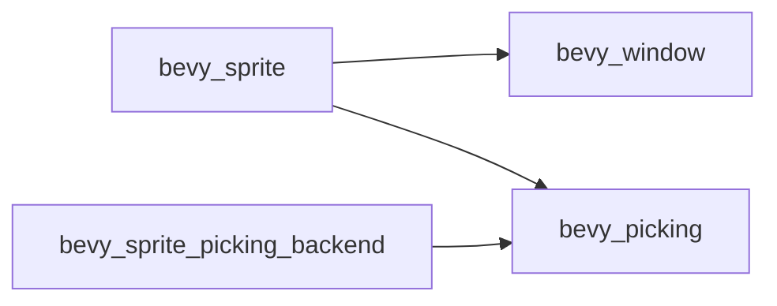

+++
title = "#20620"
date = "2025-08-17T00:00:00"
draft = false
template = "pull_request_page.html"
in_search_index = true

[taxonomies]
list_display = ["show"]

[extra]
current_language = "en"
available_languages = {"en" = { name = "English", url = "/pull_request/bevy/2025-08/pr-20620-en-20250817" }, "zh-cn" = { name = "中文", url = "/pull_request/bevy/2025-08/pr-20620-zh-cn-20250817" }}
+++

### The Story of This Pull Request  

#### The Problem and Context  
`bevy_sprite` had an optional dependency on `bevy_window` controlled by the `bevy_sprite_picking_backend` feature. This caused a problem documented in issue #20619 where certain configurations could break compilation. Optional dependencies increase maintenance complexity and can lead to "dependency hell" scenarios when features interact unexpectedly. The core issue was that `bevy_window` functionality was effectively required for core sprite operations, making the optional designation misleading and error-prone.

#### The Solution Approach  
The straightforward solution was to make `bevy_window` a mandatory dependency. This approach:  
1. Eliminates conditional compilation paths  
2. Reduces feature combinatorics  
3. Clarifies actual dependencies  
No alternatives were considered since the dependency was already effectively required - the only question was whether to formalize it.

#### The Implementation  
The changes are focused exclusively on dependency declaration in `Cargo.toml`:  
1. `bevy_window` was moved from optional to required dependencies  
2. Feature definitions were simplified to remove now-redundant conditions  
3. Dev-dependencies were cleaned up since the main dependency covers testing needs  

The key change removes the `optional = true` flag from `bevy_window` and updates feature definitions accordingly:

```toml
# Before (optional dependency):
bevy_window = { path = "../bevy_window", version = "0.17.0-dev", optional = true }

# After (required dependency):
bevy_window = { path = "../bevy_window", version = "0.17.0-dev" }
```

Feature configuration was simplified by removing the explicit `bevy_window` requirement since it's now always present:

```toml
# Before:
bevy_sprite_picking_backend = ["bevy_picking", "bevy_window"]

# After:
bevy_sprite_picking_backend = ["bevy_picking"]
```

The dev-dependency was removed since it's redundant with the main dependency:

```toml
# Removed:
[dev-dependencies]
-bevy_window = { path = "../bevy_window", version = "0.17.0-dev" }
```

#### Technical Insights  
This change demonstrates important dependency management principles:  
1. **Optional Dependencies Cost**: They introduce combinatorial complexity that grows exponentially with features  
2. **Implicit Requirements**: If a module always uses a dependency when compiled, it shouldn't be optional  
3. **Cargo Behavior**: Optional dependencies aren't automatically included in downstream crates unless explicitly activated  

#### The Impact  
These changes:  
1. Fix compilation errors in specific feature configurations  
2. Reduce maintenance burden by eliminating conditional paths  
3. Clarify the crate's actual dependencies  
4. Simplify the feature graph by removing unnecessary nodes  

The solution is complete – no further changes are needed since the dependency tree now accurately reflects actual requirements.

### Visual Representation  



### Key Files Changed  

**File**: `crates/bevy_sprite/Cargo.toml`  
1. **Changes**:  
   - Made `bevy_window` non-optional  
   - Simplified feature definitions  
   - Removed redundant dev-dependency  
2. **Code Snippets**:  
```toml
# Features section
# Before:
bevy_sprite_picking_backend = ["bevy_picking", "bevy_window"]

# After:
bevy_sprite_picking_backend = ["bevy_picking"]
```
```toml
# Dependencies section
# Before:
bevy_window = { path = "../bevy_window", version = "0.17.0-dev", optional = true }

# After:
bevy_window = { path = "../bevy_window", version = "0.17.0-dev" }
```
```toml
# Dev dependencies section
# Before:
[dev-dependencies]
approx = "0.5.1"
bevy_window = { path = "../bevy_window", version = "0.17.0-dev" }

# After:
[dev-dependencies]
approx = "0.5.1"
```

### Further Reading  
1. [Cargo Features Documentation](https://doc.rust-lang.org/cargo/reference/features.html)  
2. [Semantic Versioning in Rust](https://doc.rust-lang.org/cargo/reference/semver.html)  
3. [Dependency Management in Large Rust Projects](https://rust-lang.github.io/api-guidelines/dependencies.html)  

### Full Code Diff  
```diff
diff --git a/crates/bevy_sprite/Cargo.toml b/crates/bevy_sprite/Cargo.toml
index bc851d94a58af..48cfe2d7cbf52 100644
--- a/crates/bevy_sprite/Cargo.toml
+++ b/crates/bevy_sprite/Cargo.toml
@@ -9,7 +9,7 @@ license = "MIT OR Apache-2.0"
 keywords = ["bevy"]
 
 [features]
-bevy_sprite_picking_backend = ["bevy_picking", "bevy_window"]
+bevy_sprite_picking_backend = ["bevy_picking"]
 
 [dependencies]
 # bevy
@@ -24,7 +24,7 @@ bevy_math = { path = "../bevy_math", version = "0.17.0-dev" }
 bevy_picking = { path = "../bevy_picking", version = "0.17.0-dev", optional = true }
 bevy_reflect = { path = "../bevy_reflect", version = "0.17.0-dev" }
 bevy_transform = { path = "../bevy_transform", version = "0.17.0-dev" }
-bevy_window = { path = "../bevy_window", version = "0.17.0-dev", optional = true }
+bevy_window = { path = "../bevy_window", version = "0.17.0-dev" }
 bevy_derive = { path = "../bevy_derive", version = "0.17.0-dev" }
 bevy_text = { path = "../bevy_text", version = "0.17.0-dev" }
 
@@ -35,7 +35,6 @@ wgpu-types = { version = "26", default-features = false }
 
 [dev-dependencies]
 approx = "0.5.1"
-bevy_window = { path = "../bevy_window", version = "0.17.0-dev" }
 
 [lints]
 workspace = true
```