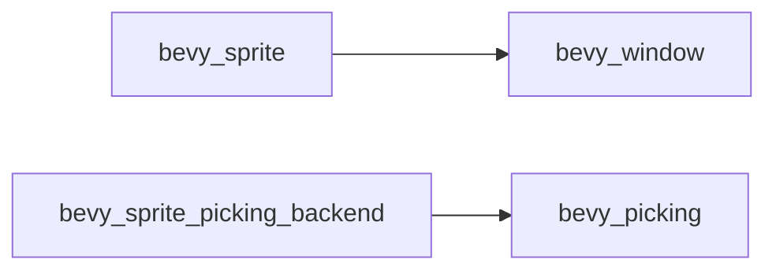

+++
title = "#20620 Make `bevy_sprite`'s `bevy_window` dependency non-optional"
date = "2025-08-17T00:00:00"
draft = false
template = "pull_request_page.html"
in_search_index = false

[extra]
current_language = "zh-cn"
available_languages = {"en" = { name = "English", url = "/pull_request/bevy/2025-08/pr-20620-en-20250817" }, "zh-cn" = { name = "中文", url = "/pull_request/bevy/2025-08/pr-20620-zh-cn-20250817" }}
+++

# 分析报告：PR #20620 - 将 `bevy_sprite` 的 `bevy_window` 依赖改为非可选

## 基本信息
- **标题**: Make `bevy_sprite`'s `bevy_window` dependency non-optional
- **PR 链接**: https://github.com/bevyengine/bevy/pull/20620
- **作者**: ickshonpe
- **状态**: 已合并
- **标签**: C-Bug, C-Dependencies, S-Ready-For-Final-Review
- **创建时间**: 2025-08-17T11:26:58Z
- **合并时间**: 2025-08-17T18:01:22Z
- **合并人**: alice-i-cecile

## 描述翻译
### 目标
修复 #20619

### 解决方案
将 `bevy_window` 改为非可选依赖

## PR 的技术分析

### 问题背景
在 Bevy 引擎的架构中，`bevy_sprite` 模块原本将 `bevy_window` 作为可选依赖（optional dependency）。这种设计导致当 `bevy_sprite_picking_backend` 特性未启用时，`bevy_window` 不会被包含在依赖图中，造成编译错误（issue #20619）。具体表现为某些代码路径尝试使用 `bevy_window` 提供的功能时，由于依赖缺失而失败。

### 解决方案
核心解决思路是将 `bevy_window` 从可选依赖改为强制依赖。这种修改确保无论特性如何配置，`bevy_window` 都会被包含在构建中，消除了条件编译导致的不一致性。技术决策基于以下考虑：
1. `bevy_sprite` 实际上在多个核心功能中依赖 `bevy_window` 的功能
2. 可选依赖增加了配置复杂性且未带来实际收益
3. 强制依赖简化了 crate 的依赖关系图

### 实现细节
修改集中在 `Cargo.toml` 的依赖声明部分：
```diff
[features]
-bevy_sprite_picking_backend = ["bevy_picking", "bevy_window"]
+bevy_sprite_picking_backend = ["bevy_picking"]

[dependencies]
-bevy_window = { path = "../bevy_window", version = "0.17.0-dev", optional = true }
+bevy_window = { path = "../bevy_window", version = "0.17.0-dev" }

[dev-dependencies]
-approx = "0.5.1"
-bevy_window = { path = "../bevy_window", version = "0.17.0-dev" }
+approx = "0.5.1"
```
关键变更点：
1. 从 `bevy_sprite_picking_backend` 特性中移除 `bevy_window` 声明（因为现在它是全局依赖）
2. 将 `bevy_window` 的依赖声明移除 `optional = true` 属性
3. 清理 `dev-dependencies` 中冗余的 `bevy_window` 声明

### 技术影响
1. **解决了编译错误**：确保 `bevy_window` 始终可用
2. **简化依赖管理**：减少特性间的耦合度
3. **二进制大小影响**：轻微增加（因包含额外依赖）
4. **编译时间影响**：轻微增加（因需编译额外 crate）

### 架构关系


## 关键文件变更

### `crates/bevy_sprite/Cargo.toml`
**变更原因**：修复条件依赖导致的编译错误  
**变更前**：
```toml
[features]
bevy_sprite_picking_backend = ["bevy_picking", "bevy_window"]

[dependencies]
bevy_window = { path = "../bevy_window", version = "0.17.0-dev", optional = true }

[dev-dependencies]
approx = "0.5.1"
bevy_window = { path = "../bevy_window", version = "0.17.0-dev" }
```

**变更后**：
```toml
[features]
bevy_sprite_picking_backend = ["bevy_picking"]

[dependencies]
bevy_window = { path = "../bevy_window", version = "0.17.0-dev" }

[dev-dependencies]
approx = "0.5.1"
```

**影响分析**：
- 主依赖中的 `optional = true` 移除使 `bevy_window` 成为强制依赖
- 特性声明简化，移除冗余依赖引用
- 开发依赖清理避免重复声明

## 完整代码差异
```diff
diff --git a/crates/bevy_sprite/Cargo.toml b/crates/bevy_sprite/Cargo.toml
index bc851d94a58af..48cfe2d7cbf52 100644
--- a/crates/bevy_sprite/Cargo.toml
+++ b/crates/bevy_sprite/Cargo.toml
@@ -9,7 +9,7 @@ license = "MIT OR Apache-2.0"
 keywords = ["bevy"]
 
 [features]
-bevy_sprite_picking_backend = ["bevy_picking", "bevy_window"]
+bevy_sprite_picking_backend = ["bevy_picking"]
 
 [dependencies]
 # bevy
@@ -24,7 +24,7 @@ bevy_math = { path = "../bevy_math", version = "0.17.0-dev" }
 bevy_picking = { path = "../bevy_picking", version = "0.17.0-dev", optional = true }
 bevy_reflect = { path = "../bevy_reflect", version = "0.17.0-dev" }
 bevy_transform = { path = "../bevy_transform", version = "0.17.0-dev" }
-bevy_window = { path = "../bevy_window", version = "0.17.0-dev", optional = true }
+bevy_window = { path = "../bevy_window", version = "0.17.0-dev" }
 bevy_derive = { path = "../bevy_derive", version = "0.17.0-dev" }
 bevy_text = { path = "../bevy_text", version = "0.17.0-dev" }
 
@@ -35,7 +35,6 @@ wgpu-types = { version = "26", default-features = false }
 
 [dev-dependencies]
 approx = "0.5.1"
-bevy_window = { path = "../bevy_window", version = "0.17.0-dev" }
 
 [lints]
 workspace = true
```

## 延伸阅读
1. [Cargo 特性文档](https://doc.rust-lang.org/cargo/reference/features.html)
2. [Bevy 依赖管理指南](https://bevyengine.org/learn/book/getting-started/dependencies/)
3. [Rust 条件编译实践](https://doc.rust-lang.org/reference/conditional-compilation.html)