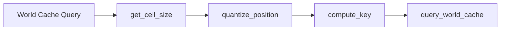

+++
title = "#20622 Tweak Solari world cache"
date = "2025-08-19T00:00:00"
draft = false
template = "pull_request_page.html"
in_search_index = true

[taxonomies]
list_display = ["show"]

[extra]
current_language = "en"
available_languages = {"en" = { name = "English", url = "/pull_request/bevy/2025-08/pr-20622-en-20250819" }, "zh-cn" = { name = "中文", url = "/pull_request/bevy/2025-08/pr-20622-zh-cn-20250819" }}
labels = ["A-Rendering", "C-Refinement"]
+++

# Tweak Solari world cache

## Basic Information
- **Title**: Tweak Solari world cache
- **PR Link**: https://github.com/bevyengine/bevy/pull/20622
- **Author**: JMS55
- **Status**: MERGED
- **Labels**: A-Rendering, S-Ready-For-Final-Review, C-Refinement
- **Created**: 2025-08-17T17:23:26Z
- **Merged**: 2025-08-19T17:49:41Z
- **Merged By**: alice-i-cecile

## Description Translation
# Objective
- Make the world cache more responsive to changes in lighting
- Make the world cache switch LODs slower to make the transition less noticeable
- Make the base cell size smaller to improve close-up lighting

## The Story of This Pull Request

This PR addresses three specific optimization goals for Bevy's Solari real-time global illumination system's world cache. The world cache is a critical component that stores and reuses lighting information to improve performance, but it needed tuning to better handle dynamic lighting scenarios and improve visual quality.

The core issue was that the world cache wasn't responsive enough to lighting changes, causing delayed updates when lights moved or changed intensity. Additionally, the Level of Detail (LOD) transitions between cache cells were too abrupt, creating visible artifacts as the camera moved through the environment. Finally, the base cell size was too large for close-up lighting scenarios, reducing detail quality in nearby areas.

The solution involved adjusting three key parameters in the world cache system and refactoring the position quantization logic. First, `WORLD_CACHE_MAX_TEMPORAL_SAMPLES` was reduced from 30.0 to 10.0, making the cache accumulate fewer frames before updating. This makes the cache more responsive to lighting changes but trades off some noise reduction.

Second, the LOD transition behavior was improved by introducing a new `WORLD_CACHE_POSITION_LOD_SCALE` constant set to 30.0 and refactoring the position quantization into separate functions. The new `get_cell_size()` function calculates cell size based on camera distance using a logarithmic scale:

```wgsl
fn get_cell_size(world_position: vec3<f32>, view_position: vec3<f32>) -> f32 {
    let camera_distance = distance(view_position, world_position) / WORLD_CACHE_POSITION_LOD_SCALE;
    let lod = exp2(floor(log2(1.0 + camera_distance)));
    return WORLD_CACHE_POSITION_BASE_CELL_SIZE * lod;
}
```

This approach creates smoother LOD transitions by making cell sizes change more gradually with distance from the camera.

Third, `WORLD_CACHE_POSITION_BASE_CELL_SIZE` was reduced from 0.4 to 0.25 meters, providing higher resolution for close-up lighting calculations. The position quantization function was simplified to accept a pre-calculated cell size rather than computing it internally.

A debug visualization feature was also added to help developers inspect the world cache behavior by overriding the output color with cache query results when `VISUALIZE_WORLD_CACHE` is defined.

These changes work together to make the Solari GI system more responsive to dynamic lighting while maintaining visual quality through smoother LOD transitions and improved close-up detail.

## Visual Representation



## Key Files Changed

### `crates/bevy_solari/src/realtime/world_cache_query.wgsl` (+14/-11)
**Purpose**: Implement the core world cache optimization changes

**Key Changes**:
```wgsl
// Constants updated for responsiveness and quality
const WORLD_CACHE_MAX_TEMPORAL_SAMPLES: f32 = 10.0; // Was 30.0
const WORLD_CACHE_POSITION_BASE_CELL_SIZE: f32 = 0.25; // Was 0.4
const WORLD_CACHE_POSITION_LOD_SCALE: f32 = 30.0; // New constant

// Refactored position quantization
fn get_cell_size(world_position: vec3<f32>, view_position: vec3<f32>) -> f32 {
    let camera_distance = distance(view_position, world_position) / WORLD_CACHE_POSITION_LOD_SCALE;
    let lod = exp2(floor(log2(1.0 + camera_distance)));
    return WORLD_CACHE_POSITION_BASE_CELL_SIZE * lod;
}

fn quantize_position(world_position: vec3<f32>, quantization_factor: f32) -> vec3<f32> {
    return floor(world_position / quantization_factor + 0.0001);
}
```

### `crates/bevy_solari/src/realtime/restir_gi.wgsl` (+4/-1)
**Purpose**: Add debug visualization and clean up unused imports

**Key Changes**:
```wgsl
// Removed unused import
// #import bevy_pbr::rgb9e5::rgb9e5_to_vec3_

// Added debug visualization
#ifdef VISUALIZE_WORLD_CACHE
    textureStore(view_output, global_id.xy, vec4(query_world_cache(world_position, world_normal, view.world_position) * view.exposure, 1.0));
#endif
```

### `release-content/release-notes/bevy_solari.md` (+1/-1)
**Purpose**: Update release notes to include this PR

**Key Changes**:
```markdown
pull_requests: [19058, 19620, 19790, 20020, 20113, 20156, 20213, 20242, 20259, 20406, 20457, 20580, 20596, 20622]
```

## Further Reading
- [Bevy Engine Documentation](https://bevyengine.org/learn/)
- [Real-Time Global Illumination Techniques](https://advances.realtimerendering.com/)
- [WGSL Shader Language Specification](https://gpuweb.github.io/gpuweb/wgsl/)