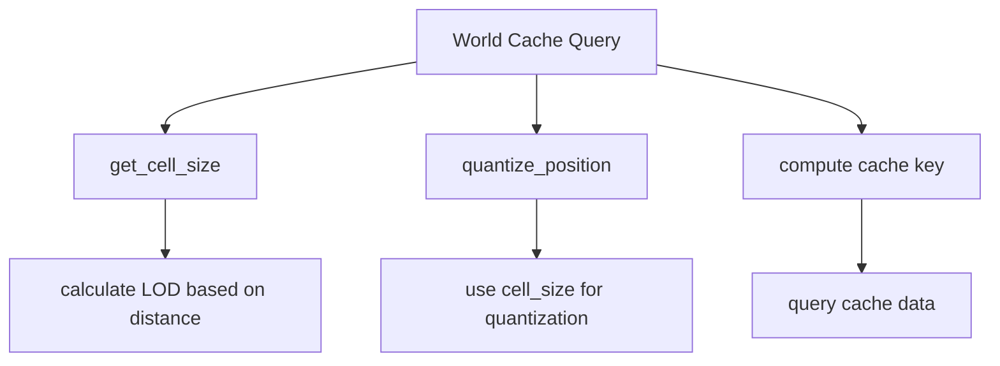

+++
title = "#20622 Tweak Solari world cache"
date = "2025-08-19T00:00:00"
draft = false
template = "pull_request_page.html"
in_search_index = false

[extra]
current_language = "zh-cn"
available_languages = {"en" = { name = "English", url = "/pull_request/bevy/2025-08/pr-20622-en-20250819" }, "zh-cn" = { name = "中文", url = "/pull_request/bevy/2025-08/pr-20622-zh-cn-20250819" }}
+++

# Tweak Solari world cache

## 基本信息
- **标题**: Tweak Solari world cache
- **PR链接**: https://github.com/bevyengine/bevy/pull/20622
- **作者**: JMS55
- **状态**: 已合并
- **标签**: A-Rendering, S-Ready-For-Final-Review, C-Refinement
- **创建时间**: 2025-08-17T17:23:26Z
- **合并时间**: 2025-08-19T17:49:41Z
- **合并者**: alice-i-cecile

## 描述翻译
# Objective (目标)
- 使世界缓存对光照变化更敏感
- 使世界缓存的LOD切换更慢，让过渡不那么明显
- 减小基础单元大小以改善近处光照效果

## 这个PR的故事

这个PR主要优化了Bevy Solari模块中的世界缓存系统。Solari是Bevy的实时光线追踪全局光照系统，世界缓存是其核心组件之一，用于存储和复用光照计算的结果。

**问题背景**
原来的世界缓存在几个方面存在不足：对光照变化的响应不够及时，LOD（细节级别）切换过于明显，以及近处光照的分辨率不够高。这些都会影响最终渲染的质量和视觉连贯性。

**解决方案**
开发者通过调整三个关键参数来解决这些问题：

1. 降低 `WORLD_CACHE_MAX_TEMPORAL_SAMPLES` 从30.0到10.0，使缓存对光照变化更敏感
2. 减小 `WORLD_CACHE_POSITION_BASE_CELL_SIZE` 从0.4到0.25，提高近处光照的分辨率
3. 引入新的 `WORLD_CACHE_POSITION_LOD_SCALE` 参数控制LOD过渡速度

**技术实现**
核心的变化在于位置量化函数的重构。原来的代码将位置量化和LOD计算耦合在一起：

```wgsl
// 之前的方法
fn quantize_position(world_position: vec3<f32>, view_position: vec3<f32>) -> vec3<f32> {
    let base_size = WORLD_CACHE_POSITION_BASE_CELL_SIZE;
    let d = distance(view_position, world_position);
    let step = max((d * base_size) / 7.0, base_size);
    let quantization_factor = exp2(floor(log2(step)));
    
    return floor(world_position / quantization_factor + 0.0001);
}
```

重构后分离了单元大小计算和位置量化：

```wgsl
// 新的方法
fn get_cell_size(world_position: vec3<f32>, view_position: vec3<f32>) -> f32 {
    let camera_distance = distance(view_position, world_position) / WORLD_CACHE_POSITION_LOD_SCALE;
    let lod = exp2(floor(log2(1.0 + camera_distance)));
    return WORLD_CACHE_POSITION_BASE_CELL_SIZE * lod;
}

fn quantize_position(world_position: vec3<f32>, quantization_factor: f32) -> vec3<f32> {
    return floor(world_position / quantization_factor + 0.0001);
}
```

这种重构使得LOD计算更加清晰和可控，新的LOD_SCALE参数允许精确调整LOD过渡的速度。

**影响与收益**
这些调整带来了明显的视觉改进：
- 光照变化更快地反映在缓存中，减少了延迟感
- LOD过渡更加平滑，减少了突兀的细节级别变化
- 近处光照质量提高，因为使用了更小的缓存单元

调试功能也得到了增强，添加了 `VISUALIZE_WORLD_CACHE` 宏来直接可视化缓存内容，便于开发和调试。

## 可视化表示



## 关键文件变更

### `crates/bevy_solari/src/realtime/world_cache_query.wgsl` (+14/-11)
核心的世界缓存查询逻辑修改，重构了位置量化函数并调整了关键参数。

**主要变更：**
```wgsl
// 之前：
const WORLD_CACHE_MAX_TEMPORAL_SAMPLES: f32 = 30.0;
const WORLD_CACHE_POSITION_BASE_CELL_SIZE: f32 = 0.4;

// 之后：
const WORLD_CACHE_MAX_TEMPORAL_SAMPLES: f32 = 10.0;
const WORLD_CACHE_POSITION_BASE_CELL_SIZE: f32 = 0.25;
const WORLD_CACHE_POSITION_LOD_SCALE: f32 = 30.0;
```

**函数重构：**
```wgsl
// 之前单一的量化函数
fn quantize_position(world_position: vec3<f32>, view_position: vec3<f32>) -> vec3<f32> {
    let base_size = WORLD_CACHE_POSITION_BASE_CELL_SIZE;
    let d = distance(view_position, world_position);
    let step = max((d * base_size) / 7.0, base_size);
    let quantization_factor = exp2(floor(log2(step)));
    
    return floor(world_position / quantization_factor + 0.0001);
}

// 之后分离的函数
fn get_cell_size(world_position: vec3<f32>, view_position: vec3<f32>) -> f32 {
    let camera_distance = distance(view_position, world_position) / WORLD_CACHE_POSITION_LOD_SCALE;
    let lod = exp2(floor(log2(1.0 + camera_distance)));
    return WORLD_CACHE_POSITION_BASE_CELL_SIZE * lod;
}

fn quantize_position(world_position: vec3<f32>, quantization_factor: f32) -> vec3<f32> {
    return floor(world_position / quantization_factor + 0.0001);
}
```

### `crates/bevy_solari/src/realtime/restir_gi.wgsl` (+4/-1)
添加了世界缓存可视化调试功能。

**主要变更：**
```wgsl
// 添加了调试可视化功能
#ifdef VISUALIZE_WORLD_CACHE
    textureStore(view_output, global_id.xy, vec4(query_world_cache(world_position, world_normal, view.world_position) * view.exposure, 1.0));
#endif
```

### `release-content/release-notes/bevy_solari.md` (+1/-1)
更新发布说明，包含这个PR的引用。

## 延伸阅读

- [Bevy Solari 项目](https://github.com/bevyengine/bevy/tree/main/crates/bevy_solari) - Solari模块的源代码
- [ReSTIR GI 论文](https://research.nvidia.com/publication/2020-07_restir-gi-path-resampling-real-time-path-tracing) - 相关的实时路径追踪技术
- [WGSL 语言规范](https://gpuweb.github.io/gpuweb/wgsl/) - WebGPU着色语言的官方文档

## 完整代码差异
```diff
diff --git a/crates/bevy_solari/src/realtime/restir_gi.wgsl b/crates/bevy_solari/src/realtime/restir_gi.wgsl
index f98546e96b40e..66ececed93a16 100644
--- a/crates/bevy_solari/src/realtime/restir_gi.wgsl
+++ b/crates/bevy_solari/src/realtime/restir_gi.wgsl
@@ -3,7 +3,6 @@
 #import bevy_core_pipeline::tonemapping::tonemapping_luminance as luminance
 #import bevy_pbr::pbr_deferred_types::unpack_24bit_normal
 #import bevy_pbr::prepass_bindings::PreviousViewUniforms
-#import bevy_pbr::rgb9e5::rgb9e5_to_vec3_
 #import bevy_pbr::utils::{rand_f, sample_uniform_hemisphere, uniform_hemisphere_inverse_pdf, sample_disk, octahedral_decode}
 #import bevy_render::maths::PI
 #import bevy_render::view::View
@@ -82,6 +81,10 @@ fn spatial_and_shade(@builtin(global_invocation_id) global_id: vec3<u32>) {
     var pixel_color = textureLoad(view_output, global_id.xy);
     pixel_color += vec4(merge_result.selected_sample_radiance * combined_reservoir.unbiased_contribution_weight * view.exposure, 0.0);
     textureStore(view_output, global_id.xy, pixel_color);
+
+#ifdef VISUALIZE_WORLD_CACHE
+    textureStore(view_output, global_id.xy, vec4(query_world_cache(world_position, world_normal, view.world_position) * view.exposure, 1.0));
+#endif
 }
 
 fn generate_initial_reservoir(world_position: vec3<f32>, world_normal: vec3<f32>, rng: ptr<function, u32>) -> Reservoir {
diff --git a/crates/bevy_solari/src/realtime/world_cache_query.wgsl b/crates/bevy_solari/src/realtime/world_cache_query.wgsl
index b30900160c7d1..ecf9a0892906b 100644
--- a/crates/bevy_solari/src/realtime/world_cache_query.wgsl
+++ b/crates/bevy_solari/src/realtime/world_cache_query.wgsl
@@ -1,14 +1,16 @@
 #define_import_path bevy_solari::world_cache
 
-/// Controls how response the world cache is to changes in lighting
-const WORLD_CACHE_MAX_TEMPORAL_SAMPLES: f32 = 30.0;
+/// How responsive the world cache is to changes in lighting (higher is less responsive, lower is more responsive)
+const WORLD_CACHE_MAX_TEMPORAL_SAMPLES: f32 = 10.0;
 /// Maximum amount of frames a cell can live for without being queried
 const WORLD_CACHE_CELL_LIFETIME: u32 = 30u;
 /// Maximum amount of attempts to find a cache entry after a hash collision
 const WORLD_CACHE_MAX_SEARCH_STEPS: u32 = 3u;
 
-/// Controls the base size of each cache cell
-const WORLD_CACHE_POSITION_BASE_CELL_SIZE: f32 = 0.4;
+/// The size of a cache cell at the lowest LOD in meters
+const WORLD_CACHE_POSITION_BASE_CELL_SIZE: f32 = 0.25;
+/// How fast the world cache transitions between LODs as a function of distance to the camera
+const WORLD_CACHE_POSITION_LOD_SCALE: f32 = 30.0;
 
 /// Marker value for an empty cell
 const WORLD_CACHE_EMPTY_CELL: u32 = 0u;
@@ -36,9 +38,9 @@ struct WorldCacheGeometryData {
 
 #ifndef WORLD_CACHE_NON_ATOMIC_LIFE_BUFFER
 fn query_world_cache(world_position: vec3<f32>, world_normal: vec3<f32>, view_position: vec3<f32>) -> vec3<f32> {
-    let world_position_quantized = bitcast<vec3<u32>>(quantize_position(world_position, view_position));
+    let cell_size = get_cell_size(world_position, view_position);
+    let world_position_quantized = bitcast<vec3<u32>>(quantize_position(world_position, cell_size));
     let world_normal_quantized = bitcast<vec3<u32>>(quantize_normal(world_normal));
-
     var key = compute_key(world_position_quantized, world_normal_quantized);
     let checksum = compute_checksum(world_position_quantized, world_normal_quantized);
 
@@ -64,12 +66,13 @@ fn query_world_cache(world_position: vec3<f32>, world_normal: vec3<f32>, view_po
 }
 #endif
 
-fn quantize_position(world_position: vec3<f32>, view_position: vec3<f32>) -> vec3<f32> {
-    let base_size = WORLD_CACHE_POSITION_BASE_CELL_SIZE;
-    let d = distance(view_position, world_position);
-    let step = max((d * base_size) / 7.0, base_size);
-    let quantization_factor = exp2(floor(log2(step)));
+fn get_cell_size(world_position: vec3<f32>, view_position: vec3<f32>) -> f32 {
+    let camera_distance = distance(view_position, world_position) / WORLD_CACHE_POSITION_LOD_SCALE;
+    let lod = exp2(floor(log2(1.0 + camera_distance)));
+    return WORLD_CACHE_POSITION_BASE_CELL_SIZE * lod;
+}
 
+fn quantize_position(world_position: vec3<f32>, quantization_factor: f32) -> vec3<f32> {
     return floor(world_position / quantization_factor + 0.0001);
 }
 
diff --git a/release-content/release-notes/bevy_solari.md b/release-content/release-notes/bevy_solari.md
index cfe89f6576927..1ab28542a473c 100644
--- a/release-content/release-notes/bevy_solari.md
+++ b/release-content/release-notes/bevy_solari.md
@@ -1,7 +1,7 @@
 ---
 title: Initial raytraced lighting progress (bevy_solari)
 authors: ["@JMS55", "@SparkyPotato"]
-pull_requests: [19058, 19620, 19790, 20020, 20113, 20156, 20213, 20242, 20259, 20406, 20457, 20580, 20596]
+pull_requests: [19058, 19620, 19790, 20020, 20113, 20156, 20213, 20242, 20259, 20406, 20457, 20580, 20596, 20622]
 ---
 
 ## Overview
```