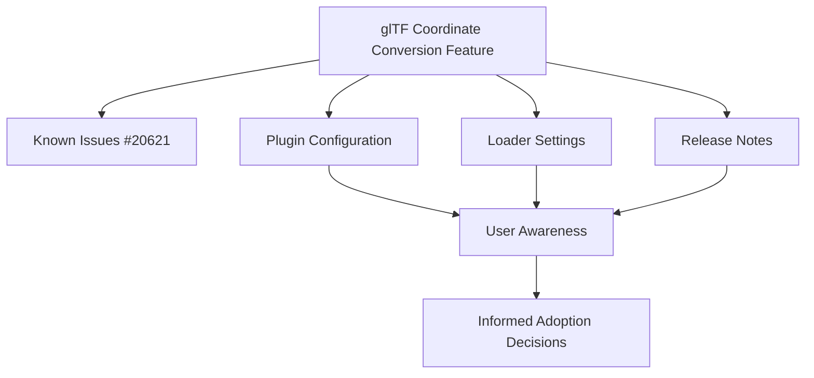

+++
title = "#20623 Add caution to glTF coordinate conversion docs and release notes"
date = "2025-08-17T00:00:00"
draft = false
template = "pull_request_page.html"
in_search_index = true

[taxonomies]
list_display = ["show"]

[extra]
current_language = "en"
available_languages = {"en" = { name = "English", url = "/pull_request/bevy/2025-08/pr-20623-en-20250817" }, "zh-cn" = { name = "中文", url = "/pull_request/bevy/2025-08/pr-20623-zh-cn-20250817" }}
labels = ["C-Docs", "A-glTF"]
+++

# Add caution to glTF coordinate conversion docs and release notes

## Basic Information
- **Title**: Add caution to glTF coordinate conversion docs and release notes
- **PR Link**: https://github.com/bevyengine/bevy/pull/20623
- **Author**: greeble-dev
- **Status**: MERGED
- **Labels**: C-Docs, S-Ready-For-Final-Review, A-glTF
- **Created**: 2025-08-17T17:33:08Z
- **Merged**: 2025-08-17T22:05:47Z
- **Merged By**: alice-i-cecile

## Description Translation
glTF coordinate conversion is new in 0.17 and desirable for some users. But it has known issues (#20621), and future versions might have breaking changes. This PR adds some cautionary notes.

> _CAUTION: This is an experimental feature with [known issues](https://github.com/bevyengine/bevy/issues/20621). Behavior may change in future versions._

## The Story of This Pull Request

The glTF coordinate conversion feature introduced in Bevy 0.17 provides better alignment between glTF assets and Bevy's coordinate system. While this functionality addresses a genuine need for some users, it comes with known technical limitations documented in issue #20621. These issues could potentially lead to breaking changes in future versions as the implementation evolves.

To manage user expectations and prevent potential surprises during upgrades, we need to clearly communicate the experimental nature of this feature. The solution involves adding standardized cautionary notices at key documentation touchpoints where users encounter this feature.

The implementation approach is straightforward but strategically placed. We add identical warning messages in three locations: 
1. The main glTF plugin configuration
2. The glTF loader settings
3. The release notes for the feature

Each warning follows the same pattern: a prominent "_CAUTION_" prefix followed by a concise explanation of the experimental status, a link to known issues, and a note about potential future changes. This consistency ensures users receive the same warning regardless of where they first encounter the feature.

The technical implementation is minimal but effective. For the code-level documentation, we add Rust doc comments above the relevant configuration fields. For the release notes, we insert the warning at the top of the feature documentation file. All warnings include a direct link to the tracking issue (#20621) so users can easily access detailed technical context about the limitations.

This approach balances several considerations:
1. It provides necessary warnings without disrupting existing documentation flow
2. It maintains consistency across different documentation surfaces
3. It gives users immediate access to deeper technical context via the issue link
4. It avoids making permanent commitments about the feature's stability

The impact of these changes is improved user awareness about the experimental nature of this feature. Developers who enable glTF coordinate conversion will now have clear expectations about its stability and be better prepared for potential future changes. This reduces the risk of unexpected breakage during upgrades and helps users make informed decisions about adopting this feature in production environments.

## Visual Representation



## Key Files Changed

### 1. `crates/bevy_gltf/src/lib.rs`
Added cautionary note to the `convert_gltf_coordinates` field documentation.

```rust
/// _CAUTION: This is an experimental feature with [known issues](https://github.com/bevyengine/bevy/issues/20621). Behavior may change in future versions._
///
/// How to convert glTF coordinates on import. Assuming glTF cameras, glTF lights, and glTF meshes had global identity transforms,
/// their Bevy [`Transform::forward`](bevy_transform::components::Transform::forward) will be pointing in the following global directions:
```

### 2. `crates/bevy_gltf/src/loader/mod.rs`
Added identical warning to the loader settings documentation.

```rust
/// _CAUTION: This is an experimental feature with [known issues](https://github.com/bevyengine/bevy/issues/20621). Behavior may change in future versions._
///
/// How to convert glTF coordinates on import. Assuming glTF cameras, glTF lights, and glTF meshes had global unit transforms,
/// their Bevy [`Transform::forward`](bevy_transform::components::Transform::forward) will be pointing in the following global directions:
```

### 3. `release-content/release-notes/convert-coordinates.md`
Added caution banner at the top of the release notes.

```markdown
_CAUTION: This is an experimental feature with [known issues](https://github.com/bevyengine/bevy/issues/20621). Behavior may change in future versions._

Bevy uses the following coordinate system for all worldspace entities that have a `Transform`:
```

## Further Reading
1. [Bevy glTF Coordinate System Documentation](https://github.com/bevyengine/bevy/blob/main/docs/gltf_coordinate_system.md)
2. [Original glTF Coordinate Conversion PR (#19633)](https://github.com/bevyengine/bevy/pull/19633)
3. [Known Issues Tracking (#20621)](https://github.com/bevyengine/bevy/issues/20621)
4. [Bevy Documentation Guidelines](https://github.com/bevyengine/bevy/blob/main/docs/plugins_guidelines.md#documentation)