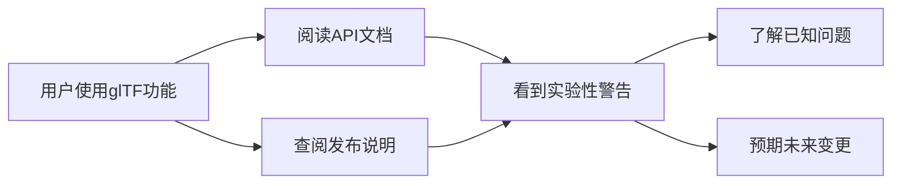

+++
title = "#20623 Add caution to glTF coordinate conversion docs and release notes"
date = "2025-08-17T00:00:00"
draft = false
template = "pull_request_page.html"
in_search_index = false

[extra]
current_language = "zh-cn"
available_languages = {"en" = { name = "English", url = "/pull_request/bevy/2025-08/pr-20623-en-20250817" }, "zh-cn" = { name = "中文", url = "/pull_request/bevy/2025-08/pr-20623-zh-cn-20250817" }}
+++

# Add caution to glTF coordinate conversion docs and release notes

## 基本信息
- **标题**: Add caution to glTF coordinate conversion docs and release notes
- **PR链接**: https://github.com/bevyengine/bevy/pull/20623
- **作者**: greeble-dev
- **状态**: 已合并
- **标签**: C-Docs, S-Ready-For-Final-Review, A-glTF
- **创建时间**: 2025-08-17T17:33:08Z
- **合并时间**: 2025-08-17T22:05:47Z
- **合并者**: alice-i-cecile

## 描述翻译
glTF坐标转换是0.17版本中的新功能，对某些用户来说是需要的。但它存在已知问题(#20621)，且未来版本可能会有破坏性变更。本PR添加了一些注意事项。

> _注意：这是一个实验性功能，存在[已知问题](https://github.com/bevyengine/bevy/issues/20621)。未来版本的行为可能会发生变化。_

## PR分析

### 问题背景
在Bevy 0.17版本中，glTF坐标转换功能作为新特性被引入，目的是解决glTF模型导入后的方向问题。该功能允许开发者选择是否在导入时自动转换glTF坐标系统（glTF使用+Y向上，+Z向前）到Bevy的坐标系统（-Z向前，+Y向上）。虽然这个功能对某些场景有用，但在实现过程中发现了几个关键问题（记录在#20621中），包括：
1. 转换逻辑在某些边界条件下不够健壮
2. 可能与其他系统存在未预期的交互
3. 未来版本可能需要调整实现方式

核心挑战在于：该功能已包含在0.17版本中，用户可能会开始依赖它，但团队意识到后续版本可能需要破坏性变更来彻底解决问题。

### 解决方案
为解决上述问题，作者采取了直接的文档更新策略：
1. 在API文档中添加警告说明
2. 在发布说明中插入注意事项
3. 明确链接到已知问题追踪单

这种方法不需要修改功能代码本身，但提供了必要的透明度，让用户了解：
- 当前实现的状态（实验性）
- 已知问题存在
- 未来行为可能变化

### 实现细节
所有变更都集中在添加警告文本到三个关键位置：

1. **GltfPlugin结构体文档**：
```rust
/// _CAUTION: This is an experimental feature with [known issues](https://github.com/bevyengine/bevy/issues/20621). Behavior may change in future versions._
///
/// How to convert glTF coordinates on import...
```

2. **GltfLoaderSettings结构体文档**：
```rust
/// _CAUTION: This is an experimental feature with [known issues](https://github.com/bevyengine/bevy/issues/20621). Behavior may change in future versions._
///
/// How to convert glTF coordinates on import...
```

3. **发布说明文档**：
```markdown
_CAUTION: This is an experimental feature with [known issues](https://github.com/bevyengine/bevy/issues/20621). Behavior may change in future versions._

Bevy uses the following coordinate system...
```

这些警告都遵循相同模式：
- 使用强调格式（Markdown斜体或Rust doc注释）
- 包含指向问题跟踪的明确链接
- 位置放在功能说明的正上方，确保可见性

### 技术权衡
该方法有几个优点：
1. **最小侵入性**：不修改任何功能代码，避免引入新bug
2. **即时生效**：文档变更随下一个版本立即发布
3. **用户透明**：明确设定期望，避免未来破坏性变更时的意外

潜在限制：
- 依赖用户实际阅读文档
- 不影响运行时行为

### 影响评估
这些变更通过以下方式降低项目风险：
1. 保护用户：防止用户过度依赖可能变化的实验性功能
2. 保护维护者：为未来变更建立明确的预期
3. 促进贡献：通过公开问题链接，鼓励社区参与解决方案讨论

## 可视化表示



## 关键文件变更

### crates/bevy_gltf/src/lib.rs
**变更原因**：在主要插件结构体的文档中添加警告  
**代码变更**：
```diff
 pub struct GltfPlugin {
     /// Can be modified with the [`DefaultGltfImageSampler`] resource.
     pub default_sampler: ImageSamplerDescriptor,
 
+    /// _CAUTION: This is an experimental feature with [known issues](https://github.com/bevyengine/bevy/issues/20621). Behavior may change in future versions._
+    ///
     /// How to convert glTF coordinates on import...
```

### crates/bevy_gltf/src/loader/mod.rs
**变更原因**：在加载器配置的文档中添加相同警告  
**代码变更**：
```diff
 pub struct GltfLoaderSettings {
     pub default_sampler: Option<ImageSamplerDescriptor>,
     /// If true, the loader will ignore sampler data from gltf and use the default sampler.
     pub override_sampler: bool,
+    /// _CAUTION: This is an experimental feature with [known issues](https://github.com/bevyengine/bevy/issues/20621). Behavior may change in future versions._
+    ///
     /// How to convert glTF coordinates on import...
```

### release-content/release-notes/convert-coordinates.md
**变更原因**：在功能发布说明顶部添加警告  
**代码变更**：
```diff
 authors: ["@janhohenheim"]
 pull_requests: [19633, 19685, 19816, 20131, 20122]
 ---
 
+_CAUTION: This is an experimental feature with [known issues](https://github.com/bevyengine/bevy/issues/20621). Behavior may change in future versions._
+
 Bevy uses the following coordinate system...
```

## 延伸阅读
1. [glTF坐标转换原始PR讨论](https://github.com/bevyengine/bevy/pull/19633)
2. [已知问题追踪单 #20621](https://github.com/bevyengine/bevy/issues/20621)
3. [Bevy文档指南](https://github.com/bevyengine/bevy/blob/main/docs/CODE_DOCUMENTATION.md)
4. [glTF坐标系统规范](https://registry.khronos.org/glTF/specs/2.0/glTF-2.0.html#coordinate-system-and-units)