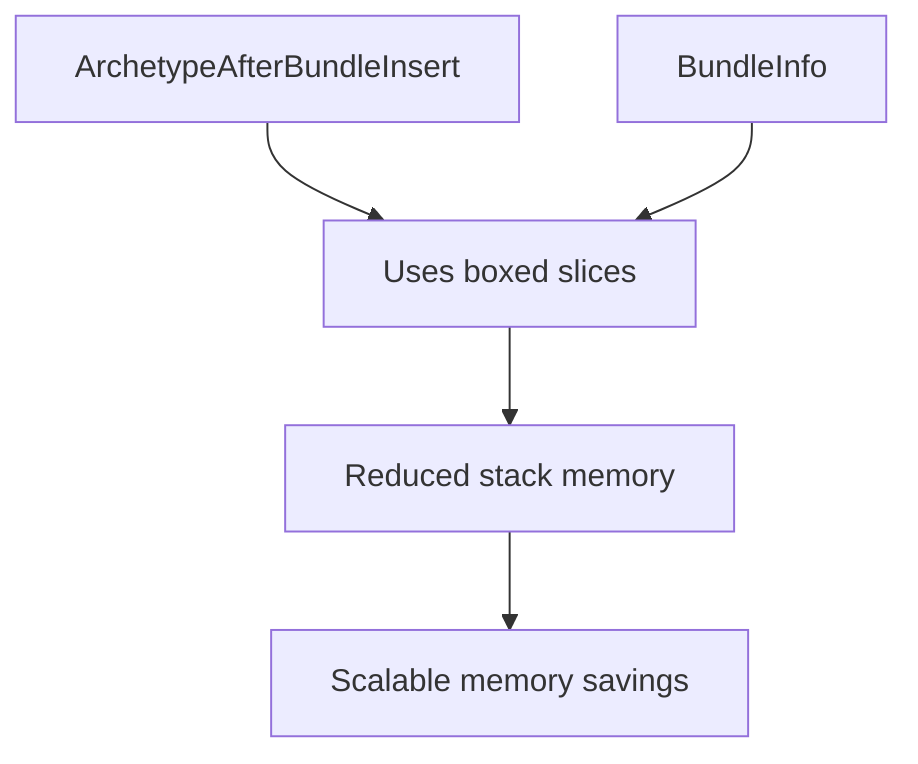

+++
title = "#20626 Shrink ArchetypeAfterBundleInsert"
date = "2025-08-18T00:00:00"
draft = false
template = "pull_request_page.html"
in_search_index = true

[taxonomies]
list_display = ["show"]

[extra]
current_language = "en"
available_languages = {"en" = { name = "English", url = "/pull_request/bevy/2025-08/pr-20626-en-20250818" }, "zh-cn" = { name = "中文", url = "/pull_request/bevy/2025-08/pr-20626-zh-cn-20250818" }}
labels = ["D-Trivial", "A-ECS", "C-Performance"]
+++

### Shrinking ArchetypeAfterBundleInsert: Optimizing ECS Memory Footprint

#### Basic Information
- **Title**: Shrink ArchetypeAfterBundleInsert
- **PR Link**: https://github.com/bevyengine/bevy/pull/20626
- **Author**: james7132
- **Status**: MERGED
- **Labels**: D-Trivial, A-ECS, C-Performance, S-Ready-For-Final-Review
- **Created**: 2025-08-17T20:36:18Z
- **Merged**: 2025-08-18T22:39:18Z
- **Merged By**: alice-i-cecile

#### Description Translation
# Objective  
`ArchetypeAfterBundleInsert` caches information about changes to an entity's archetype after a bundle has been inserted. It's currently stored in a `SparseArray`, so its stack size can have a significant impact on the amount of memory used to store ECS metadata, even if an edge does not exist between two archetypes.  

## Solution  
Use boxed slices instead to shrink the stack size of `ArchetypeAfterBundleInsert` by 40 bytes. Went ahead and also did the same with `BundleInfo` (16 bytes per registered `Bundle`)  

## Testing  
Existing unit tests and miri have been run.  

#### The Story of This Pull Request
The ECS metadata memory footprint became a focus when analyzing archetype transition costs. `ArchetypeAfterBundleInsert` tracks archetype changes after bundle insertion, stored in a `SparseArray`. Each instance carried significant stack overhead due to its `Vec` fields, consuming memory even for unused archetype edges. 

The solution replaced `Vec` fields with boxed slices (`Box<[T]>`), reducing per-instance stack size. Boxed slices maintain heap allocations but slim their stack representation from 24 bytes (for `Vec`) to 16 bytes by dropping capacity tracking. This is safe since these collections are immutable after creation.

In `archetype.rs`, four fields in `ArchetypeAfterBundleInsert` were converted:
```rust
// Before:
pub bundle_status: Vec<ComponentStatus>,
pub required_components: Vec<RequiredComponentConstructor>,
pub added: Vec<ComponentId>,
pub existing: Vec<ComponentId>,

// After:
bundle_status: Box<[ComponentStatus]>,
pub required_components: Box<[RequiredComponentConstructor]>,
added: Box<[ComponentId]>,
existing: Box<[ComponentId]>,
```
The `Edges::add_bundle` method was updated to accept any `Into<Box<[T]>>` type, maintaining ergonomics:
```rust
pub(crate) fn add_bundle(
    &mut self,
    bundle_id: BundleId,
    archetype_id: ArchetypeId,
    bundle_status: impl Into<Box<[ComponentStatus]>>,
    // ...other fields similarly
) {
    // Conversion via .into()
}
```

The same optimization was applied to `BundleInfo` in `bundle/info.rs`, replacing two `Vec` fields with boxed slices:
```rust
// Before:
pub(super) contributed_component_ids: Vec<ComponentId>,
pub(super) required_component_constructors: Vec<RequiredComponentConstructor>,

// After:
pub(super) contributed_component_ids: Box<[ComponentId]>,
pub(super) required_component_constructors: Box<[RequiredComponentConstructor]>,
```

Constructors were updated to directly collect into boxed slices:
```rust
required_component_constructors: required_components
    .iter()
    .map(|(_, rc)| rc.constructor)
    .collect::<Box<_>>(),  // Collects directly into Box<[]>
```

These changes reduce `ArchetypeAfterBundleInsert`'s stack size by 40 bytes (from 104B to 64B) and `BundleInfo` by 16 bytes per registered bundle. Since these structures exist for every archetype edge and bundle, the memory savings scale with ECS complexity. The optimizations maintain identical heap allocations while slimming stack-presence, with no behavior changes. Existing tests and Miri verification confirmed correctness.

#### Visual Representation


#### Key Files Changed
1. **crates/bevy_ecs/src/archetype.rs**  
   Optimized memory layout for archetype transition tracking:  
   ```rust
   // Before:
   pub bundle_status: Vec<ComponentStatus>,
   // ...3 other Vec fields
   
   // After:
   bundle_status: Box<[ComponentStatus]>,
   // ...3 other Box<[T]> fields
   ```
   - Converted four Vec fields to boxed slices  
   - Updated builder method to accept slice conversions  
   - Reduces ArchetypeAfterBundleInsert stack size by 40 bytes

2. **crates/bevy_ecs/src/bundle/info.rs**  
   Optimized bundle metadata storage:  
   ```rust
   // Before:
   contributed_component_ids: Vec<ComponentId>,
   required_component_constructors: Vec<RequiredComponentConstructor>
   
   // After:
   contributed_component_ids: Box<[ComponentId]>,
   required_component_constructors: Box<[RequiredComponentConstructor]>
   ```
   - Converted two Vec fields to boxed slices  
   - Updated constructor to use direct boxed collection  
   - Saves 16 bytes per registered bundle  

#### Further Reading
- [Rust Vec vs Boxed Slice Memory Layout](https://doc.rust-lang.org/std/vec/struct.Vec.html#memory-layout)  
- [Bevy ECS Archetype Internals](https://bevyengine.org/learn/book/next/ecs-in-depth/archetypes/)  
- [Rust Boxed Slices Documentation](https://doc.rust-lang.org/std/boxed/struct.Box.html#method.into_boxed_slice)