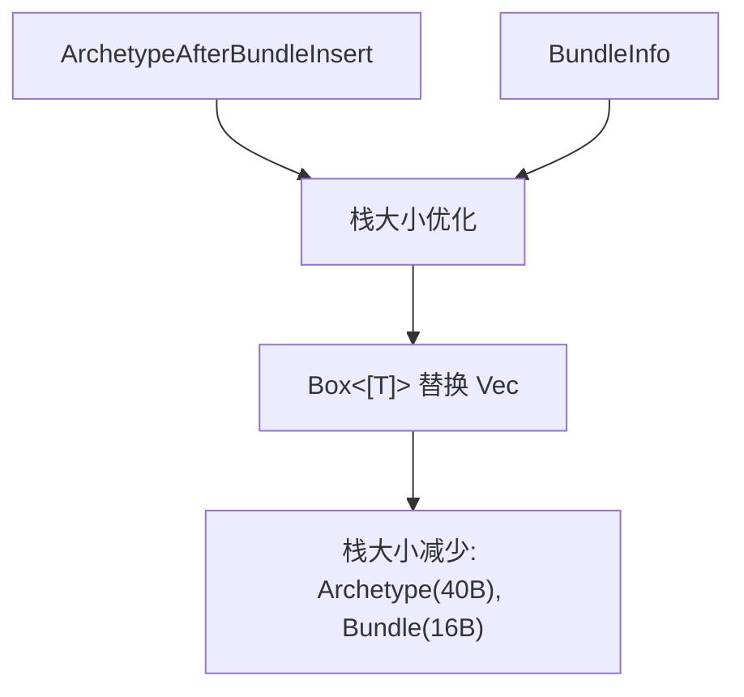

+++
title = "#20626 Shrink ArchetypeAfterBundleInsert"
date = "2025-08-18T00:00:00"
draft = false
template = "pull_request_page.html"
in_search_index = false

[extra]
current_language = "zh-cn"
available_languages = {"en" = { name = "English", url = "/pull_request/bevy/2025-08/pr-20626-en-20250818" }, "zh-cn" = { name = "中文", url = "/pull_request/bevy/2025-08/pr-20626-zh-cn-20250818" }}
+++

# Shrink ArchetypeAfterBundleInsert

## 基本信息
- **标题**: Shrink ArchetypeAfterBundleInsert
- **PR链接**: https://github.com/bevyengine/bevy/pull/20626
- **作者**: james7132
- **状态**: 已合并
- **标签**: D-Trivial, A-ECS, C-Performance, S-Ready-For-Final-Review
- **创建时间**: 2025-08-17T20:36:18Z
- **合并时间**: 2025-08-18T22:39:18Z
- **合并者**: alice-i-cecile

## 描述翻译
# Objective
`ArchetypeAfterBundleInsert` 缓存了在 bundle 插入后实体原型(archetype)的变化信息。它目前存储在 `SparseArray` 中，因此即使两个原型之间不存在边(edge)，其栈大小(stack size)也会显著影响存储 ECS 元数据的内存使用量。

## Solution
改用装箱切片(boxed slices)将 `ArchetypeAfterBundleInsert` 的栈大小缩小 40 字节。同时也对 `BundleInfo` 进行了相同的优化（每个注册的 `Bundle` 节省 16 字节）。

## Testing
已运行现有单元测试和 miri。

## PR技术分析

### 问题背景
在 Bevy 的 ECS 实现中，`ArchetypeAfterBundleInsert` 结构体负责记录在插入 bundle 后实体原型的变化信息。该结构体包含多个向量(Vec)字段，每个 Vec 在栈上占用 24 字节（在 64 位系统上）。由于这些结构体被大量存储在 `SparseArray` 中，即使某些原型之间没有实际连接，这些向量占用的栈空间也会累积成显著的内存开销。

同样的问题也存在于 `BundleInfo` 结构体，其向量字段为每个注册的 bundle 增加不必要的内存开销。在大型 ECS 应用中，这些看似微小的开销可能累积成显著的内存浪费。

### 解决方案
核心优化方案是将多个向量字段替换为装箱切片(boxed slices)。装箱切片在栈上仅存储胖指针(fat pointer)（数据指针 + 长度），占用 16 字节，相比 Vec 的 24 字节减少 33%。具体修改包括：

1. 将 `ArchetypeAfterBundleInsert` 的四个字段类型从 `Vec` 改为 `Box<[T]>`
2. 将 `BundleInfo` 的两个字段类型从 `Vec` 改为 `Box<[T]>`
3. 修改相关构造函数，接受任何可转换为 `Box<[T]>` 的类型

### 实现细节
**archetype.rs 的关键修改**：
```rust
// Before:
pub bundle_status: Vec<ComponentStatus>,
pub required_components: Vec<RequiredComponentConstructor>,
pub added: Vec<ComponentId>,
pub existing: Vec<ComponentId>,

// After:
bundle_status: Box<[ComponentStatus]>,
pub required_components: Box<[RequiredComponentConstructor]>,
added: Box<[ComponentId]>,
existing: Box<[ComponentId]>,
```

对应的构造函数调整为接受泛型参数：
```rust
// 修改后签名：
pub fn insert_after_bundle(
    &mut self,
    bundle_id: BundleId,
    archetype_id: ArchetypeId,
    bundle_status: impl Into<Box<[ComponentStatus]>>,
    required_components: impl Into<Box<[RequiredComponentConstructor]>>,
    added: impl Into<Box<[ComponentId]>>,
    existing: impl Into<Box<[ComponentId]>>,
)
```

**bundle/info.rs 的关键修改**：
```rust
// Before:
pub(super) contributed_component_ids: Vec<ComponentId>,
pub(super) required_component_constructors: Vec<RequiredComponentConstructor>,

// After:
pub(super) contributed_component_ids: Box<[ComponentId]>,
pub(super) required_component_constructors: Box<[RequiredComponentConstructor]>,
```

集合初始化改用装箱：
```rust
// 修改后初始化方式：
required_component_constructors: required_components.into(),
contributed_component_ids: component_ids.into(),
```

### 技术权衡
选择装箱切片而非其他方案的原因：
1. **内存效率**：在栈空间节省和堆分配开销之间取得平衡
2. **兼容性**：保持与现有 Vec API 的互操作性（通过 `Into<Box<[T]>>`）
3. **不变性**：装箱切片的内容不可变，符合这些结构体初始化后不再修改的特性

### 性能影响
优化后内存占用显著降低：
- `ArchetypeAfterBundleInsert`：栈大小减少 40 字节
- `BundleInfo`：每个注册 bundle 减少 16 字节
在包含大量原型和 bundle 的 ECS 应用中，这些节省会累积成显著的内存优化。

### 验证方案
保持修改的可靠性：
1. 所有现有单元测试通过
2. 使用 miri 进行内存安全检查
3. 接口变更保持向后兼容（通过泛型参数）

## 可视化表示



## 关键文件变更

### 1. crates/bevy_ecs/src/archetype.rs
**变更原因**：减少 `ArchetypeAfterBundleInsert` 结构体的内存占用  
**关键修改**：
```rust
// 字段类型变更
-    pub bundle_status: Vec<ComponentStatus>,
+    bundle_status: Box<[ComponentStatus]>,
-    pub required_components: Vec<RequiredComponentConstructor>,
+    pub required_components: Box<[RequiredComponentConstructor]>,
-    pub added: Vec<ComponentId>,
+    added: Box<[ComponentId]>,
-    pub existing: Vec<ComponentId>,
+    existing: Box<[ComponentId]>,

// 构造函数参数变更
     pub fn insert_after_bundle(
         &mut self,
         bundle_id: BundleId,
         archetype_id: ArchetypeId,
-        bundle_status: Vec<ComponentStatus>,
-        required_components: Vec<RequiredComponentConstructor>,
-        added: Vec<ComponentId>,
-        existing: Vec<ComponentId>,
+        bundle_status: impl Into<Box<[ComponentStatus]>>,
+        required_components: impl Into<Box<[RequiredComponentConstructor]>>,
+        added: impl Into<Box<[ComponentId]>>,
+        existing: impl Into<Box<[ComponentId]>>,
     ) {
         self.insert_bundle.insert(
             bundle_id,
             ArchetypeAfterBundleInsert {
                 archetype_id,
-                bundle_status,
-                required_components,
-                added,
-                existing,
+                bundle_status: bundle_status.into(),
+                required_components: required_components.into(),
+                added: added.into(),
+                existing: existing.into(),
             },
         );
     }
```

### 2. crates/bevy_ecs/src/bundle/info.rs
**变更原因**：减少 `BundleInfo` 结构体的内存占用  
**关键修改**：
```rust
// 字段类型变更
-    pub(super) contributed_component_ids: Vec<ComponentId>,
+    pub(super) contributed_component_ids: Box<[ComponentId]>,
-    pub(super) required_component_constructors: Vec<RequiredComponentConstructor>,
+    pub(super) required_component_constructors: Box<[RequiredComponentConstructor]>,

// 初始化方式变更
         let required_components = required_components
             .iter()
             .map(|(_, required_component)| required_component.constructor)
-            .collect::<Vec<_>>();
+            .collect::<Box<_>>();
         BundleInfo {
             id,
-            contributed_component_ids: component_ids,
+            contributed_component_ids: component_ids.into(),
             required_component_constructors: required_components,
         }
```

## 延伸阅读

1. [Rust 内存布局文档](https://doc.rust-lang.org/std/boxed/struct.Box.html#memory-layout) - 了解 `Box` 和切片的内存表示
2. [ECS 架构模式](https://en.wikipedia.org/wiki/Entity_component_system) - 理解原型(archetype)和 bundle 在 ECS 中的作用
3. [Bevy 官方文档](https://bevyengine.org/learn/book/getting-started/ecs/) - Bevy ECS 的核心概念
4. [Rust 性能优化指南](https://nnethercote.github.io/perf-book/) - 内存优化技巧