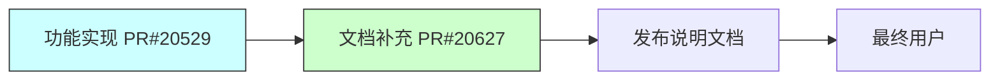

+++
title = "#20627 Add release note for atmosphere env map"
date = "2025-08-17T00:00:00"
draft = false
template = "pull_request_page.html"
in_search_index = false

[extra]
current_language = "zh-cn"
available_languages = {"en" = { name = "English", url = "/pull_request/bevy/2025-08/pr-20627-en-20250817" }, "zh-cn" = { name = "中文", url = "/pull_request/bevy/2025-08/pr-20627-zh-cn-20250817" }}
labels = ["C-Docs"]
+++

# Add release note for atmosphere env map

## Basic Information
- **Title**: Add release note for atmosphere env map
- **PR Link**: https://github.com/bevyengine/bevy/pull/20627
- **Author**: mate-h
- **Status**: MERGED
- **Labels**: C-Docs
- **Created**: 2025-08-17T21:35:19Z
- **Merged**: 2025-08-17T22:55:29Z
- **Merged By**: alice-i-cecile

## Description Translation
### 目标 (Objective)
- 跟进PR，添加发布说明
- 保持友好的语气，不涉及技术细节（这些在PR中已有）
- 关注使用场景而不是实现细节

## The Story of This Pull Request

这个PR源于一个功能实现的需求：当Bevy引擎添加了大气环境贴图功能后，需要提供相应的发布说明文档。原始功能PR(#20529)实现了从程序化大气生成环境贴图的技术方案，但缺少面向最终用户的文档说明。

核心需求是创建用户友好的发布说明，重点突出功能价值而非技术细节。文档需要达到两个目标：1) 清晰说明功能解决了什么问题 2) 展示基本用法示例。同时保持语气友好，避免让非技术用户感到压力。

文档结构采用标准发布说明格式：
1. 元数据头(metadata header)包含功能标题、作者和关联PR
2. 视觉占位符(TODO)用于后续添加效果截图
3. 功能价值描述段落
4. 具体用法代码示例
5. 当前限制说明
6. 致谢部分

关键决策在于聚焦使用场景而非实现机制。例如文档强调"动态反射随天空自动更新"而非底层渲染技术。代码示例选用最小可行配置：`AtmosphereEnvironmentMapLight::default()`添加到相机实体。这符合Bevy的易用性设计哲学，用户无需配置复杂参数即可获得基础效果。

技术说明部分处理了重要限制：明确该功能目前是per-view实现，尚未支持light probes。这有助于用户避免错误预期，同时为未来改进留下明确标注点。

最终文档采用Markdown格式，符合Bevy发布说明规范。文件路径`release-content/release-notes/`确保文档会包含在官方版本更新中。

## Visual Representation



## Key Files Changed

### 1. `release-content/release-notes/atmosphere_environment_map.md` (新增)
新增发布说明文档，完整内容如下：

```markdown
---
title: Generated environment map for procedural atmosphere
authors: ["@mate-h"]
pull_requests: [20529]
---

(TODO: Embed screenshot of atmosphere-generated reflections)

You can now have dynamic reflections and ambient light in your scene that match the procedural sky.

As the sky changes, reflections on shiny and rough materials update automatically to stay consistent — no pre-baked environment maps needed.

To enable this for a camera, add the new component `AtmosphereEnvironmentMapLight` to the camera entity:

```rust
commands.spawn((
    Camera3d::default(),
    // Generates an environment cubemap from the atmosphere for this view
    AtmosphereEnvironmentMapLight::default(),
));
```

Note that this is a per-view effect (per camera). Light probes are not yet supported.

Special thanks to @atlv24, @JMS55 and @ecoskey for reviews and feedback.
```

**变更分析**：
- 新增Markdown文档文件
- 包含功能描述、使用示例和限制说明
- 代码示例展示最小化启用方式
- 文件路径符合Bevy发布说明规范

## Further Reading
1. [原始功能实现PR#20529](https://github.com/bevyengine/bevy/pull/20529) - 大气环境贴图的技术实现
2. [Bevy文档贡献指南](https://github.com/bevyengine/bevy/blob/main/CONTRIBUTING.md#documenting-features) - 项目文档规范
3. [环境贴图技术说明](https://en.wikipedia.org/wiki/Reflection_mapping) - 环境贴图基础概念
4. [Bevy光照系统文档](https://bevyengine.org/learn/book/next/pbr/) - PBR渲染相关内容